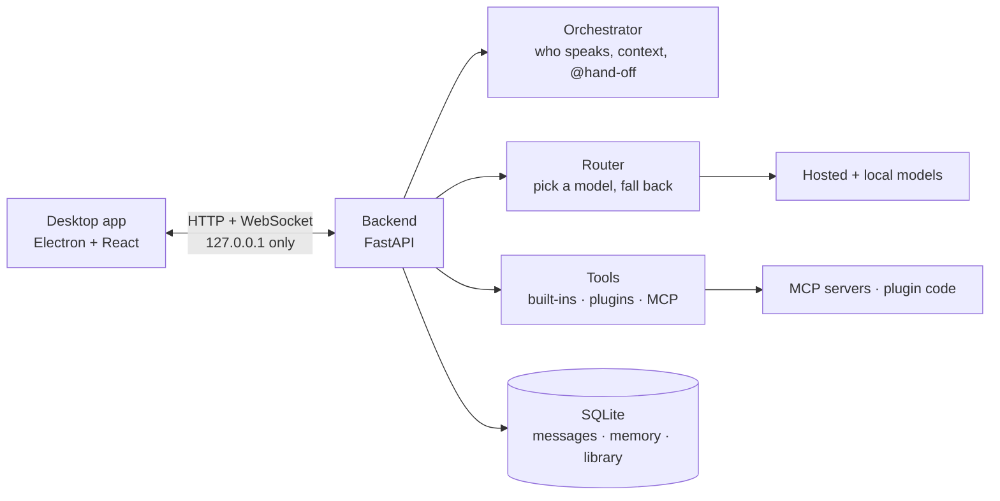
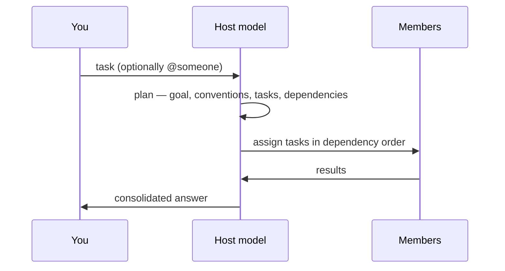

# Team Agent

[Chinese](README.zh-CN.md) · English

Team Agent puts several large language models — hosted or local — into one group chat, where they split the
work by their own strengths and hand tasks to each other with `@mentions`. A desktop workbench for office
documents, video production, writing and research.

- **Many models, one group.** Every member can be a different model. If one fails or is rate-limited the
  request falls back to the next, ending at a local model.
- **The host plans the work.** For anything non-trivial the host splits the goal into tasks with owners,
  dependencies and deliverables, then consolidates the results.
- **Tools that really run.** Tool calls use a plain text protocol, so hosted and local models both work.
- **Local knowledge and memory.** A searchable document library and memory that follows your group.
- **Stays on your machine.** The backend only listens on loopback; API keys live in the system keychain.

Interface language: **English by default**, switchable to Chinese in *Settings → Appearance → Language*.
Built-in content — the model catalog, the local-model list, strength tags and the template gallery — is
bilingual too and follows that setting. Every API accepts `?lang=zh` or an `Accept-Language` header.

## How it works



One turn:



## Quick start

```bash
scripts/dev-setup.sh            # create the venv, install backend and frontend dependencies
scripts/setup_local_model.sh    # optional: install Ollama and pull a local fallback model
cd desktop && npm run dev       # start the backend and open the desktop window
```

On first launch, add an API key under *Settings → Providers* (without one everything goes to the local
model), then pick a scene or a group template on the home page and describe your task.

Browser only: `cd backend && python -m app`, then `cd desktop && npm run dev:web`, and open
<http://localhost:5173>.

## Tests

```bash
cd backend && ../.venv/bin/python -m pytest    # the whole suite, about a minute
cd desktop && npx tsc --noEmit                 # front-end types
python3 scripts/check-i18n.py                  # run from the repo root: dictionary gaps + frozen language
```

One test is **skipped by default**: `test_real_keychain_round_trip`. It writes a single item to your
real login keychain (service `team-agent`, account `selftest:roundtrip`), reads it back and deletes it
again, so an ordinary test run never touches your credentials. To run it as well:

```bash
cd backend
TEAM_AGENT_KEYCHAIN_TEST=1 ../.venv/bin/python -m pytest tests/test_compliance.py::test_real_keychain_round_trip
```

Every other test uses an in-memory fake keychain — `tests/conftest.py` sets `TEAM_AGENT_NO_KEYCHAIN=1`
to keep it that way, and removing that variable is what makes the real keychain reachable.

## Features

| Area | What you get |
| --- | --- |
| Group chat | Members, a host, `@`-hand-off, role statements, and a live task board |
| Planning | Automatic / always / never, per group; plans are validated before they run |
| Models | Built-in catalog plus live listings, strength-based selection, routing chain, automatic fallback, health indicator per model |
| Tools | Text-protocol calls (max 3 per reply), five built-ins, Python plugins, MCP over stdio / SSE / HTTP |
| Library | txt, md, csv, json, html, pdf, docx → chunks → BM25 search (CJK-aware); per-group scope; `#document` references |
| Memory | Global / group / member × preference, fact, decision, lesson, playbook; auto-extraction; two-way Obsidian sync |
| Prompts | Editable global system prompt, a prompt library, per-group prompts, `{{variables}}` |
| Template gallery | 51 ready-made teams, roles, skills, prompts and MCP recipes, installed in one click; bring your own as JSON |
| Local models | Curated catalog, hardware fit estimate, discovery of new model versions |
| External agents | Run a command-line agent as a group member, at read-only / edit / full permission, off by default |
| Data | Backup and restore, chat export to Markdown, usage statistics |

## Security

- The backend listens on `127.0.0.1` only, and every request has to carry a token generated at startup.
- API keys and the GitHub token are kept in the **system keychain**; the database holds only a reference.
- Backups, exports and API responses never contain plaintext keys.
- **No automatic outbound calls**: update checks are off by default.
- A "block hosted models" switch stops every hosted request, including update checks and remote MCP.
- Plugins and MCP servers run code with your privileges. Enable only what you trust.

## Chat channels

A group chat here can be reached from a chat platform, and what it produces can be pushed into one.
*Settings → Chat channels* lists six, each off by default:

| Channel | Direction | Needs a public address | Notes |
|---|---|---|---|
| **WhatsApp** (Cloud API) | receives and replies | **yes** | Meta posts every event to a callback URL, so a tunnel or a public server is required; `graph.facebook.com` also needs a proxy from mainland China |
| **Telegram** | receives and replies | **no** | this app polls Telegram instead, so a machine behind NAT with no tunnel still receives messages |
| **WeCom** | pushes only | no | a group robot cannot receive messages |
| **Feishu** | pushes only | no | custom bot; optional signature |
| **DingTalk** | pushes only | no | custom bot; keyword/IP/加签 security settings all supported |
| **Slack** | pushes only | no | Incoming Webhook |

**Receiving channels answer the sender.** Only text is carried, only from the senders you allowlist, and
each platform's own signature authenticates every request — an unconfigured secret refuses rather than
accepts. A round started from outside **may only use read-only tools**: it can search the library and
your memory, but it can never run code or write files, because there is nobody at this machine to
approve anything.

**Pushing channels forward every finished answer** in the group they are bound to, so a WeCom or Feishu
group sees what the team produced without opening this app.

**WhatsApp specifics.** Three things are arranged outside this app. (1) A public HTTPS address: Meta
rejects `localhost`, private addresses and plain HTTP, so a tunnel is the usual answer
(`cloudflared tunnel --url http://127.0.0.1:8765`), and its hostname goes under *Public hostname*. That
hostname is the single exception to the API being loopback-only, and requests on it are authenticated by
Meta's signature rather than by the app token — restart the app after changing it. (2) A Meta app with
the WhatsApp product: paste `<your host>/hooks/whatsapp` and your verify token into
*WhatsApp → Configuration → Webhook*, then subscribe to `messages`. Use a permanent access token; the
temporary one expires in 24 hours. (3) A proxy, if you are in mainland China.

**Telegram specifics.** Talk to `@BotFather`, run `/newbot`, and paste the token. Send the bot one
message so it knows your chat id, add that id to the allowlist, and switch the channel on — there is no
tunnel, no certificate and no public address. Borrowing the bot's updates with a webhook set is the one
configuration that fails silently, so "Check now" reports it explicitly.

**Every channel has two buttons**: *Check now* (reads what the platform reports about itself, sends
nothing) and *Send test* (really does send one, because on a robot that is the only honest test). The
counters below them — accepted, rejected, ignored — are what makes a misconfiguration visible at all: a
webhook's usual symptom is silence.

## Bringing definitions in from other AI apps

*Settings → MCP servers / Skills → **From another app*** reads the configuration those
applications already keep on this machine and imports what they contain, instead of asking
you to copy a config by hand.

**What travels, and what does not.** MCP has become the shared standard for "a plugin" —
Claude Desktop, Claude Code, Codex, Cursor, Windsurf, Cline, Roo Code, Continue, LM Studio
and Zed all store the same `command` / `args` / `env` or `url` / `headers` shape. Claude-style
`SKILL.md` folders travel as text, because that is the format this project's own skills use.
Nothing else does: **a plugin here is a Python file calling `register()`**, which no other
application produces; a ChatGPT GPT is a prompt plus authenticated actions behind a login;
a Cursor or VS Code extension is TypeScript against a different host API. The importer says
so rather than offering buttons that would silently import nothing.

**How it reads.** Only a fixed list of paths (the ten applications above, plus the skills and
MCP servers bundled inside installed Claude Code plugins). No walking of the home directory,
no following symlinks, a size cap per file, and a cap on how many entries are handled. A scan
reports a broken config instead of failing.

**Nothing runs.** A scan reads text; an import writes rows. Secrets in a source config
(`env`, `headers`) are masked in the preview and never sent to the UI — the import re-reads
the file on the server, so a key does not have to travel through the browser to be moved.
Everything imported lands **disabled**, whatever the other application had set, and an MCP
server is not connected to anything until you open it here and say so. Each entry shows the
command line it would run, plus notes for the cases worth a second look: a launcher that
downloads a package (`npx`, `uvx`), an argument containing shell characters, a program
outside your home directory, a plain-text URL, environment values that did not come along.

## Licence

**[Apache License 2.0](LICENSE)** — Copyright 2026 **zifulifufu**.

- Free to use, modify, redistribute and sell, including commercially.
- Keep the copyright notice, the licence text and [NOTICE](NOTICE) with any copy you distribute, and
  state which files you changed.
- It carries an express patent grant, which ends automatically if you sue contributors over the
  software's patents. No trademark rights are granted, and there is no warranty.
- Releases **up to and including 0.5.0** were published under the Business Source License 1.1; from
  **0.5.1** on, this repository is Apache-2.0. A copy you already hold under BUSL-1.1 keeps the terms
  it came with.

Third-party components are listed in [THIRD_PARTY_NOTICES.md](THIRD_PARTY_NOTICES.md). They are all
permissively licensed (MIT / BSD / Apache-2.0 / ISC) with no GPL or AGPL, so none of them require you to
open-source your own code — but keep their notices when you redistribute. The repository bundles no content
from other projects.

## Limitations

- Only tested on macOS. No code signing, notarisation or auto-update yet.
- The model catalog is a snapshot; strength tags are heuristic, not benchmarks.
- Planning quality depends on the host model following the plan format; a malformed plan falls back to a
  plain relay.
- PDF extraction has no OCR, so scanned documents cannot be read.
- Re-importing a library folder detects changes by file size, so a same-size edit is missed.
- With a single provider, strength-based model selection adds little — more models make it worthwhile.

## Roadmap

1. Packaging: signed installers for macOS and Windows, plus auto-update.
2. Attachments (images, audio, video) in the group chat.
3. A sandbox for plugins.
