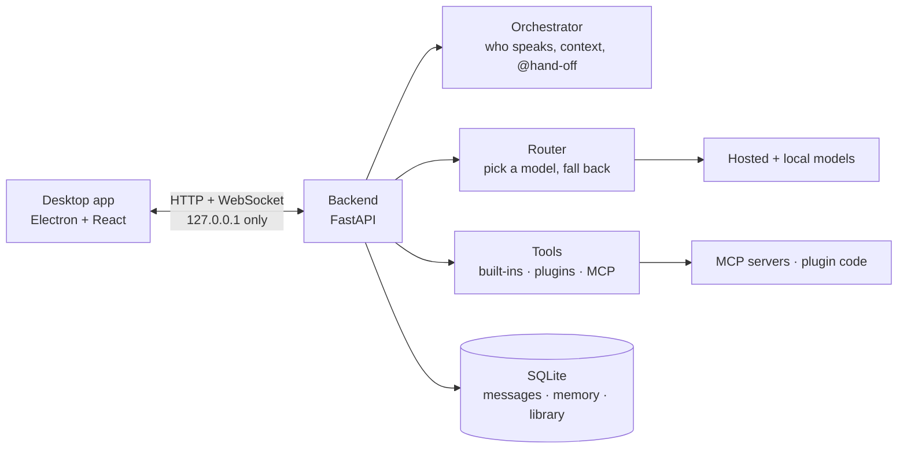
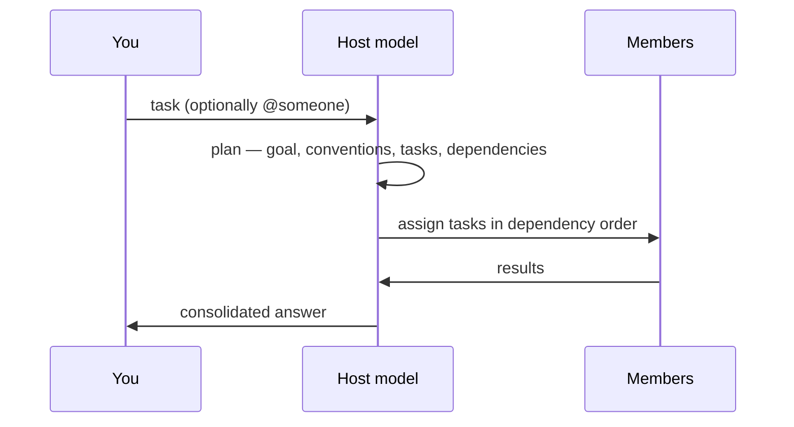

# Team Agent

[Chinese](README.zh-CN.md) · English

Team Agent puts several large language models — hosted or local — into one group chat, where they split the
work by their own strengths and hand tasks to each other with `@mentions`. A desktop workbench for office
documents, video production, writing and research.

- **Many models, one group.** Every member can be a different model. If one fails or is rate-limited the
  request falls back to the next, ending at a local model.
- **The host plans the work.** For anything non-trivial the host splits the goal into tasks with owners,
  dependencies and deliverables, then consolidates the results.
- **Tools that really run.** Tool calls use a plain text protocol, so hosted and local models both work.
- **Local knowledge and memory.** A searchable document library and memory that follows your group.
- **Stays on your machine.** The backend only listens on loopback; API keys live in the system keychain.

Interface language: **English by default**, switchable to Chinese in *Settings → Appearance → Language*.
Built-in content — the model catalog, the local-model list, strength tags and the template gallery — is
bilingual too and follows that setting. Every API accepts `?lang=zh` or an `Accept-Language` header.

## How it works


```mermaid
flowchart LR
  UI["Desktop app<br/>Electron + React"] <-->|"HTTP + WebSocket<br/>127.0.0.1 only"| API["Backend<br/>FastAPI"]
  API --> ORCH["Orchestrator<br/>who speaks, context, @hand-off"]
  API --> ROUTE["Router<br/>pick a model, fall back"]
  API --> TOOLS["Tools<br/>built-ins · plugins · MCP"]
  ROUTE --> MODELS["Hosted + local models"]
  TOOLS --> EXT["MCP servers · plugin code"]
  API --> DB[("SQLite<br/>messages · memory · library")]
```

One turn:


```mermaid
sequenceDiagram
  participant U as You
  participant H as Host model
  participant M as Members
  U->>H: task (optionally @someone)
  H->>H: plan — goal, conventions, tasks, dependencies
  H->>M: assign tasks in dependency order
  M->>H: results
  H->>U: consolidated answer
```

## Quick start

```bash
scripts/dev-setup.sh            # create the venv, install backend and frontend dependencies
scripts/setup_local_model.sh    # optional: install Ollama and pull a local fallback model
cd desktop && npm run dev       # start the backend and open the desktop window
```

On first launch, add an API key under *Settings → Providers* (without one everything goes to the local
model), then pick a scene or a group template on the home page and describe your task.

Browser only: `cd backend && python -m app`, then `cd desktop && npm run dev:web`, and open
<http://localhost:5173>.

## Tests

```bash
cd backend && ../.venv/bin/python -m pytest    # the whole suite, about a minute
cd desktop && npx tsc --noEmit                 # front-end types
python3 scripts/check-i18n.py                  # run from the repo root: dictionary gaps + frozen language
```

One test is **skipped by default**: `test_real_keychain_round_trip`. It writes a single item to your
real login keychain (service `team-agent`, account `selftest:roundtrip`), reads it back and deletes it
again, so an ordinary test run never touches your credentials. To run it as well:

```bash
cd backend
TEAM_AGENT_KEYCHAIN_TEST=1 ../.venv/bin/python -m pytest tests/test_compliance.py::test_real_keychain_round_trip
```

Every other test uses an in-memory fake keychain — `tests/conftest.py` sets `TEAM_AGENT_NO_KEYCHAIN=1`
to keep it that way, and removing that variable is what makes the real keychain reachable.

## Features

| Area | What you get |
| --- | --- |
| Group chat | Members, a host, `@`-hand-off, role statements, and a live task board; a group chat is created by **picking its workspace and then its members**, and both stay editable |
| Generating members | A video or image model can join a group as a member of its own: **discuss the clip with everybody, then say "make that"** — a chat model reads the conversation into one prompt and hands it over, and the result comes back as a file. It does not chat, plan or hand off itself |
| Files | Any file can be attached (screenshot, PDF, Word, Excel, PowerPoint, video, archive); documents are read on this machine, pictures and video frames are looked at or described; `@file:` / `@dir:` / `@msg:` / `@doc:` references with autocomplete |
| Workspace | Every group has one, and it can be **a project folder of your own** (picked when the group is made, changeable later) rather than one the app manages; each task delivers into its own folder, and the panel lists and downloads what is in there |
| Planning | Automatic / always / never, per group; plans are validated before they run |
| Models | Built-in catalog plus live listings, strength-based selection, routing chain, automatic fallback, health indicator per model |
| Tools | Text-protocol calls (max 3 per reply), five built-ins, Python plugins, MCP over stdio / SSE / HTTP |
| Library | txt, md, csv, json, html, pdf, docx, xlsx, pptx → chunks → BM25 search (CJK-aware); per-group scope; `#document` references |
| Memory | Global / group / member × preference, fact, decision, lesson, playbook; auto-extraction; two-way Obsidian sync |
| Prompts | Editable global system prompt, a prompt library, per-group prompts, `{{variables}}` |
| Template gallery | 81 ready-made teams, roles, skills, prompts and MCP recipes, installed in one click; bring your own as JSON |
| Local models | Curated catalog, hardware fit estimate, discovery of new model versions |
| External agents | Run a command-line agent as a group member, at read-only / edit / full permission, off by default |
| Data | Backup and restore, chat export to Markdown, usage statistics |

## Security

- The backend listens on `127.0.0.1` only, and every request has to carry a token generated at startup.
- The window (Electron's renderer) runs under a strict CSP: no remote scripts or styles, and only
  the local API is reachable. Pictures and clips are shown from `blob:` URLs — the bytes are fetched
  with the app token first — so `blob:` is allowed for those two media types. Dropping it silently
  turns every image and every clip into something that cannot load.
- API keys and the GitHub token are kept in the **system keychain**; the database holds only a reference.
- Backups, exports and API responses never contain plaintext keys.
- **No automatic outbound calls**: update checks are off by default.
- A "block hosted models" switch stops every hosted request, including update checks and remote MCP.
- Plugins and MCP servers run code with your privileges. Enable only what you trust.
- **Hooks** are your own code too. They run in a subprocess with a trimmed environment (no app
  token, no inherited API keys), with a timeout, off by default, and a gate can only *object* or
  *rewrite* — never grant what Permissions & control already denies.

## Hooks

*Sidebar → Tools → **Hooks***. Your own code at eight fixed points of a group chat. A hook is one
folder with two files, and it is **off until you switch it on**:

```
hooks/my-hook/HOOK.json     which events, timeout, whether it may block, which groups
hooks/my-hook/hook.py       def handle(event, payload): ...
```

| Event | Kind | What it is for |
|---|---|---|
| `round.start` / `round.end` | observer | One user message in, one answer out: log it, count it, push it somewhere |
| `agent.reply` | observer | One member finished a reply (who, which model, how long, which tools) |
| `tool.called` | observer | A tool ran: name, arguments, ok, how long, a cut-down result |
| `pre_prompt` | injector | Before a member's prompt goes out: add lines to it (`{"append": "…"}`) |
| `post_reply` | gate | Before a reply is stored: object, or rewrite it — the last moment the *record* can be kept clean |
| `pre_tool_use` | gate | Before a tool runs: object (`{"block": true, "reason": …}`) or rewrite the arguments |
| `before_send` | gate | Before text leaves this machine (chat channels): object, or replace the text |

**Templates**: *Settings → Template gallery → Hooks* ships four readable starting points
(house style, keep secrets out of the transcript, check before a message leaves the machine, audit
trail). They are installed switched off and written to `hooks/<name>/`, so they are yours to edit.

Four things are enforced rather than documented, because a hook file gets copied between machines:

- **A gate can only tighten.** Your permission settings are consulted first, and a hook has no
  vocabulary for granting anything — there is no "allow", only "object". A hook that echoes the
  whole payload back cannot turn a value it was never shown into the real one either.
- **An injector can only add.** `pre_prompt` appends; it cannot replace or remove what the app
  assembled, so a hook cannot quietly take the group's rules or memories out of the prompt. And it
  is handed who is speaking and about what — never the prompt itself.
- **It runs in a subprocess** with the trimmed environment members' code gets: no app token, no
  inherited API keys, its own process group, and a timeout that kills the group.
- **A failure is recorded, never fatal.** The reason appears on the Hooks page and in
  `hook-log.jsonl` next to the data directory. By default a broken gate lets read-only tools
  through, holds back writes and outgoing messages, and lets a reply stand — dropping a reply that
  has already been written would leave the group with no answer at all.
- **It can be run once from the page** with a sample payload — installed and working are different
  claims, and the page shows the second one.

## Files, the workspace, and pictures

Every group has a workspace, created when the group is created. It is the one directory a member's
tool calls may use as their working directory, and it is where everything a group produces lands —
including one folder per task (`tasks/<task>/`), so two tasks running in one plan do not write over
each other. The workspace button in the chat header lists what is in there and downloads it.

**Which directory that is, is yours to decide.** It is picked while the group is being created, and
can be changed afterwards from the workspace panel:

* **Pick one of your own folders** (a native folder chooser) and the members work in *your* project
  directory — the files they write appear where you keep that project, instead of being buried in
  the app's data folder. The directory has to exist already: a mistyped path is refused with the
  reason rather than turned into a stray tree on disk.
* **Pick nothing** and the app manages one for the group
  (`<data dir>/workspaces/<group id>`, with the base configurable as `code_workdir` under
  *Permissions & control*).

Two things worth being explicit about:

* **The folder you pick *is* the workspace** — no group-id subfolder is nested inside it.
* **Changing it does not move files.** What was already written stays where it was written; the
  choice only decides where future work happens.
* A picked folder that you delete is **not** recreated at startup — resurrecting it is not a call a
  startup routine should make. It comes back when something actually needs it.

**Members are picked too.** While creating a group you tick who is in it (the first one you tick
becomes the host); tick nobody and there is nothing to create. Each scene used to fill the new group
with its three stock members — now it starts empty, and the scene tab offers that lineup as a
one-click *suggestion* instead. The sample group a fresh install comes with ("Product launch group")
is still there; say the word if you want it gone too.

Attachments are any kind of file. The kind is decided by the file's own bytes, not by its name:

| Kind | What the members get |
| --- | --- |
| Documents (pdf, docx, xlsx, pptx, txt, md, csv, json, html) | The text, extracted on this machine when the file is uploaded. **No vision model is involved**, so this works with any model. When nothing can be extracted (a scanned PDF) the members are told exactly that, rather than being handed a bare filename. |
| Images | Given to the model directly when the answering member's model can see; otherwise described once by the *vision model*, and the description is what members read. |
| Video | Duration and resolution, plus a few evenly spaced stills (ffmpeg), treated like images. The audio track is not transcribed. |
| Audio | Transcribed on this machine when a transcriber is installed (see below). With none, named with its size and left in the workspace. |
| Anything else | Named with its size, and available in the workspace for a member to open with its own tools. |

Two switches decide where a picture may go, and they are separate on purpose: **cloud calls** under
Permissions & control (`external_calls_enabled`), and **cloud vision** (`vision_cloud`). With cloud
vision off, a picture is looked at by a local vision model if one exists, and never leaves the
machine. If no model here can look at a picture, the members are told exactly that — they say they
cannot see it instead of inventing content, and the settings page tells you what to install
(`ollama pull qwen2.5vl:3b` is a good local choice).

*Settings → General → Which model looks at pictures* offers **only models that can really look**. A
gateway lists its chat models and its **image generators** side by side, so `gpt-image-…` and
`gemini-…-image` read like models that *handle* images; picking one of those used to mean **no picture
in any group was ever read**. Three things now prevent that:

* a model that only makes pictures never gets the `multimodal` tag, so it is not offered as eyes at
  all — the judgement lives in one place (`media.purpose_of`, the same one that keeps generators out
  of the member roster);
* a pick that cannot look no longer turns vision off silently: the search falls through to a model
  that can, still local-first and still gated by `vision_cloud`, so a wrong pick cannot send a picture
  off the machine;
* **cloud vision is the only thing that decides whether a picture may leave the machine** — a cloud
  model chosen by hand needs that switch too. It used to be bypassed: name one cloud model once and
  every picture in every group went to that provider while the switch still read "off";
* when nothing can look, the sentence the members read **names the model** ("the model picked to look
  at pictures (X) cannot look at images...") instead of the blanket "no model here can look at
  images" — otherwise the reader stares at the model they just chose and cannot tell what to change.

**"Automatic" is not a blind choice.** The settings page writes out which model it means (the name
gets a ★) and what that implies: a local model is "pictures never leave this machine", a cloud one is
"pictures are sent to that provider". **The recommendation is the model automatic would pick** — one
rule for both, so the page can never recommend one model while the app quietly uses another. A model
its provider has **stopped listing** is neither offered nor recommended (the same judgement the model
chooser badges as "gone": `discovery.still_listed`) — an enabled, keyed, multimodal-looking model that
answers `NotFoundError` is worse as a recommendation than no recommendation.

**Speech is the one kind that needs a program rather than a model.** Nothing is bundled and nothing
is downloaded on your behalf: a whisper model is a few hundred megabytes, and fetching one silently
while somebody waits for an answer is not a decision this app gets to make. If `mlx_whisper` or
`whisper` is already on the machine it is used, and *Settings → General → Files in a group chat* lets
you name any other transcriber — `{out}` is the folder for the text and `{audio}` marks where the
file goes. The words are read once and remembered on the attachment. With nothing installed, the
members are told the audio was not read, rather than being handed a summary of something nobody
listened to. That row no longer stops at "nothing found": it prints **the install command that works
on this machine** (`mlx-whisper` on Apple silicon, `openai-whisper` elsewhere, through whichever of
`uv`/`pipx`/`pip3` is installed — those all land in `~/.local/bin`, which the app searches), and has a
*Check again* button, because installing a transcriber changes no setting at all.
Note that a transcriber is found **by name** along PATH plus `/opt/homebrew/bin`, `/usr/local/bin`,
`~/.local/bin`, `/usr/bin` and `/bin` — so `pipx install mlx-whisper` (or `pip install --user …`),
which land in `~/.local/bin`, are found as they are, while one installed inside this app's own
virtualenv is not: write the full path under *Transcribe audio* for that.

Referencing something with `@` in the composer offers members, files, folders and documents, and
inserts a token the backend understands:

```
@file:reports/q3.xlsx     one file from the workspace, inlined (text clipped to the budget)
@dir:reports/             a folder listing with the first lines of each file
@msg:<id>                 an earlier message of this conversation, quoted whole
@doc:<id>                 a document from a knowledge base this group can reach
#title                    the same thing by title, the older shorthand
```

Paths are resolved inside the group's workspace and re-checked after resolving links, so a
reference cannot reach outside it. How much referenced content one prompt may carry is
`refs_budget` under Settings → General.

## Making video: bringing mature video tools in

The sections above are about this app *generating* video itself (`generate_video`, and the three
dialects behind it). This one is the other half: **wiring in video tools that already exist**. Their
shapes differ a lot, so where each one goes differs too — putting them all in the provider list
would only get each of them half right.

| Tool | Shape | Where it goes | Cost / prerequisite |
|---|---|---|---|
| **Remotion** | a local npm command line (`npx remotion render`) | built-in skill *Video as code (Remotion)* | Node.js 22+. The first project installs dependencies and downloads a headless browser (a few hundred megabytes), which can outlast one `run_code` call |
| **HyperFrames** (HeyGen's open-source framework) | a local npm command line (`npx hyperframes render`) | built-in skill *HTML to video (HyperFrames)* | Node.js 22+ and `ffmpeg`. Its **cloud rendering API** is not wired up here (it needs a key and bills per minute of output) |
| **Voicebox** | a desktop app on this machine, **serving MCP** over HTTP | Template gallery → MCP → *Voicebox (voice on this machine)* | Install and start Voicebox first; its MCP server listens on `127.0.0.1:17493`. Speaking comes out of your speakers |
| **HeyGen** | stdio MCP (`uvx heygen-mcp`) | Template gallery → MCP → *HeyGen (avatar video)* | Needs an API key from your HeyGen account; rendering happens on their servers and **is billed to that account** |
| **ChatCut** | a **hosted** HTTP MCP with a Bearer header | Template gallery → MCP → *ChatCut (edit video by describing it)* | You obtain the token yourself with their sign-in flow; it is short-lived (about an hour), so **a 401 later usually means refreshing it, not a wrong key** |
| **DaVinci Resolve** | stdio MCP (`uvx --python 3.11 --with 'mcp<2' davinci-resolve-mcp`) | Template gallery → MCP → *DaVinci Resolve (cut on a real timeline)* | Needs **Resolve Studio** (the free version exposes no scripting API), external scripting set to Local, and **Resolve open before you press test**. The `--python 3.11` and `mcp<2` pins are not optional: without either one the server dies at import |
| **Jianying / CapCut** | no installable MCP exists — the code route: `uv run --with pyJianYingDraft` | built-in skill *Jianying (CapCut) drafts* | It writes Jianying's own draft files, so the **draft folder has to be asked for** — write it anywhere else and the user opens Jianying and sees nothing |

Three rules, the same ones the rest of this app follows:

* **The two local routes are skills, not providers.** A skill is plain text written for the model to
  read and **executes nothing by itself**. What actually runs is `run_code`: the member builds a
  project in the group workspace, writes the composition, runs the render command, and the result
  lands in the workspace — which is how it becomes a file in the chat. So the video skills only work
  once **Permissions & control → Let members write and run code** is on (it is off by default), and
  `run_code` is an execution-class tool, so **by default you are asked before every call**.
* ⚠️ **A render takes minutes, while `code_timeout` defaults to 60 seconds and stops at 600.**
  Both skills say so, and require the member to **say it out loud** when the timeout cuts the run
  short and ask for a longer budget, rather than quietly lowering the quality or dropping frames to
  fit. Install the dependencies once in a terminal first; that is the step most likely to time out.
* **MCP entries are imported disabled**, this app will not enable one for you, and it will not fill
  in a key for you (a key you paste in goes to the keychain, not to the database in the clear).
* **A member cannot watch the result.** Both skills require it to say what it composed and which
  command it ran, and forbid describing the picture.

> ChatCut Desktop registers its own **local** MCP server with the agents it detects — Claude Code
> and Codex among them. Those config files are already readable here: pick the matching source under
> *Settings → Importing from other AI apps* and you never have to know the address.

## The everyday services, over MCP

Template gallery → MCP carries this family too. **Every address in it was contacted before it was
written down**: a wrong one is not a broken template, it is one that looks fine and can never work,
and it tells you so one opaque failure at a time.

| Service | Shape | What you have to supply |
|---|---|---|
| **Playwright** (browser automation) | local `npx` (`@playwright/mcp@latest`) | nothing. It is an execution-class tool, so you are asked before each call; the browser may need downloading on first use |
| **Context7** (current library docs) | hosted HTTP, **no credential** | nothing at all — verified against the live endpoint. Add `Authorization: Bearer <key>` yourself only if the shared rate limit becomes a problem |
| **GitHub** | hosted HTTP + `Authorization` | a PAT written as `Bearer ghp_…`. **Its scopes are what a member can then do**, so start read-only |
| **Supabase** | hosted HTTP + `Authorization` | the address already asks for `read_only=true` — **keep it**, this server can write; add `&project_ref=<ref>` to scope it; the token goes in as `Bearer sbp_…` |
| **Sentry** | hosted HTTP + `Authorization` | a user token written as **`Sentry-Bearer sntrys_…`** — deliberately not a plain `Bearer`, which Sentry reserves for OAuth tokens |
| **Figma** (the design itself) | **local** `http://127.0.0.1:3845/mcp` | no account and nothing leaves the machine, but the Figma desktop app has to be running with its local MCP server switched on, and it needs a Dev or Full seat on a paid plan |
| **Vercel** (deployments and logs) | `npx -y mcp-remote https://mcp.vercel.com` | one browser sign-in. Read-only server (and during its beta Vercel keeps an allowlist of clients) |
| **Linear** (issues and projects) | `npx -y mcp-remote https://mcp.linear.app/mcp/readonly` | one browser sign-in. The address ends in `/readonly`; drop the suffix for write access |

Three rules, the same as everywhere else here — but worth repeating at this spot:

* **Everything is imported disabled.** This app will not enable one for you and will not fill in a key
  for you (a key you paste in goes to the keychain, not to the database in the clear).
* **For the OAuth ones (Vercel, Linear) the first Test will very likely time out** — that is the
  browser page still being open. The token is cached in `~/.mcp-auth` afterwards, so pressing the same
  button again connects. If it keeps failing, run `npx -y mcp-remote <address>` once in a terminal,
  finish the sign-in there, and test again. A failed connection also quotes what the process printed,
  which is usually the sign-in link it wants you to open.
* ⚠️ **These servers can change things on your accounts.** GitHub's scopes, Supabase's `read_only` and
  Linear's `/readonly` are switches worth actually reading; do not hand out write access to all of them
  by reflex.

One more thing worth knowing: this app appends its list of usual install prefixes to the environment an
MCP server is started in, so `npx` and `uvx` are found even when the app was launched from the Finder.
Without that the templates above fail with `command not found`, which looks exactly like "Node is not
installed".

## External agents

A group member can *be* another application's command-line agent — WorkBuddy ships one — instead of
a model reached through the routing layer. *Settings → External agents* holds the master switch
(off by default), the permission level (read-only / may edit files / full), an optional working
directory, and the hand-off rule.

**Two shapes, and the difference is on purpose.** By default the engine is run inside the isolation
this app sets up for it, and that isolation is *why* its answers are not always what you get from
running the application by hand:

| | Isolated (default) | "Use the application's own configuration" |
|---|---|---|
| MCP connectors | none (`--strict-mcp-config`) | the engine's own, as configured in that application |
| Turn limit | `--max-turns 20` | none — the engine's own default |
| Conversation | a fresh process each round | one session of its own, continued across rounds |
| System prompt | permission level and working directory described | only what the group chat itself needs |

Turn the switch on for a member whose answers should match a direct run; leave it off when the point
is to keep the engine on a short leash. Either way its reply is chat text only — it is never parsed
as `<plan>` or `<tool_call>` — and the subprocess gets an allow-listed environment with neither this
app's token nor any provider's key.

**Signing the engine in is a separate thing.** The WorkBuddy window being signed in does not sign the
command line in, and that is the first failure most people meet: *the connection test* answers with
the engine's own `Authentication required. Please use /login command to sign in to your account`.
Either route fixes it, and the hint you get names both, with the exact command line this app would
run (the engine ships inside the app bundle, so `codebuddy` is usually not on your `PATH`):

* run that command line once in a terminal and type `/login` — the sign-in is kept in your home
  folder, so it keeps working however this app was launched; or
* paste a WorkBuddy API key into the member's own settings. It is kept in the keychain like every
  other key this app stores, and handed to the engine as `CODEBUDDY_API_KEY` on every run, so it does
  not depend on how this app was launched at all. A key filled in on the member wins over one this
  app inherited from its environment.

The same environment route still exists system-wide (`launchctl setenv CODEBUDDY_API_KEY …`, then
reopen this app) — note that a variable merely *exported* in a shell never reaches an app opened from
Finder. Nothing here ever reads the engine's own account or session files.

## Chat channels

A group chat here can be reached from a chat platform, and what it produces can be pushed into one.
*Settings → Chat channels* lists six, each off by default:

| Channel | Direction | Needs a public address | Notes |
|---|---|---|---|
| **WhatsApp** (Cloud API) | receives and replies | **yes** | Meta posts every event to a callback URL, so a tunnel or a public server is required; `graph.facebook.com` also needs a proxy from mainland China |
| **Telegram** | receives and replies | **no** | this app polls Telegram instead, so a machine behind NAT with no tunnel still receives messages |
| **WeCom** | pushes only | no | a group robot cannot receive messages |
| **Feishu** | pushes only | no | custom bot; optional signature |
| **DingTalk** | pushes only | no | custom bot; keyword/IP/加签 security settings all supported |
| **Slack** | pushes only | no | Incoming Webhook |

**Receiving channels answer the sender.** Only text is carried, only from the senders you allowlist, and
each platform's own signature authenticates every request — an unconfigured secret refuses rather than
accepts. A round started from outside **may only use read-only tools**: it can search the library and
your memory, but it can never run code or write files, because there is nobody at this machine to
approve anything.

**Pushing channels forward every finished answer** in the group they are bound to, so a WeCom or Feishu
group sees what the team produced without opening this app.

**WhatsApp specifics.** Three things are arranged outside this app. (1) A public HTTPS address: Meta
rejects `localhost`, private addresses and plain HTTP, so a tunnel is the usual answer
(`cloudflared tunnel --url http://127.0.0.1:8765`), and its hostname goes under *Public hostname*. That
hostname is the single exception to the API being loopback-only, and requests on it are authenticated by
Meta's signature rather than by the app token — restart the app after changing it. (2) A Meta app with
the WhatsApp product: paste `<your host>/hooks/whatsapp` and your verify token into
*WhatsApp → Configuration → Webhook*, then subscribe to `messages`. Use a permanent access token; the
temporary one expires in 24 hours. (3) A proxy, if you are in mainland China.

**Telegram specifics.** Talk to `@BotFather`, run `/newbot`, and paste the token. Send the bot one
message so it knows your chat id, add that id to the allowlist, and switch the channel on — there is no
tunnel, no certificate and no public address. Borrowing the bot's updates with a webhook set is the one
configuration that fails silently, so "Check now" reports it explicitly.

**Every channel has two buttons**: *Check now* (reads what the platform reports about itself, sends
nothing) and *Send test* (really does send one, because on a robot that is the only honest test). The
counters below them — accepted, rejected, ignored — are what makes a misconfiguration visible at all: a
webhook's usual symptom is silence.

## Bringing definitions in from other AI apps

*Settings → MCP servers / Skills → **From another app***, and *Members → **Import experts***,
read the definitions those applications already keep on this machine and import what they
contain, instead of asking you to copy a config by hand.

**What travels, and what does not.** MCP has become the shared standard for "a plugin" —
Claude Desktop, Claude Code, Codex, Cursor, Windsurf, Cline, Roo Code, Continue, LM Studio
and Zed all store the same `command` / `args` / `env` or `url` / `headers` shape. Claude-style
`SKILL.md` folders travel as text, because that is the format this project's own skills use.
Nothing else does: **a plugin here is a Python file calling `register()`**, which no other
application produces; a ChatGPT GPT is a prompt plus authenticated actions behind a login;
a Cursor or VS Code extension is TypeScript against a different host API. The importer says
so rather than offering buttons that would silently import nothing.

**⚠️ An entry can arrive and still be unable to run — and the reason is always specific.** Two
servers in one config here did exactly that: one was a **relative path** (`./Xxx.app/…`), the other
was the owning application's **own executable**. The first can never resolve — this app starts an MCP
server with its own working directory, and the `cwd` that made that path meaningful is known only to
the application it came from — so it is now refused outright, with "use the absolute path". The second
only ever printed its own log lines and never spoke JSON-RPC, so **a failed test now quotes the last
lines that process printed** (it used to say only "Connection timed out", which blames the network and
gives no clue at all). A relative path is also flagged **at import time**, rather than waiting for you
to press test and find out.

**WorkBuddy, if you also run it.** Three of its assets map onto something that exists here,
and each is kept in a different shape on disk, so all three are read:

| What | Where it is read from | What it becomes |
| --- | --- | --- |
| Skills | `~/.workbuddy/skills`, plus the `skills/` of the plugins it has installed | a skill (same `SKILL.md`, so the text moves unchanged) |
| Experts | the `agents/*.md` of the installed plugins and of the expert packages | a member: the package's name, profession and prompt |
| Connectors | `~/.workbuddy/connectors/*/mcp.json`, plus its whole connector catalogue | an MCP server (remote), imported disabled |

Two things deliberately do not travel. An expert package's picture, because avatars here are
a single emoji — one is picked from what the expert is about instead. And the **authorization**
on a connector: that lives in WorkBuddy, so an imported connector will refuse its first call
until you supply a credential of your own. Every imported connector says so on the row, and
the catalogue is kept out of a full scan because it runs to hundreds of entries — ask for it
by name. Some agent files are a one-line template include (``) whose real text
is somewhere else; those are counted and reported rather than imported as a member that would
say nothing.

**How it reads.** Only a fixed list of paths (the ten applications above, plus the skills and
MCP servers bundled inside installed Claude Code or WorkBuddy plugins). No walking of the home
directory, no following symlinks, a size cap per file, and a cap on how many entries are
handled. WorkBuddy's installed-plugin paths come from its own record rather than a wildcard —
that is also what keeps a plugin stored at three versions from being offered three times — and
any path in that record pointing outside the home directory is ignored. A scan reports a broken
config instead of failing.

**Nothing runs.** A scan reads text; an import writes rows. Secrets in a source config
(`env`, `headers`) are masked in the preview and never sent to the UI — the import re-reads
the file on the server, so a key does not have to travel through the browser to be moved.
Everything imported lands **disabled**, whatever the other application had set, and an MCP
server is not connected to anything until you open it here and say so. Each entry shows the
command line it would run, plus notes for the cases worth a second look: a launcher that
downloads a package (`npx`, `uvx`), an argument containing shell characters, a program
outside your home directory, a plain-text URL, environment values that did not come along.

## Using a platform that aggregates models

Platforms such as **MetaChat** and **Cherry Studio** front many models behind one key. Both are
integrated here, in two shapes:

* **as a model provider** — the same platforms appear in the provider presets, so their chat
  models can be used for members through the ordinary routing layer. For MetaChat this is the
  *only* place it is configured: the address, the key and the model list all live there.
* **as an external-agent engine** — a member whose replies come from that platform's chat
  endpoint (Settings → External agents). **Cherry Studio** uses its own local gateway, with the
  address and key held on the member; **MetaChat's engine is bound to the provider of the same
  name**, so the address, the key and the model come from there and only the *other* settings
  (the @-mention hand-off, the timeout) stay on the member. One platform, configured once — no
  more "changed it under Providers, but the member still had the old value".
  MetaChat's models join a group through Add member → Models I added; it is no longer offered as
  something to add as a new external agent, while members already using it stay editable under
  Settings → External agents.

What their APIs actually expose, checked against MetaChat's own documentation rather than
assumed:

| Capability | Reachable | Notes |
|---|---|---|
| Text models | **yes** | OpenAI / Anthropic / Gemini-compatible addresses; one key covers all of them |
| Image generation | **yes** | Two routes. The models on the OpenAI-compatible address are reachable, and are recognised as image models when that provider's list is refreshed (GPT-Image, Gemini's `*-image`). **Midjourney, FLUX, Seedream, Z-Image and Grok Image only exist on a different host** (`api.mmchat.xyz/open/v1`, an asynchronous API) — **this app speaks that too**, see below |
| Video generation | **yes, 2 models only** | The open platform documents exactly two video endpoints: `api.mmchat.xyz/open/v1/video/generate` (Grok Imagine Video, `grok-imagine-video-1.5-preview`) and `api.mmchat.xyz/open/v1/midjourney/video` (Midjourney Video V1, `mj-video-v1`). **This app speaks both** — see below. **Seedance 2.0, Sora 2, Kling V3 and Veo 3.1 are web-only** — no section of the API documentation mentions them, so refreshing can never reveal them |
| Account quota | yes | MetaChat exposes balance and usage |
| **Agents / 智能体** | **no** | an agent is a *web-app* construct: a prompt plus a chosen model. There is no endpoint that runs one, so nothing can be imported from that list |
| **Audio / speech** | **no** | MetaChat publishes no TTS/STT endpoint and no audio models, so "音频" cannot be called through it |

A provider that lists several kinds of model on one endpoint is handled as such: every model carries
what the provider said it is for — chat, image, video, or `responses` (OpenAI's other API shape) —
and the model list shows it. That is what makes one MetaChat key usable both for members and for
drawing, and what keeps a member from being pointed at a model that cannot hold a conversation.
The image and video settings look for the same signal — a provider that reports models for that
medium, or one whose kind is that medium's kind (self-hosted H3, MetaChat's media API) — so it is
offered there without any further setup. MetaChat's media provider therefore appears in both lists:
one key, two APIs, one place to configure it.

So an agent you like on that site cannot be called as such — but it can be **reproduced here**,
because a member here *is* a model plus a role prompt: add a member, pick the same model, and
write the instructions. See "Members and roles".

**Image generation is wired up** (*Permissions & control → Image generation*), by either route:
any service speaking `/images/generations` works (the "Image generation (OpenAI-compatible)" preset
points at MetaChat's OpenAI-compatible address) — save its key, switch the tool on, and members get
`generate_image`. The picture lands in the group's own workspace and appears in the transcript.
Nothing needs a GPU — a key and a model name are the whole setup, and the probe button reads the
service's model list so you can see whether the model name you typed exists before spending
anything. The other route is MetaChat's media API below, which is the only way to reach the drawing
models that are not on that address — Midjourney in particular.

**MetaChat's media API is wired up too**, and its one key covers **drawing and video** (*Permissions
& control → Image generation* and *→ Video generation*). Add the **"MetaChat media (drawing and
video)"** preset under Model providers — address `https://api.mmchat.xyz/open/v1`, backup
`https://api2.mmchat.xyz/open/v1`, the same key as the OpenAI-compatible address — then pick that
provider and its model on those two pages.

It is a *job* shape rather than a reply, and a different job shape from the OpenAI-compatible
`/images/generations` and from self-hosted H3 — so `app/video.py` and `app/imagegen.py` each speak
one:

```
video   POST video/generate        -> data.id   poll video/result/{id}      -> fetch data.video_url
image   POST image/generate        -> data.id   poll image/result/{id}      -> fetch data.image_urls
        POST midjourney/imagine    -> data.id   poll midjourney/result/{id} -> fetch data.image_url
```

That fetch happens **without the key**: the link points at MetaChat's object storage, so the key
belongs to MetaChat alone.

Four things are properties of that API rather than choices of ours, and they are worth knowing
before the first generation:

- **The paths and the parameters differ per model, so it is a table and not one shape.** Drawing has
  fifteen models: `image/generate` covers Grok Image, FLUX, Seedream and Z-Image, while Midjourney
  and niji go to their own `midjourney/imagine` and return **one four-up picture** rather than a
  list. Each model is asked **only** for the parameters its own page lists — Grok Image takes
  `num`/`aspect`, Seedream only `num` — because sending something a model does not recognise is a
  failure the user has paid for.
- **No model list to fetch.** `/open/v1/models`, `/open/v1/video/models` and `/open/v1/image/models`
  all answer 404, so the ids ship with the app: the preset seeds them and "refresh" answers with the
  same built-in list, making no network request at all. That is unlike chat models, where the
  provider is simply asked.
- **Both video models are image-to-video**, and the reference image must be an **http(s) URL** —
  MetaChat downloads it itself and has no upload endpoint. A local path is refused with the reason
  rather than sent as something the other side cannot open, and so is `last_frame`, because the API
  has one keyframe slot.
- **No `seed` parameter** (H3 has one), and both knobs are *mapped* rather than passed through:
  `video_short_edge` becomes 480p at or below 640px and 720p above, and `image_size` becomes the
  `aspect` that API takes.

**Seedance 2.0, Sora 2, Kling V3 and Veo 3.1 are web-only** on *MetaChat*: no section of its API
documentation mentions them, so refreshing can never reveal them and no key of theirs reaches them.

### Doubao Seedance (Volcengine Ark)

The third video dialect, and the only one that is a cloud vendor's own API rather than a self-hosted
server or an aggregator. It takes its own shape: the request body is a `content` array — the text is
one item, every piece of reference material is another, each carrying a `role` — and which role you
use decides the *task type* the model runs (keyframe interpolation versus the omni-reference path),
which in turn constrains the parameters. So `app/video.py` speaks it separately:

```
POST contents/generations/tasks        -> {"id": "cgt-..."}                    submit
GET  contents/generations/tasks/{id}   -> {"status": "...", "content": ...}    poll
GET  the content.video_url it reports  -> the mp4 bytes                        download
```

Add the **"Doubao Seedance (Volcengine Ark)"** preset under Model providers — address
`https://ark.cn-beijing.volces.com/api/v3`, key created in the Ark console → API Key management, and
**the key has to belong to the same region as the address** — then pick it under *Permissions &
control → Video generation*.

- **4-30 seconds, sound on by default** (`generate_audio` defaults to true, so a silent clip is the
  thing you have to ask for). The reference budget is wide: up to 30 pictures, 10 video clips and 10
  audio clips, 50 items in total.
- **Reference material may be a public URL *or* a file in the group's own workspace** — the latter is
  **inlined as base64** by this app, because that is the only place a group's pictures exist. Above
  20 MB each it is refused with the reason: Ark caps a whole request at 64 MB and its documentation
  says outright not to base64-encode large files.
- **A first/last frame pins the ratio to `adaptive`** (that is the task type's own rule). The request
  is *adjusted* and you are told, rather than refused.
- **The model id ships with the app** (`doubao-seedance-2-5-260628`): Ark publishes no model listing
  to page through either, so "refresh" answers with the same built-in list. BytePlus, the
  international face of the same platform, calls it `dreamina-seedance-2-5-260628` — and **a key
  issued in one region does not authenticate against the other**, so the address and the id have to
  belong to the same account.

### Generating members: the model itself, in the group

The sections above are about members *calling* `generate_video` and `generate_image`. A video or
image model can also **be** a member: the member adder has a **Generating members** section listing
every enabled model that generates — including the drawing models a gateway reports under its own key
(the eleven `*-image` ones on MetaChat's OpenAI-compatible address, for instance).

- **It reads the whole discussion, not just your last sentence.** That is what the member being *in*
  the group is for: "everybody agrees on this approach → `@name just do that`" is the normal way to
  use it, and a chat model turns the recent conversation (the conclusions the members reached, the
  style, the length, the wording they settled on) into **one** generation prompt before the generator
  runs. An instruction that is already a complete description is kept as it is — the writer is told
  not to rewrite something already written — and when no chat model is available the run still
  happens on your own words, with a line in the message saying which prompt was used. The writer is
  also told **this provider's own conventions** (Seedance wants references named by position,
  @图片1, and makes sound by default; H3 wants shots and then sound), which is the one thing it
  cannot guess. The result lands in the group's workspace and appears exactly as a tool call does —
  the same pill, the same player.
- **It runs on the provider it came from**, so the group's own video provider setting cannot redirect
  a member that names its own model.
- **The master switches still govern it**: with *Permissions & control → Video generation* (or →
  Image generation) off it does nothing and says which switch is in the way. Every generation is
  still subject to the **approval policy** (`generate_video` defaults to "ask"; add it to
  "always allow" if you would rather not confirm each time).
- **Attachments on the message become reference material** — the last two only on Ark. Pictures go in
  as `reference_image` rather than `first_frame`, because a keyframe pins the aspect ratio and
  somebody who attached a picture *and* asked for 16:9 meant both.
- **It does not plan, does not own the group and does not hand off** — it has no judgement to add,
  and the text it "said" was written by this app, so an `@` in it would not be delegation.
- It is not a conversational model, so it stays out of the chat roster, the routing chain and the
  model picker; and when the model is deleted, the member made from it goes with it.

## Licence

**[Apache License 2.0](LICENSE)** — Copyright 2026 **zifulifufu**.

- Free to use, modify, redistribute and sell, including commercially.
- Keep the copyright notice, the licence text and [NOTICE](NOTICE) with any copy you distribute, and
  state which files you changed.
- It carries an express patent grant, which ends automatically if you sue contributors over the
  software's patents. No trademark rights are granted, and there is no warranty.
- Releases **up to and including 0.5.0** were published under the Business Source License 1.1; from
  **0.5.1** on, this repository is Apache-2.0. A copy you already hold under BUSL-1.1 keeps the terms
  it came with.

Third-party components are listed in [THIRD_PARTY_NOTICES.md](THIRD_PARTY_NOTICES.md). They are all
permissively licensed (MIT / BSD / Apache-2.0 / ISC) with no GPL or AGPL, so none of them require you to
open-source your own code — but keep their notices when you redistribute. The repository bundles no content
from other projects.

## Limitations

- Only tested on macOS. No code signing, notarisation or auto-update yet.
- The model catalog is a snapshot; strength tags are heuristic, not benchmarks.
- Planning quality depends on the host model following the plan format; a malformed plan falls back to a
  plain relay.
- PDF extraction has no OCR, so scanned documents cannot be read.
- Re-importing a library folder detects changes by file size, so a same-size edit is missed.
- With a single provider, strength-based model selection adds little — more models make it worthwhile.

## Roadmap

1. Packaging: signed installers for macOS and Windows, plus auto-update.
2. Attachments (images, audio, video) in the group chat.
3. A sandbox for plugins.
