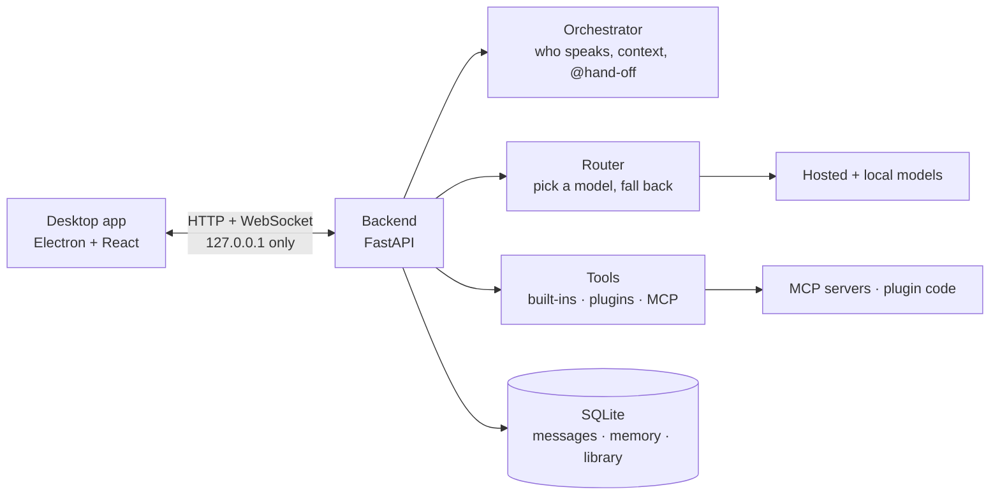
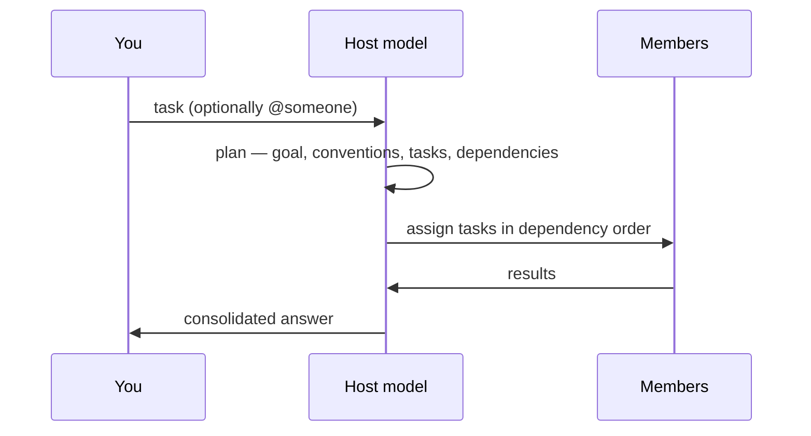

# Team Agent

[Chinese](README.zh-CN.md) · English

Team Agent puts several large language models — hosted or local — into one group chat, where they split the
work by their own strengths and hand tasks to each other with `@mentions`. A desktop workbench for office
documents, video production, writing and research.

- **Many models, one group.** Every member can be a different model. If one fails or is rate-limited the
  request falls back to the next, ending at a local model.
- **The host plans the work.** For anything non-trivial the host splits the goal into tasks with owners,
  dependencies and deliverables, then consolidates the results.
- **Tools that really run.** Tool calls use a plain text protocol, so hosted and local models both work.
- **Local knowledge and memory.** A searchable document library and memory that follows your group.
- **Stays on your machine.** The backend only listens on loopback; API keys live in the system keychain.

Interface language: **English by default**, switchable to Chinese in *Settings → Appearance → Language*.
Built-in content — the model catalog, the local-model list, strength tags and the template gallery — is
bilingual too and follows that setting. Every API accepts `?lang=zh` or an `Accept-Language` header.

## How it works


```mermaid
flowchart LR
  UI["Desktop app<br/>Electron + React"] <-->|"HTTP + WebSocket<br/>127.0.0.1 only"| API["Backend<br/>FastAPI"]
  API --> ORCH["Orchestrator<br/>who speaks, context, @hand-off"]
  API --> ROUTE["Router<br/>pick a model, fall back"]
  API --> TOOLS["Tools<br/>built-ins · plugins · MCP"]
  ROUTE --> MODELS["Hosted + local models"]
  TOOLS --> EXT["MCP servers · plugin code"]
  API --> DB[("SQLite<br/>messages · memory · library")]
```

One turn:


```mermaid
sequenceDiagram
  participant U as You
  participant H as Host model
  participant M as Members
  U->>H: task (optionally @someone)
  H->>H: plan — goal, conventions, tasks, dependencies
  H->>M: assign tasks in dependency order
  M->>H: results
  H->>U: consolidated answer
```

## Quick start

```bash
scripts/dev-setup.sh            # create the venv, install backend and frontend dependencies
scripts/setup_local_model.sh    # optional: install Ollama and pull a local fallback model
cd desktop && npm run dev       # start the backend and open the desktop window
```

On first launch, add an API key under *Settings → Providers* (without one everything goes to the local
model), then pick a scene or a group template on the home page and describe your task.

Browser only: `cd backend && python -m app`, then `cd desktop && npm run dev:web`, and open
<http://localhost:5173>.

## Tests

```bash
cd backend && ../.venv/bin/python -m pytest    # the whole suite, about a minute
cd desktop && npx tsc --noEmit                 # front-end types
python3 scripts/check-i18n.py                  # run from the repo root: dictionary gaps + frozen language
```

One test is **skipped by default**: `test_real_keychain_round_trip`. It writes a single item to your
real login keychain (service `team-agent`, account `selftest:roundtrip`), reads it back and deletes it
again, so an ordinary test run never touches your credentials. To run it as well:

```bash
cd backend
TEAM_AGENT_KEYCHAIN_TEST=1 ../.venv/bin/python -m pytest tests/test_compliance.py::test_real_keychain_round_trip
```

Every other test uses an in-memory fake keychain — `tests/conftest.py` sets `TEAM_AGENT_NO_KEYCHAIN=1`
to keep it that way, and removing that variable is what makes the real keychain reachable.

## Features

| Area | What you get |
| --- | --- |
| Group chat | Members, a host, `@`-hand-off, role statements, and a live task board; a group chat is created by **picking its workspace and then its members**, and both stay editable |
| Generating members | A video or image model can join a group as a member of its own: **discuss the clip with everybody, then say "make that"** — a chat model reads the conversation into one prompt and hands it over, and the result comes back as a file. It does not chat, plan or hand off itself |
| Reading a reference | `study_video`: a link or a local file, measured by ffmpeg (aspect, length, every cut and its timing, audio level), transcribed on this machine and looked at frame by frame; it leaves a `参考风格-….md` brief in the workspace and in the group's knowledge base. **The form is reused; the material is not** |
| Making a film | A clip is seconds and a film is minutes, so the shots are **joined by a built-in tool every member has**: `assemble_video` records the narration with the machine's own voice, draws the subtitles in (this `ffmpeg` has no `drawtext`, so they are drawn with Pillow and overlaid), and writes a `.mp4` plus a `.srt` and an editable shot sheet. Local, free, and it says what it could not do |
| Delivering the file | `write_document` turns a finished draft into the file the user opens — `.docx` (Word), `.pptx` (slides), `.xlsx` (a workbook) or `.md` — written into the group's workspace and indexed into its library in the same turn. One Markdown-ish body works in all four formats (`#`/`##` headings, `- ` bullets, `1. ` steps, `| a | b |` tables); in `.pptx` each `##` is a slide and in `.xlsx` each `##` is a sheet. It lays out text — it does not write or check it — and a task whose deliverable names a file is **checked against the workspace**, so "the report is written" and "there is a report.docx" stop being two different things |
| Files | Any file can be attached (screenshot, PDF, Word, Excel, PowerPoint, video, archive); documents are read on this machine, pictures and video frames are looked at or described; `@file:` / `@dir:` / `@msg:` / `@doc:` references with autocomplete |
| Checking a picture or a recording | Before a picture, a clip or a narration is signed off, a member **looks at it** (`review_picture` — several frames in one pass with `paths`, a frame of a clip at a given second) or **listens to it** (`review_audio` — a window of a long recording, not the whole thing). A look is remembered for the whole group, so the second member to ask the same question pays nothing; the file itself comes back with the answer, so you can look at it yourself instead of reading a description of it |
| A project's folder, and what it is doing | Each project in the sidebar shows the folder it works in — **the same directory the chat's workspace panel lists**, resolved once in the backend — with the name that identifies it (its own name when you picked the directory, the group's name when the app manages one), one click to open it in the Finder, and a rename that is only offered for a folder that is yours. Underneath sits the task that project is on: **what is running now**, else what is next, else what it just finished. Emptying the folder moves it to the Trash — never a delete |
| A reply, and what you can do with it | Under every member's message: **copy**, **judge** (good / not good, with a note), **forward** to another group, **read aloud** on this machine, and **quote** — the whole message or just the passage you selected. Judgements land in the feedback panel, per member, with both counts: nothing about a member changes by itself |
| Templates from your own groups | Any group you have run can be kept as a template — its members, host, skills and prompt — and it comes back with them in one click. Saved templates are listed **first**, newest first, on the home screen and in the template gallery || Watching the process | A built-in **process engineer** is kept in **every group and is invisible in all of them**: not in the member list, not `@`-mentionable, never a turn, never the host. After each round it records the defects a program can *measure* — a task marked done whose file is not on disk, a task whose every tool call failed, a plan nobody could use, the same call failing twice — into that group's `process-log.md`, counting a repeat (`seen ×N`) instead of writing it twice; one short call to a model that is **not a member** then adds the likely cause and a concrete fix, and never overwrites a cause written by hand. The watcher itself appears only in Settings → General, where its switches and everything it has recorded are shown. Visible members still have `process_log` (measure, record, move an entry `open → fixed → verified`, and only a re-run makes something verified) and `ask_advisor` (a narrow question to the codex / Claude Code on this machine, **read-only and inside the group's workspace**, each call approved by the user); and the panel's **Review the flow** button hands what is still open to the coding agents on this machine — WorkBuddy's own bundled engine and `codex` — **with write access to that group's own workspace**, both sent at once and neither waiting for the other, where the press itself is the whole approval |
| Workspace | Every group has one, and it can be **a project folder of your own** (picked when the group is made, changeable later) rather than one the app manages; each task delivers into its own folder, and the panel lists and downloads what is in there |
| Planning | Automatic / always / never, per group; plans are validated before they run |
| Models | Built-in catalog plus live listings, strength-based selection, routing chain, automatic fallback, health indicator per model |
| Tools | Text-protocol calls (max 3 per reply), eighteen built-ins, Python plugins, MCP over stdio / SSE / HTTP. Each call is **labelled with what it is doing** — a verb plus the command, file or query it acts on — instead of the bare tool name, and a call that is still running **shows its output as it is printed**, with the elapsed time ticking beside it |
| Seeing the work | The **working behind a reply** is shown above it and folds away once the answer is there: a reasoning model's train of thought, or the plan a command-line engine writes before acting on it. It is stored with the message, so it can be read again later; a model that does not reason gets no empty block |
| How it reads | No speech bubbles: avatar, name and text sit directly in the middle column, so a reply is as wide as the column and a paragraph does not wrap into a tower beside an empty half-window |
| Library | txt, md, csv, json, html, pdf, docx, xlsx, pptx → chunks → BM25 search (CJK-aware); per-group scope; `#document` references; **the pictures a note came with**, reachable by document. A real library is thousands of documents, so it is **read one page at a time and classified** three ways — where each document came from, what kind of file it is, and **what the material is for** — each class with its own count; filter by title or file name, or open a class as a list |
| A skill pile that reads as a list | Material the app fetched for itself carries a **category in its own words** (`camera work`, `storyboard`, `performance`, `ads`, `director style`, …) — a hundred-odd skills off one platform arrive as twelve short lists instead of one grey pile. Read off the name, then the platform's own tags, then the opening of the body; a document whose words say nothing stays **unclassified** rather than being guessed into a bucket |
| Memory | Global / group / member × preference, fact, decision, lesson, playbook; auto-extraction; two-way Obsidian sync |
| Prompts | Editable global system prompt, a prompt library, per-group prompts, `{{variables}}` |
| Template gallery | 81 ready-made teams, roles, skills, prompts and MCP recipes, installed in one click; bring your own as JSON |
| Local models | Curated catalog, hardware fit estimate, discovery of new model versions |
| External agents | Run a command-line agent as a group member, at read-only / edit / full permission, off by default |
| Data | Backup and restore, chat export to Markdown, usage statistics |

## Security

- The backend listens on `127.0.0.1` only, and every request has to carry a token generated at startup.
- The window (Electron's renderer) runs under a strict CSP: no remote scripts or styles, and only
  the local API is reachable. Pictures and clips are shown from `blob:` URLs — the bytes are fetched
  with the app token first — so `blob:` is allowed for those two media types. Dropping it silently
  turns every image and every clip into something that cannot load.
- API keys and the GitHub token are kept in the **system keychain**; the database holds only a reference.
  Separate data directories use separate keychain namespaces, so a test profile cannot overwrite
  or clear the normal installation's credentials.
- Backups, exports and API responses never contain plaintext keys.
- **No automatic outbound calls**: update checks are off by default.
- A "block hosted models" switch stops every hosted request, including update checks and remote MCP.
- Plugins and MCP servers run code with your privileges. Enable only what you trust.
- **Hooks** are your own code too. They run in a subprocess with a trimmed environment (no app
  token, no inherited API keys), with a timeout, off by default, and a gate can only *object* or
  *rewrite* — never grant what Permissions & control already denies.

## Hooks

*Sidebar → Tools → **Hooks***. Your own code at eight fixed points of a group chat. A hook is one
folder with two files, and it is **off until you switch it on**:

```
hooks/my-hook/HOOK.json     which events, timeout, whether it may block, which groups
hooks/my-hook/hook.py       def handle(event, payload): ...
```

| Event | Kind | What it is for |
|---|---|---|
| `round.start` / `round.end` | observer | One user message in, one answer out: log it, count it, push it somewhere |
| `agent.reply` | observer | One member finished a reply (who, which model, how long, which tools) |
| `tool.called` | observer | A tool ran: name, arguments, ok, how long, a cut-down result |
| `pre_prompt` | injector | Before a member's prompt goes out: add lines to it (`{"append": "…"}`) |
| `post_reply` | gate | Before a reply is stored: object, or rewrite it — the last moment the *record* can be kept clean |
| `pre_tool_use` | gate | Before a tool runs: object (`{"block": true, "reason": …}`) or rewrite the arguments |
| `before_send` | gate | Before text leaves this machine (chat channels): object, or replace the text |

**Templates**: *Settings → Template gallery → Hooks* ships four readable starting points
(house style, keep secrets out of the transcript, check before a message leaves the machine, audit
trail). They are installed switched off and written to `hooks/<name>/`, so they are yours to edit.

Four things are enforced rather than documented, because a hook file gets copied between machines:

- **A gate can only tighten.** Your permission settings are consulted first, and a hook has no
  vocabulary for granting anything — there is no "allow", only "object". A hook that echoes the
  whole payload back cannot turn a value it was never shown into the real one either.
- **An injector can only add.** `pre_prompt` appends; it cannot replace or remove what the app
  assembled, so a hook cannot quietly take the group's rules or memories out of the prompt. And it
  is handed who is speaking and about what — never the prompt itself.
- **It runs in a subprocess** with the trimmed environment members' code gets: no app token, no
  inherited API keys, its own process group, and a timeout that kills the group.
- **A failure is recorded, never fatal.** The reason appears on the Hooks page and in
  `hook-log.jsonl` next to the data directory. By default a broken gate lets read-only tools
  through, holds back writes and outgoing messages, and lets a reply stand — dropping a reply that
  has already been written would leave the group with no answer at all.
- **It can be run once from the page** with a sample payload — installed and working are different
  claims, and the page shows the second one.

## Files, the workspace, and pictures

Every group has a workspace, created when the group is created. It is the one directory a member's
tool calls may use as their working directory, and it is where everything a group produces lands —
including one folder per task (`tasks/<task>/`), so two tasks running in one plan do not write over
each other. The workspace button in the chat header lists what is in there and downloads it.

**The column on the right has two pages.** "Members" is the group's roster; **"Outputs"** is what the
project has actually produced — every file in its workspace, newest first, grouped by the folder it
landed in, with its size and when it changed. It re-reads itself whenever the group gets a new
message, so a round's deliverables are there when the round ends rather than having to be hunted for
in the transcript. Clicking a file opens it with the system's default application (in a browser, it
downloads). The same header carries **collapse** (the chevron, which puts the column away entirely)
and **maximise** (which lets the column fill the window, taking the chat's place until you click it
again — both controls stay exactly where they were, so there is always a way back). What is listed is
read from the same endpoint the workspace panel uses, so the two cannot disagree about what is on
disk.

**Which directory that is, is yours to decide.** It is picked while the group is being created, and
can be changed afterwards from the workspace panel:

* **Pick one of your own folders** (a native folder chooser) and the members work in *your* project
  directory — the files they write appear where you keep that project, instead of being buried in
  the app's data folder. The directory has to exist already: a mistyped path is refused with the
  reason rather than turned into a stray tree on disk.
* **Pick nothing** and the app manages one for the group
  (`<data dir>/workspaces/<group id>`, with the base configurable as `code_workdir` under
  *Permissions & control*).

Two things worth being explicit about:

* **The folder you pick *is* the workspace** — no group-id subfolder is nested inside it.
* **Changing it does not move files.** What was already written stays where it was written; the
  choice only decides where future work happens.
* A picked folder that you delete is **not** recreated at startup — resurrecting it is not a call a
  startup routine should make. It comes back when something actually needs it.

**Members are picked too.** While creating a group you tick who is in it (the first one you tick
becomes the host); tick nobody and there is nothing to create. Each scene used to fill the new group
with its three stock members — now it starts empty, and the scene tab offers that lineup as a
one-click *suggestion* instead. The sample group a fresh install comes with ("Product launch group")
is still there; say the word if you want it gone too.

Attachments are any kind of file. The kind is decided by the file's own bytes, not by its name:

| Kind | What the members get |
| --- | --- |
| Documents (pdf, docx, xlsx, pptx, txt, md, csv, json, html) | The text, extracted on this machine when the file is uploaded. **No vision model is involved**, so this works with any model. When nothing can be extracted (a scanned PDF) the members are told exactly that, rather than being handed a bare filename. |
| Images | Given to the model directly when the answering member's model can see; otherwise described once by the *vision model*, and the description is what members read. With no model to describe it, **the text printed on it is read on this machine instead** (macOS's own recogniser — no model, no account, nothing sent anywhere) and that text is what members get, labelled as text and not as a description of the picture. |
| Video | Duration and resolution, plus a few evenly spaced stills (ffmpeg), treated like images. The audio track is not transcribed. |
| Audio | Transcribed on this machine when a transcriber is installed (see below). With none, named with its size and left in the workspace. |
| Anything else | Named with its size, and available in the workspace for a member to open with its own tools. |

Two switches decide where a picture may go, and they are separate on purpose: **cloud calls** under
Permissions & control (`external_calls_enabled`), and **cloud vision** (`vision_cloud`). With cloud
vision off, a picture is looked at by a local vision model if one exists, and never leaves the
machine. If no model here can look at a picture, the members are told exactly that — they say they
cannot see it instead of inventing content, and the settings page tells you what to install
(`ollama pull qwen2.5vl:3b` is a good local choice). What they are *not* left without is the words on
it: `read_image_text` reads those out here, with no model at all, and both the attachment path and the
members themselves can reach for it.

*Settings → General → Which model looks at pictures* offers **only models that can really look**. A
gateway lists its chat models and its **image generators** side by side, so `gpt-image-…` and
`gemini-…-image` read like models that *handle* images; picking one of those used to mean **no picture
in any group was ever read**. Three things now prevent that:

* a model that only makes pictures never gets the `multimodal` tag, so it is not offered as eyes at
  all — the judgement lives in one place (`media.purpose_of`, the same one that keeps generators out
  of the member roster);
* a pick that cannot look no longer turns vision off silently: the search falls through to a model
  that can, still local-first and still gated by `vision_cloud`, so a wrong pick cannot send a picture
  off the machine;
* **cloud vision is the only thing that decides whether a picture may leave the machine** — a cloud
  model chosen by hand needs that switch too. It used to be bypassed: name one cloud model once and
  every picture in every group went to that provider while the switch still read "off";
* when nothing can look, the sentence the members read **names the model** ("the model picked to look
  at pictures (X) cannot look at images...") instead of the blanket "no model here can look at
  images" — otherwise the reader stares at the model they just chose and cannot tell what to change.

**"Automatic" is not a blind choice.** The settings page writes out which model it means (the name
gets a ★) and what that implies: a local model is "pictures never leave this machine", a cloud one is
"pictures are sent to that provider". **The recommendation is the model automatic would pick** — one
rule for both, so the page can never recommend one model while the app quietly uses another. A model
its provider has **stopped listing** is neither offered nor recommended (the same judgement the model
chooser badges as "gone": `discovery.still_listed`) — an enabled, keyed, multimodal-looking model that
answers `NotFoundError` is worse as a recommendation than no recommendation.

**Speech is the one kind that needs a program rather than a model.** Nothing is bundled and nothing
is downloaded on your behalf: a whisper model is a few hundred megabytes, and fetching one silently
while somebody waits for an answer is not a decision this app gets to make. If `mlx_whisper` or
`whisper` is already on the machine it is used, and *Settings → General → Files in a group chat* lets
you name any other transcriber — `{out}` is the folder for the text and `{audio}` marks where the
file goes. The words are read once and remembered on the attachment. With nothing installed, the
members are told the audio was not read, rather than being handed a summary of something nobody
listened to. That row no longer stops at "nothing found": it prints **the install command that works
on this machine** (`mlx-whisper` on Apple silicon, `openai-whisper` elsewhere, through whichever of
`uv`/`pipx`/`pip3` is installed — those all land in `~/.local/bin`, which the app searches), and has a
*Check again* button, because installing a transcriber changes no setting at all.
Note that a transcriber is found **by name** along PATH plus `/opt/homebrew/bin`, `/usr/local/bin`,
`~/.local/bin`, `/usr/bin` and `/bin` — so `pipx install mlx-whisper` (or `pip install --user …`),
which land in `~/.local/bin`, are found as they are, while one installed inside this app's own
virtualenv is not: write the full path under *Transcribe audio* for that.

**Reading the text off a picture is the same kind of thing, and it costs nothing.** The built-in tool
`read_image_text` reads the words printed on a screenshot, an error dialog, a table, a slide or a frame
of a video, **on this machine, with no model, no account and nothing sent anywhere** — macOS ships the
recogniser that powers Preview's Live Text, so this is a small wrapper around a system framework rather
than a download. The program is judged **by its own answer** (`ocr --languages`) rather than by its
name, so some unrelated binary that happens to be called `ocr` is refused and named instead of being
read as "this picture has no text"; `TEAM_AGENT_OCR` points the app at a different one. It is **not a
substitute for looking**: it returns characters, not a description, and both the tool's own answer and
the attachment path say so in as many words — a member told "here is what the picture says" when all
that happened was a recognition pass will describe a chart from its axis labels and believe it has
understood the chart. Lines the recogniser was not sure about are **counted and named** rather than
dropped, because text that quietly disappears is the one failure nobody can see. Character recognition
**approximates punctuation** (measured on a real dialog: `--index-url` came back as `-index-url`, and
`'torch'` as `torch®`), so anything that has to be copied exactly has to come from the file itself.

Referencing something with `@` in the composer offers the group's members first, and once a
character is typed it also offers files, folders and documents, inserting a token the backend
understands. Members come on their own for an empty query on purpose: the picker is bounded in
height, and listing every file and document alongside them buried the people the `@` is for.

```
@file:reports/q3.xlsx     one file from the workspace, inlined (text clipped to the budget)
@dir:reports/             a folder listing with the first lines of each file
@msg:<id>                 an earlier message of this conversation, quoted whole
@doc:<id>                 a document from a knowledge base this group can reach
#title                    the same thing by title, the older shorthand
```

Paths are resolved inside the group's workspace and re-checked after resolving links, so a
reference cannot reach outside it. How much referenced content one prompt may carry is
`refs_budget` under Settings → General.

### A group's own material stays in the group; the library holds what you filed

A group is a workspace, and **nothing of its own enters the library by itself**. A group's
attachments, the files its members write, its working directory — all of that is read where it is
(attachments are read out when they arrive, the workspace is a directory a member can open). A
knowledge base is a shelf somebody decided to build, and a project's working files are not that.

This is a reversal, and it is worth saying why, because the join it replaces sounded reasonable. Every
group used to be handed a knowledge base the moment it existed, and before every turn the text already
read out of its attachments plus the documents in its workspace were copied into it, so that a search
would find what the group had now. The effect was a list nobody could read: this app's own database
reached **sixty-four knowledge bases, sixty of them empty, for ten projects**, and a half-finished
draft sat on the same footing as material somebody had deliberately collected. It also put a
project's work in front of every *other* project, since a group's search scope includes the shared
bases. So the copying is gone, along with the switch that controlled it (*"Keep this group's own
material in its knowledge base"*) and the per-group base that was created for it.

**Filing something still works.** Upload a document, add a note or a URL, or import a folder — into a
group's own library or the shared one — and it goes in, exactly as before. A group's first upload
creates that group's base; it is owned by that group, so a document filed in one group never becomes
readable by another.

#### Two labels, so a library can be read rather than scrolled

* **Where the material came from** is a **fact about each document**, read off the row rather than
  asked for: a folder you imported is *imported from a folder*, material the app fetched into its own
  data directory is *fetched by this app*, a bare name came in through a form, a URL is a *web page*,
  `attachment:`/`workspace:` keys are a group's own, and nothing at all was typed here.
* **What a base is for** is a **heading the user chooses**. Five are suggested — project material,
  reference, methods & craft, data & tables, writing material — and anything can be typed instead,
  because the headings a person keeps are theirs.

The shelf is **grouped by heading**, and the word for where a base's material came from sits on each
row **together with the breakdown behind it** — a base that holds an imported folder *and* 114 notes
fetched from a website is `mixed`, and it says "imported 6029 · fetched 114" rather than leaving the
adjective standing on its own. A base belonging to a project is grouped under *project material* and
**collapsed by default**: that is the part of a library which used to grow on its own, so it is the
part that gets out of the way.

The origin word is derived when the list is read, not stored — a value written once would go stale the
moment a document was added, and a stale label is worse than none because it is exactly the thing a
user would trust. Opening its editor is how you disagree with the derivation, and *automatic* is how
you change your mind back.

One kind of material still cannot read itself: a document is read when it arrives, but a **picture has
to be looked at**, and a picture nobody has looked at cannot be handed to a model. Doing that on a
timer would spend money without being asked, so the panel shows the count and offers a button —
*"N pictures have never been looked at → Describe them"* — describing a bounded batch per press (12 by
default, at most 50) and caching each description on the attachment, so the next member shown that
picture reads the same description instead of paying for another look.

And when a search still comes back empty, the member is told **what this group can search**: the
document titles it can reach, plus the note that the knowledge base may be in another language than
the conversation. That is the difference between a dead end and a next step — a word index matches
words, and a question asked in Chinese shares none with an English document, which is the usual shape
of a library here (atlases, papers, manuals).

And when a search still comes back empty, the member is told **what this group can search**: the
document titles it can reach, plus the note that the knowledge base may be in another language than
the conversation. That is the difference between a dead end and a next step — a word index matches
words, and a question asked in Chinese shares none with an English document, which is the usual shape
of a library here (atlases, papers, manuals).

### Searching by meaning, not only by word

A knowledge base is searched twice and the two rankings are merged.

**Keywords** (BM25, over bigrams for Chinese) stay. They are better than anything else at an exact
identifier — `MHT ILT`, a drug name, a catalogue number — and the vector half is weaker there.

**Meaning** is added by an embedding model, and it is what makes a paraphrase or another language
reachable at all. On this vault's neuroangiography notes, with keywords alone:

| Query | keywords only | with vectors |
|---|---|---|
| `pulsatile tinnitus diagnosis` | the right page | the right page |
| `Moyamoya revascularization` | **wrong page** (ophthalmic artery) | the revascularisation page |
| `大脑中动脉分叉部动脉瘤怎么处理` | **nothing** | the MCA aneurysm page |
| `颈动脉狭窄 支架还是开刀` | **nothing** | pages on carotid and intracranial stenosis |

The two rankings are merged by **position, not by score** (`textindex.rrf`): a BM25 score is
unbounded and means nothing outside its own corpus, a cosine lives in [-1, 1], and adding them
invents a conversion nobody can justify. So a document found by both retrievers outranks one that
either found alone, and the head of the result is what to trust — `score` and `sim` are the two
inputs, not the answer.

Two things this deliberately does *not* hide.

**One passage per document.** A note in a real vault averages seventeen passages, so the best
twenty-four passages are one or two notes — and a five-line answer made of five passages of the same
page has answered once. Both retrievers are reduced to the best passage per document before they are
merged, which also reaches further: a page whose best passage ranks 214th overall is around the
thirtieth *document*, and the head of a passage list never sees it.

**The model is the limit, and its cross-language alignment is uneven.** Measured on this library
(`BAAI/bge-m3`), term by term:

| Chinese | English | cosine |
|---|---|---|
| 搏动性耳鸣 | pulsatile tinnitus | 0.634 |
| 脑血管痉挛 | vasospasm | **0.431** |
| 脑血管痉挛 | cerebral vasospasm | 0.587 |
| 蛛网膜下腔出血 | subarachnoid haemorrhage | 0.509 |

`脑血管痉挛` sits closer to an unrelated English phrase (0.538) than to its own translation (0.431),
and no re-ranking can invent a signal that is not there. What does work is measured, not guessed:

| Query | where the vasospasm page lands |
|---|---|
| `蛛网膜下腔出血 脑血管痉挛` | not in the top 5 |
| `蛛网膜下腔出血后脑血管痉挛的防治` (longer, still Chinese) | not in the top 5 |
| `脑血管痉挛 angioplasty` (one English term in the same query) | **#1** |
| `cerebral vasospasm after aneurysmal subarachnoid haemorrhage` | **#1** |

So the advice written into the `library_search` description, the fallback message and the expert
prompts is not "translate the question" but **"put the library's word for it into the same query"** —
and the member is told to search again before concluding the library has nothing.

#### Where the model runs, and why it is not in this process

`scripts/embed-server.py` serves an OpenAI-compatible `/v1/embeddings` on `127.0.0.1:8799`, and
`backend/app/embed.py` is its client. It has to be a separate process: this app's own virtualenv is
**x86_64 under Rosetta on Python 3.14**, and neither torch nor onnxruntime publishes wheels for that,
while the native arm64 interpreter beside it can run the model on Metal. Measured here: **12.5 s** to
load, **~90 passages/s** to embed, 1024 dimensions, 8192-token context.

```bash
# once: the environment that can run the model
uv venv --python 3.12 .venv-embed && uv pip install --python .venv-embed/bin/python sentence-transformers
# once: the weights (huggingface.co is unreachable from some networks; the mirror works — and
# huggingface_hub 1.x otherwise tries its Xet backend, which the mirror answers with a 401)
HF_ENDPOINT=https://hf-mirror.com HF_HUB_DISABLE_XET=1 \
  .venv-embed/bin/python scripts/embed-server.py --allow-download
# then, whenever the library should be searchable by meaning:
TEAM_AGENT_DATA=... .venv/bin/python scripts/ingest-vault.py --only <root>
```

Four rules it follows, each of them about not lying to the person searching:

* **Nothing downloads by itself.** A server started without `--allow-download` reports a missing model
  with the command that would fetch it. Fetching 2 GB because somebody typed a query is not a search.
* **"Up" and "ready" are different answers.** `/health` replies immediately while the model is still
  loading, and a 4xx is reported as the configuration problem it is instead of a state to wait out.
* **A search never starts a model.** Retrieval with no server falls back to keywords and says so; a
  mixture that quietly became keywords-only reads exactly like a library with nothing to say.
* **Vectors from another model are left out, not mixed in.** They are not comparable, and averaging
  them answers confidently and wrongly. The document records which model made its vectors, so
  re-indexing is a decision rather than a guess.

All of that is on **Settings → Library**, above the document list, because "can these documents be
found by meaning or only by the words in them" is a property of the pile the page is showing. The
card has the switch, the model and address, the coverage (`N of M passages have vectors`), a *Start
it* button, *Index a first 1000 passages* / *Continue indexing* / *Index everything*, and *Drop the
vectors* for re-indexing with another model. Whatever is missing is named with the command that
fixes it, printed in full — the two commands above are what it shows.

#### Putting a collection in: `scripts/ingest-vault.py`

It reads a whitelist (`~/.team-agent/vault-whitelist.json`) rather than a folder, because a real
vault is a mixture: the notes worth indexing, books nobody needs, and a few hundred gigabytes of
other things. Each entry carries the reason it is there, so "why can I not find this book" has an
answer that is written down. `--tier tier1,tier2,tier3` picks which layers to take — markdown trees,
named PDFs, and the scans (which need OCR and are therefore opt-in).

Four things it does that are worth knowing, all of them about not being quiet:

* **A scanned PDF is named, not skipped.** It comes back with its page count in the report — `! 1
  file has no text layer (713 pages), which needs OCR to enter the index` — because "this book is
  not in the library" and "this book is in the library and says nothing about your question" are
  different answers, and only one of them is honest.
* **A text layer that extracts as static is refused.** A PDF whose fonts lack an encoding comes out
  as replacement characters, and that sort of text indexes and retrieves *exactly as confidently as
  prose* — a library full of it is worse than one missing the book, since nothing in a search result
  would look wrong. Measured before it goes in; refused above 1%.
* **A book longer than the library's own limit is cut on page boundaries**, and each part becomes its
  own document titled with its page range. Cutting at character offsets would be easier and would
  let a passage name a page it is not on; refusing the whole book would keep a 1343-page textbook out
  of the index entirely. Measured on this vault: the largest book is 2.76 M characters, just under
  the limit, so the cut did not fire — it exists for the next one.
* **Identity is the file's path, not its title.** Two notes may share a title; matching on the title
  then finds the wrong one, and the consequence is a *second copy on every run* — this vault had 28
  notes duplicated that way, which showed up as the same page three times in a search result and
  looked like bad ranking. Re-running is a replace, and leftovers from an older shape (a book that
  used to be cut into five parts and is now four) are removed.

Measured on this vault, one pass: **5956 notes + 12 books** (3,977 pages of PDF, 9.8 M characters)
→ **96,341 passages**, text in 98 s and vectors in about an hour on Metal.

## Making video: bringing mature video tools in

The sections above are about this app *generating* video itself (`generate_video`, and the four
dialects behind it). This one is the other half: **wiring in video tools that already exist**. Their
shapes differ a lot, so where each one goes differs too — putting them all in the provider list
would only get each of them half right.

| Tool | Shape | Where it goes | Cost / prerequisite |
|---|---|---|---|
| **Remotion** | a local npm command line (`npx remotion render`) | built-in skill *Video as code (Remotion)* | Node.js 22+. The first project installs dependencies and downloads a headless browser (a few hundred megabytes), which can outlast one `run_code` call |
| **HyperFrames** (HeyGen's open-source framework) | a local npm command line (`npx hyperframes render`) | built-in skill *HTML to video (HyperFrames)* | Node.js 22+ and `ffmpeg`. Its **cloud rendering API** is not wired up here (it needs a key and bills per minute of output) |
| **Voicebox** | a desktop app on this machine, **serving MCP** over HTTP | Template gallery → MCP → *Voicebox (voice on this machine)* | Install and start Voicebox first; its MCP server listens on `127.0.0.1:17493`. Speaking comes out of your speakers |
| **HeyGen** | stdio MCP (`uvx heygen-mcp`) | Template gallery → MCP → *HeyGen (avatar video)* | Needs an API key from your HeyGen account; rendering happens on their servers and **is billed to that account** |
| **ChatCut** | a **hosted** HTTP MCP with a Bearer header | Template gallery → MCP → *ChatCut (edit video by describing it)* | You obtain the token yourself with their sign-in flow; it is short-lived (about an hour), so **a 401 later usually means refreshing it, not a wrong key** |
| **DaVinci Resolve** | stdio MCP (`uvx --python 3.11 --with 'mcp<2' davinci-resolve-mcp`) | Template gallery → MCP → *DaVinci Resolve (cut on a real timeline)* | Needs **Resolve Studio** (the free version exposes no scripting API), external scripting set to Local, and **Resolve open before you press test**. The `--python 3.11` and `mcp<2` pins are not optional: without either one the server dies at import |
| **Jianying / CapCut** | no installable MCP exists — the code route: `uv run --with pyJianYingDraft` | built-in skill *Jianying (CapCut) drafts* | It writes Jianying's own draft files, so the **draft folder has to be asked for** — write it anywhere else and the user opens Jianying and sees nothing |
| **ComfyUI** | a **local HTTP API** (`/prompt` → `/history/{id}` → `/view`) | Model providers → the *ComfyUI (local video)* preset, and a video-generation provider like any other | A ComfyUI you run yourself, **a video checkpoint installed**, and the workflow's file names matching what you have. Nothing is billed; a five-second clip took about eight minutes on an M-series Mac |

### Where a picture may come from

A generated clip is 4-30 seconds, while the explainer a group is actually making runs for minutes.
The step between the two is not generation, so it is not a provider, and it is not something to leave
to each member's own `ffmpeg` command line either — twelve of those agree about nothing. It is a
**built-in tool every member already has**: `assemble_video`. It needs nothing on this machine except
`ffmpeg` — no key, no account, no per-group setup, nothing billed however many times it runs — and it
joins the shots, records the narration, and puts the words on screen.

**But which pictures go into it is a separate decision, and the one that decides whether the film is
worth anything.** A picture falls into one of three grades, and the grade decides where it may come from:

| Grade | What it is | Where it may come from |
|---|---|---|
| **A — real imagery** | an angiogram, an anatomical plate, an intra-operative photograph, a recording of the procedure | the real thing, and nothing else. This is the only legitimate source for anatomy, a lesion, an instrument, or a step of a procedure |
| **B — real imagery with marks** | the same picture with an arrow, a circle, a magnified inset, a structure named, or a before/after wipe | the real picture, marked here (`make_figure`) |
| **C — explanatory graphics** | flow arrows, title cards, charts, flat shapes, a schematic of a vessel and a bulge | drawn here (`make_figure` with `schematic`), or generated — *because they make no claim about how anything looks* |

Asking a text-to-video model for a realistic artery is asking it to guess: it has no anatomy, only
the metaphor in the prompt, so "a weak spot bulging on a wall" comes back as whatever shape it felt
like. That is how a medical film ends up embarrassing, and it is not something assembly can repair —
assembly joins what it is given. **Measured on this very pipeline**: four clips were generated from
text alone, with no reference picture at all, from prompts about "a translucent blue pipe with a bulge
in its wall". None of them is an aneurysm.

So the work order is: **look for the real thing first** (`list_figures` prints the pictures that came
with a document — a knowledge base imported from notes or an atlas usually has hundreds, already
correct and already captioned), **decide how each shot moves**, **make the frame that will be looked
at**, and only then render. A still can be read and rejected; a rendered clip cannot. Skipping that
gate is how a wrong picture survives to a finished film.

Two tools carry it:

* **`list_figures`** — the real pictures and recordings one of this group's documents came with. A
  note is read for its `![[...]]` embeds, each resolved against the note's own folder and refused
  unless it lands on a real file there, and the note's recorded `source` comes back with them. When a
  document has none, the answer says so *and* names the documents that do.
* **`make_figure`** — one teaching picture from exactly one of: a picture in the workspace, a
  document's own figure, or a schematic drawn here. Arrows, circles, structure labels and magnified
  insets go on top; every frame gets a heading, a caption, and a **credit line**. Marks are placed by
  naming a part (`at_part: "sac"`) rather than by guessing a fraction — the drawing knows where its own
  parts are and hands those positions back, because a mark placed from a guess points somewhere else.
  A schematic also says on the frame that it is a drawing.

### The style comes off the material, and every still is placed by it (`app/visual.py`)

The grade above decides *whether* a picture may be used. This decides *how it gets in*, and it exists
because a finished film was measured and the numbers were worse than the impression. One 300-second
science film, 30 pictures:

| Measured on the finished film | |
|---|---|
| pictures that were not the film's shape | **12 of 30** — the worst was 2210x584 against a 0.5625 frame, off by a factor of nearly seven |
| distinct backgrounds | **9** — `#081828`, `#F8F8F8`, `#D8D8D8`, … |
| spread in how many colours each used | **14x** (121 to 1706) — flat line art next to a rendered 3D illustration |
| the 15 pictures this app drew itself | **identical to each other**: same background, colour spread within 7/255 |

So the drawing code was never the problem. The problem was that a mixed pile of pictures was placed
into the frame one at a time with nobody deciding, and nine of those backgrounds are not a matter of
taste — they are what "stretched sideways screenshot" looks like from the inside.

Now the material a group hands over **is** the brief, and it is read rather than asked about:

* **`profile()`** measures the set — the background they share, the palette they are drawn in, how
  heavy the lines are, and how much of the set actually agrees. `agreement` and `split` name the
  pictures that do not belong, which is the useful half: on this film it named all 8 of them.
* **`admit()`** then decides each picture's placement from two measurements, not from taste. Within
  4% of the frame's aspect → it **fills** the frame. A drawing (`coverage` ≥ 0.65, measured in an
  empty gap between 0.73–0.80 for line art and 0.40–0.53 for web diagrams) → it is **drawn again**:
  structure kept, the film's one palette, the film's one background. Any other real picture →
  **framed whole** with a heading and its source line.
* **`redraw()`** is the drawing-again: the picture's own background is dropped, its colours are
  matched to the film's palette, and ink and paper trade places in HSV when the film is darker than
  the material was. Never cropped, never stretched.
* **`assemble_video` runs this by itself**, before a single frame is encoded, and writes the
  measurements beside the film as `style.json` — so a re-cut months later is the same film.

⚠️ **A real picture is never re-drawn.** Measured, on real material: 496–716 colours in, **6–7 out**
(71–102x), 9 distinct backgrounds → **1** for everything the gate placed, and an offline OCR re-read
of the output keeps **98–100% of the labels** — which is the evidence that the structure and the
contrast survived, since nobody working here can watch the film. But re-drawing a photograph produces
a posterised picture that claims to be real, and on an angiogram that is fabrication. Those are
framed, and the numbers above are the coverage threshold's job: **one of the 0.42s is somebody's
angiogram.**

To see what the assembler is about to do, before it does it:

```sh
python3 scripts/lint-figures.py ~/.team-agent/workspaces/<id> --size 1080x1920
python3 scripts/lint-figures.py <folder> --json > figures.json   # for a pipeline; exit 1 = act on it
```

**What is not done**: a photograph's own look is not restyled — that needs the structure-locked
generative route (SDXL + ControlNet + IP-Adapter), which is not wired up here. And the app's own
cards and animations still draw on `figure.DRAWING_BG` (#0B1422) while plates use `figure.INK`
(#0C1016) — a 4/255 difference nobody can see, but it is two backgrounds where there should be one.

### Read someone else's film before making your own (`study_video`)

"Make one like this" is not an instruction that can be executed as written. So there is a tool for the step
in between: **`study_video`**. Give it a link (YouTube, Bilibili, Douyin — anything `yt-dlp` knows) or a video
file in the workspace, and it will

1. **measure the file with ffmpeg** — length, frame size and aspect, frame rate, *every cut and when it
   happens* (rhythm is counted, not described), and the audio's mean and peak level (which is what tells
   narration from a music bed from near-silence);
2. **listen** — the speech is transcribed on this machine, and if no transcriber is installed it says
   "not heard" rather than inventing narration;
3. **look** — frames are sampled across the film and described one by one by a model that can see: where the
   text sits and how big, the palette, the framing, whether it is footage, a drawing, an animation or a
   screen recording, and which frames share a look and which change;
4. **write it up as a brief** at `参考风格-<title>.md` in the workspace, and into the group's knowledge base
   under the same name — so **the whole group can search it**, instead of one member holding it in context.

The brief has a fixed shape: format / shot list / on-screen text / sound / what makes it recognisable /
**what must be made fresh**. That last section is not optional: **the form may be reused — aspect, pacing,
caption placement, framing — and the reference's own footage, music and people may not.** The line travels
with the brief, so the next member does not read it as "copy this".

One built-in skill, "Work from a reference instead of from memory", fixes the order: study first → write the
storyboard against the brief's numbers (a brief that says a cut every 1.8s means shots of about 1.8s) → make
each shot fresh → assemble → look at frames, hear the audio, compare the finished film with the brief's
numbers — and only then call it done.

**What it cannot do** (each of these is reported rather than worked around): links that need a sign-in,
a membership or a region; a machine without `yt-dlp` (it names the install command — local files still work);
nothing that can look at a picture (the missing piece is named); and it reads the first ten minutes of a
film, not all of it. It is not an editor either: what it produces is a written spec, not a copy.

#### Every shot has to move — a film of stills is a slide show

What makes an assembled film feel like a slide show is not the length of the clips; it is that nothing
*inside* the frame moves. Blood does not flow, the bulge is already there in the first frame, the coil
arrives fully wound — and none of it shows the mechanism the narration is describing. So every shot is
given a way to move, and the choice is made in this order:

1. **Real motion** — a recording of the procedure, or a run of angiographic frames. For anatomy, a
   lesion, an instrument or a step, this is the only honest source of motion there is.
2. **Computed motion** — `make_animation`, or a shot's `anim`. The app draws every frame itself, so
   the anatomy is the drawing the stills use and nothing is invented:

   | animation | what it shows |
   |---|---|
   | `blood_flow` | blood travelling along the vessel, past the sac |
   | `aneurysm_grow` | a weak spot bulging out into the sac, with a dashed outline of where the wall was |
   | `coil_fill` | the coil being wound in, loops filling the sac, the feeding wire visible from the catheter tip |
   | `catheter_advance` | the microcatheter travelling the lumen and turning into the sac |
   | `contrast_fill` | contrast running up the vessel and opacifying the finding |

   It costs nothing and it is **deterministic** — the same shot gives the same frames, so "make the
   coil slower" is a number to turn rather than a re-roll. And a still is simply **the last frame of
   the same drawing**: `make_figure` and `make_animation` are one vocabulary, not two, so the frame a
   reviewer approved is a frame of the film that follows.
3. **A still that has been looked at** — a title card, a chart, a real picture with marks on it. Held
   with nothing but a slow push, and only when the shot genuinely has no mechanism to show.
4. **Generated motion** — image-to-video **from a real first frame**, once that frame has been looked
   at. Text-to-video stays limited to C-grade graphics, for the reason above.

`assemble_video` takes either a file (`clip`) or an animation (`anim`) for a shot, and an animated shot
is **drawn at the length its narration needs** — the motion spreads over the time the line really takes
instead of being stretched to fit. It also counts what moved: the answer says how many shots were drawn
here, how many were real footage, and how many were held still — and if **every** shot was a still, it
says the film is a slide show rather than leaving you to find out after rendering.

`assemble_video` then asks each shot for its `credit` — where that picture came from and under what
terms — writes it into the shot sheet, and names the shots that have none. A film that cannot answer
that question is one nobody may publish, and the question always arrives after the work is done.

> **On the material itself.** An atlas or somebody's case collection is fine to check your own work
> against, and fine to learn from. Putting it into a published film is a permission question, not a
> technical one: the notes record a source URL and no licence, so the credit line is where that gets
> settled — by you, deliberately, rather than by accident.

### Assembling the shots into one film

A generated clip is 4-30 seconds, while the explainer a group is actually making runs for minutes.
The step between the two is not generation, so it is not a provider, and it is not something to leave
to each member's own `ffmpeg` command line either — twelve of those agree about nothing. It is a
**built-in tool every member already has**: `assemble_video`. It needs nothing on this machine except
`ffmpeg` — no key, no account, no per-group setup, nothing billed however many times it runs — and it
joins the shots, records the narration, and puts the words on screen.

How it works was measured here rather than assumed, because two of the three obvious routes turn out
to be closed on this machine:

* **Subtitles cannot be burned in with a filter.** This build of `ffmpeg` has **no `drawtext`, no
  `subtitles` and no `ass`** — it is compiled without freetype and without libass, whatever the
  tutorials say. So every line is drawn to a transparent PNG with Pillow (wrapped, a font that has
  the characters, a drop shadow, a plate behind it) and laid over the picture with `overlay`, which
  this build does have. The `.srt` is written as well, from the same plan that timed the film, so
  the sidecar and the burned-in text cannot disagree.
* **The narration is `say`.** macOS's own speech reads Chinese (`Tingting`) and English offline, so
  a film can be *timed* before anything is rendered, and no key or bill is involved. It is a
  **preview voice, not a studio one**, and the tool's answer and the shot sheet both say so: a group
  must not present a synthesised read-through as a finished dub.
* **Footage of the wrong shape is not quietly cropped.** A 16:9 clip in a 9:16 film is normally
  inset over a blurred copy of *itself* (`fit: "blur"`, the default). `cover` fills the frame by
  cutting the sides off — measured on the group's own clip, that removes one of the two vessels and
  a third of the frame's own caption — and `contain` leaves black bars. It is one word per film, or
  per shot.
* **A shot's length follows its narration.** A shot asked to run 5 seconds whose line really takes
  6.7 is lengthened and told about it — a sentence cut off mid-way is the most obvious way an
  assembled film looks broken. A `total_seconds` target is met by holding the stills and title cards
  longer (the answer says by how much), and when there is no still to hold, the shortfall is reported
  instead of faked. Nothing is ever dropped to hit a length, because that would delete work the group
  agreed on.
* **The result is three files, not one.** The `.mp4`, a `.srt`, and a shot sheet listing every shot
  with its source, its length and its words. The sheet is the artefact the group edits before
  assembling again — which is what makes a second cut cheap.

Where the heavier tools fit, once the cut is a real cut:

| What the film needs | Where it goes |
|---|---|
| several generated shots, narration, subtitles, a stated length | `assemble_video` — local, free, every member has it |
| animated charts, kinetic type, a design that has to move | Remotion or HyperFrames, through `run_code` (Node 22+) |
| real dubbing, colour, frame-accurate editing | hand it to a person: a Jianying draft, or DaVinci Resolve / ChatCut over MCP |

Two things it deliberately does *not* do, both visible in the group panel: it never describes what
the film looks like (nobody involved can watch it), and it never claims a film is finished — a
generated picture with a synthesised voice is a rough cut, and saying so is part of the deliverable.
A member is only offered the tool when `ffmpeg` is really there; otherwise the panel says what to
install instead of handing someone a tool that fails. The budget it runs under is its own setting
(**Permissions & control → Assembly timeout**), because a three-minute vertical film is thousands of
frames.

Three rules, the same ones the rest of this app follows:

* **The two local routes are skills, not providers.** A skill is plain text written for the model to
  read and **executes nothing by itself**. What actually runs is `run_code`: the member builds a
  project in the group workspace, writes the composition, runs the render command, and the result
  lands in the workspace — which is how it becomes a file in the chat. So the video skills only work
  once **Permissions & control → Let members write and run code** is on (it is off by default), and
  `run_code` is an execution-class tool, so **by default you are asked before every call**.
* ⚠️ **A render takes minutes, while `code_timeout` defaults to 60 seconds and stops at 600.**
  Both skills say so, and require the member to **say it out loud** when the timeout cuts the run
  short and ask for a longer budget, rather than quietly lowering the quality or dropping frames to
  fit. Install the dependencies once in a terminal first; that is the step most likely to time out.
* **MCP entries are imported disabled**, this app will not enable one for you, and it will not fill
  in a key for you (a key you paste in goes to the keychain, not to the database in the clear).
* **A member cannot watch the result.** Both skills require it to say what it composed and which
  command it ran, and forbid describing the picture.

> ChatCut Desktop registers its own **local** MCP server with the agents it detects — Claude Code
> and Codex among them. Those config files are already readable here: pick the matching source under
> *Settings → Importing from other AI apps* and you never have to know the address.

## The everyday services, over MCP

Template gallery → MCP carries this family too. **Every address in it was contacted before it was
written down**: a wrong one is not a broken template, it is one that looks fine and can never work,
and it tells you so one opaque failure at a time.

| Service | Shape | What you have to supply |
|---|---|---|
| **Playwright** (browser automation) | local `npx` (`@playwright/mcp@latest`) | nothing. It is an execution-class tool, so you are asked before each call; the browser may need downloading on first use |
| **Context7** (current library docs) | hosted HTTP, **no credential** | nothing at all — verified against the live endpoint. Add `Authorization: Bearer <key>` yourself only if the shared rate limit becomes a problem |
| **GitHub** | hosted HTTP + `Authorization` | a PAT written as `Bearer ghp_…`. **Its scopes are what a member can then do**, so start read-only |
| **Supabase** | hosted HTTP + `Authorization` | the address already asks for `read_only=true` — **keep it**, this server can write; add `&project_ref=<ref>` to scope it; the token goes in as `Bearer sbp_…` |
| **Sentry** | hosted HTTP + `Authorization` | a user token written as **`Sentry-Bearer sntrys_…`** — deliberately not a plain `Bearer`, which Sentry reserves for OAuth tokens |
| **Figma** (the design itself) | **local** `http://127.0.0.1:3845/mcp` | no account and nothing leaves the machine, but the Figma desktop app has to be running with its local MCP server switched on, and it needs a Dev or Full seat on a paid plan |
| **Vercel** (deployments and logs) | `npx -y mcp-remote https://mcp.vercel.com` | one browser sign-in. Read-only server (and during its beta Vercel keeps an allowlist of clients) |
| **Linear** (issues and projects) | `npx -y mcp-remote https://mcp.linear.app/mcp/readonly` | one browser sign-in. The address ends in `/readonly`; drop the suffix for write access |

Three rules, the same as everywhere else here — but worth repeating at this spot:

* **Everything is imported disabled.** This app will not enable one for you and will not fill in a key
  for you (a key you paste in goes to the keychain, not to the database in the clear).
* **For the OAuth ones (Vercel, Linear) the first Test will very likely time out** — that is the
  browser page still being open. The token is cached in `~/.mcp-auth` afterwards, so pressing the same
  button again connects. If it keeps failing, run `npx -y mcp-remote <address>` once in a terminal,
  finish the sign-in there, and test again. A failed connection also quotes what the process printed,
  which is usually the sign-in link it wants you to open.
* ⚠️ **These servers can change things on your accounts.** GitHub's scopes, Supabase's `read_only` and
  Linear's `/readonly` are switches worth actually reading; do not hand out write access to all of them
  by reflex.

One more thing worth knowing: this app appends its list of usual install prefixes to the environment an
MCP server is started in, so `npx` and `uvx` are found even when the app was launched from the Finder.
Without that the templates above fail with `command not found`, which looks exactly like "Node is not
installed".

## External agents

A group member can *be* another application's command-line agent — WorkBuddy ships one — instead of
a model reached through the routing layer. *Settings → External agents* holds the master switch
(off by default), the permission level (read-only / may edit files / full), an optional working
directory, and the hand-off rule.

WorkBuddy is one command line on this machine, so there is one such member to make: once one exists
the add-member list greys that engine out, and a second one is refused with a message naming the
member that is in the way. A chat gateway is not limited that way — two members may point at two
different gateways, or at two models of one.

**Two shapes, and the difference is on purpose.** By default the engine is run inside the isolation
this app sets up for it, and that isolation is *why* its answers are not always what you get from
running the application by hand:

| | Isolated (default) | "Use the application's own configuration" |
|---|---|---|
| MCP connectors | none (`--strict-mcp-config`) | the engine's own, as configured in that application |
| Turn limit | `--max-turns 20` | none — the engine's own default |
| Conversation | a fresh process each round | one session of its own, continued across rounds |
| System prompt | permission level and working directory described | only what the group chat itself needs |

Turn the switch on for a member whose answers should match a direct run; leave it off when the point
is to keep the engine on a short leash. Either way its reply is chat text only — it is never parsed
as `<plan>` or `<tool_call>` — and the subprocess gets an allow-listed environment with neither this
app's token nor any provider's key.

**The engine needs a model, and signing the engine in is not something this app can do for it.** The
WorkBuddy window being signed in does not sign the command line in, and that is the first failure
most people meet: *the connection test* answers with the engine's own `Authentication required.
Please use /login command to sign in to your account`. There are exactly two things that fix it, and
which one applies is measured rather than assumed:

* **Point the member at a model of your own** (always available). Fill in an OpenAI-compatible
  address, that service's key, and a model name in the member's settings — the same three fields a
  chat gateway uses. The address and the key go over as `CODEBUDDY_BASE_URL` and `CODEBUDDY_API_KEY`,
  and the model name as `--model`, after which the engine calls that service directly and needs no
  account at all. It still brings its own tools. Measured on the bundled engine: the address is what
  routes the call (a wrong one fails with "cannot resolve the server address"), a key on its own
  still goes to the account's endpoint and comes back "API key verification service unavailable",
  and an address with no key beside it still ends in "Authentication required" — so all three travel
  together, and a local service with no key of its own needs a placeholder in that field. A loopback
  address is a poor choice either way: the engine's HTTP call follows its environment's proxy
  variables and ignores `NO_PROXY`. `CODEBUDDY_BASE_URL` and `CODEBUDDY_API_KEY` are also the pair to
  export system-wide (`launchctl setenv …`, then reopen this app) if you would rather not store a key
  here; a variable merely *exported* in a shell never reaches an app opened from Finder.
* **Sign it in by hand** (only when that is possible). `/login` is a command of the *interactive*
  bundle, so this applies only when that bundle ships next to the engine. The connection test says
  which case you are in, and in this one it quotes the exact command line to run — the engine lives
  inside the app bundle, so `codebuddy` is usually not on your `PATH`.

What is *not* possible, on either route, is running the models tied to the WorkBuddy account
(`glm-5.1`, `kimi-k2.5`, …): running those is precisely what the account's sign-in is for.
Nothing here ever reads the engine's own account or session files.

## Chat channels

A group chat here can be reached from a chat platform, and what it produces can be pushed into one.
*Settings → Chat channels* lists six, each off by default:

| Channel | Direction | Needs a public address | Notes |
|---|---|---|---|
| **WhatsApp** (Cloud API) | receives and replies | **yes** | Meta posts every event to a callback URL, so a tunnel or a public server is required; `graph.facebook.com` also needs a proxy from mainland China |
| **Telegram** | receives and replies | **no** | this app polls Telegram instead, so a machine behind NAT with no tunnel still receives messages |
| **WeCom** | pushes only | no | a group robot cannot receive messages |
| **Feishu** | pushes only | no | custom bot; optional signature |
| **DingTalk** | pushes only | no | custom bot; keyword/IP/加签 security settings all supported |
| **Slack** | pushes only | no | Incoming Webhook |

**Receiving channels answer the sender.** Only text is carried, only from the senders you allowlist, and
each platform's own signature authenticates every request — an unconfigured secret refuses rather than
accepts. A round started from outside **may only use read-only tools**: it can search the library and
your memory, but it can never run code or write files, because there is nobody at this machine to
approve anything.

**Pushing channels forward every finished answer** in the group they are bound to, so a WeCom or Feishu
group sees what the team produced without opening this app.

**WhatsApp specifics.** Three things are arranged outside this app. (1) A public HTTPS address: Meta
rejects `localhost`, private addresses and plain HTTP, so a tunnel is the usual answer
(`cloudflared tunnel --url http://127.0.0.1:8765`), and its hostname goes under *Public hostname*. That
hostname is the single exception to the API being loopback-only, and requests on it are authenticated by
Meta's signature rather than by the app token — restart the app after changing it. (2) A Meta app with
the WhatsApp product: paste `<your host>/hooks/whatsapp` and your verify token into
*WhatsApp → Configuration → Webhook*, then subscribe to `messages`. Use a permanent access token; the
temporary one expires in 24 hours. (3) A proxy, if you are in mainland China.

**Telegram specifics.** Talk to `@BotFather`, run `/newbot`, and paste the token. Send the bot one
message so it knows your chat id, add that id to the allowlist, and switch the channel on — there is no
tunnel, no certificate and no public address. Borrowing the bot's updates with a webhook set is the one
configuration that fails silently, so "Check now" reports it explicitly.

**Every channel has two buttons**: *Check now* (reads what the platform reports about itself, sends
nothing) and *Send test* (really does send one, because on a robot that is the only honest test). The
counters below them — accepted, rejected, ignored — are what makes a misconfiguration visible at all: a
webhook's usual symptom is silence.

## Skills: one skill is one skill, and they are filed by what they are for

**A skill is plain text written for a model to read** (how to write a formal notice, how to run a
review meeting). It never runs anything. There are two scopes: a **member skill** is ticked for one
member, a **group rule** is attached to the whole group and followed by everyone. The list lives
under *Settings → Skills*; where they are ticked is the member editor and the group panel in the
right sidebar of a chat.

**The list is grouped by purpose, not one alphabetical run of folder names.** The sections are
Writing, Video, Research, Data & analysis, Meetings & discussion, Code & tooling, Translation,
Making skills & plugins, Imported from elsewhere, Other — and within a section the order is by the
name you actually see. Sorted by folder name, a Chinese interface showed all thirteen Chinese names
after every English one, the two copies of a skill sat far apart, and nothing of the same kind was
ever next to anything else, which is most of why the list was hard to use. The three screens that
show it (the skills page, the member editor, the group panel) take one order, worked out once on the
server, and the skills page and the member editor both have a search box.

**A built-in skill no longer exists twice.** It did: the seed marker was keyed by the skill's *name*,
and the name changed from Chinese to English when the built-in text became bilingual, so the whole
set was written a second time — one Chinese folder, one English folder. Nothing looked broken, since
a skill is found by either spelling; what you saw was the same skill listed twice with identical
title and description, and a member that could be given the same rule twice. **It is cleaned up on
upgrade**: the canonical copy is kept and only a folder whose content still matches the built-in text
is removed — a copy you rewrote by hand survives (it is not a copy any more) and is marked with a
*Stored as …* line so it can be told apart from the other. Members and groups that had ticked the old
spelling are rewritten, so no tick silently disappears.

**A skill can be a folder, not only that paragraph.** Importing from another app brings the skill's
own `references/` and `scripts/` **as well**, and the prompt states the directory they are in —
because the text says "read `references/resolve.md`" and "run `scripts/resolve.mjs`", and neither
line means anything without it. A skill that carries files is marked *N files* in the list, so
"a paragraph of rules" and "a manual you have to go and read" are told apart at a glance.

⚠️ Earlier versions imported **the SKILL.md alone**, so those skills installed empty: every reference
in the text pointed at a file that was never written, and nothing on screen said so. **Upgrades fill
them in once** — one pass per skill, only files that are missing, never overwriting something you
edited — so there is nothing to re-import by hand. The GitHub install path is still one-file; see
Known limitations.

## Bringing definitions in from other AI apps

*Settings → MCP servers / Skills → **From another app***, and *Members → **Import experts***,
read the definitions those applications already keep on this machine and import what they
contain, instead of asking you to copy a config by hand.

**What travels, and what does not.** MCP has become the shared standard for "a plugin" —
Claude Desktop, Claude Code, Codex, Cursor, Windsurf, Cline, Roo Code, Continue, LM Studio
and Zed all store the same `command` / `args` / `env` or `url` / `headers` shape. Claude-style
`SKILL.md` folders travel as text, because that is the format this project's own skills use.
Nothing else does: **a plugin here is a Python file calling `register()`**, which no other
application produces; a ChatGPT GPT is a prompt plus authenticated actions behind a login;
a Cursor or VS Code extension is TypeScript against a different host API. The importer says
so rather than offering buttons that would silently import nothing.

**⚠️ An entry can arrive and still be unable to run — and the reason is always specific.** Two
servers in one config here did exactly that: one was a **relative path** (`./Xxx.app/…`), the other
was the owning application's **own executable**. The first can never resolve — this app starts an MCP
server with its own working directory, and the `cwd` that made that path meaningful is known only to
the application it came from — so it is now refused outright, with "use the absolute path". The second
only ever printed its own log lines and never spoke JSON-RPC, so **a failed test now quotes the last
lines that process printed** (it used to say only "Connection timed out", which blames the network and
gives no clue at all). A relative path is also flagged **at import time**, rather than waiting for you
to press test and find out.

**WorkBuddy, if you also run it.** Three of its assets map onto something that exists here,
and each is kept in a different shape on disk, so all three are read:

| What | Where it is read from | What it becomes |
| --- | --- | --- |
| Skills | `~/.workbuddy/skills`, the `skills/` of the plugins it has installed, and the skills it **ships with** (including those of its own bundled plugins) | a skill (same `SKILL.md`, so the text moves unchanged — **and the files a skill comes with move too**) |
| Experts | the `agents/*.md` of the installed plugins and of the expert packages | a member: the package's name, profession and prompt |
| Connectors | `~/.workbuddy/connectors/*/mcp.json`, plus its whole connector catalogue | an MCP server (remote), imported disabled |

Two things deliberately do not travel. An expert package's picture, because avatars here are
a single emoji — one is picked from what the expert is about instead. And the **authorization**
on a connector: that lives in WorkBuddy, so an imported connector will refuse its first call
until you supply a credential of your own. Every imported connector says so on the row, and
the catalogue is kept out of a full scan because it runs to hundreds of entries — ask for it
by name. Some agent files are a one-line template include (``) whose real text
is somewhere else; those are counted and reported rather than imported as a member that would
say nothing.

**How it reads.** Only a fixed list of paths (the ten applications above, plus the skills and
MCP servers bundled inside installed Claude Code or WorkBuddy plugins). No walking of the home
directory, no following symlinks, a size cap per file, and a cap on how many entries are
handled. WorkBuddy's installed-plugin paths come from its own record rather than a wildcard —
that is also what keeps a plugin stored at three versions from being offered three times — and
any path in that record pointing outside the home directory is ignored. A scan reports a broken
config instead of failing.

**Nothing runs.** A scan reads text; an import writes rows. Secrets in a source config
(`env`, `headers`) are masked in the preview and never sent to the UI — the import re-reads
the file on the server, so a key does not have to travel through the browser to be moved.
Everything imported lands **disabled**, whatever the other application had set, and an MCP
server is not connected to anything until you open it here and say so. Each entry shows the
command line it would run, plus notes for the cases worth a second look: a launcher that
downloads a package (`npx`, `uvx`), an argument containing shell characters, a program
outside your home directory, a plain-text URL, environment values that did not come along.

## Using a platform that aggregates models

Platforms such as **MetaChat** and **Cherry Studio** front many models behind one key. Both are
integrated here, in two shapes:

* **as a model provider** — the same platforms appear in the provider presets, so their chat
  models can be used for members through the ordinary routing layer. For MetaChat this is the
  *only* place it is configured: the address, the key and the model list all live there.
* **as an external-agent engine** — a member whose replies come from that platform's chat
  endpoint (Settings → External agents). **Cherry Studio** uses its own local gateway, with the
  address and key held on the member; **MetaChat's engine is bound to the provider of the same
  name**, so the address, the key and the model come from there and only the *other* settings
  (the @-mention hand-off, the timeout) stay on the member. One platform, configured once — no
  more "changed it under Providers, but the member still had the old value".
  MetaChat's models join a group through Add member → Models I added; it is no longer offered as
  something to add as a new external agent, while members already using it stay editable under
  Settings → External agents.

What their APIs actually expose, checked against MetaChat's own documentation rather than
assumed:

| Capability | Reachable | Notes |
|---|---|---|
| Text models | **yes** | OpenAI / Anthropic / Gemini-compatible addresses; one key covers all of them |
| Image generation | **yes** | Two routes. The models on the OpenAI-compatible address are reachable, and are recognised as image models when that provider's list is refreshed (GPT-Image, Gemini's `*-image`). **Midjourney, FLUX, Seedream, Z-Image and Grok Image only exist on a different host** (`api.mmchat.xyz/open/v1`, an asynchronous API) — **this app speaks that too**, see below |
| Video generation | **yes, 2 models only** | The open platform documents exactly two video endpoints: `api.mmchat.xyz/open/v1/video/generate` (Grok Imagine Video, `grok-imagine-video-1.5-preview`) and `api.mmchat.xyz/open/v1/midjourney/video` (Midjourney Video V1, `mj-video-v1`). **This app speaks both** — see below. **Seedance 2.0, Sora 2, Kling V3 and Veo 3.1 are web-only** — no section of the API documentation mentions them, so refreshing can never reveal them |
| Account quota | yes | MetaChat exposes balance and usage |
| **Agents / 智能体** | **no** | an agent is a *web-app* construct: a prompt plus a chosen model. There is no endpoint that runs one, so nothing can be imported from that list |
| **Audio / speech** | **no** | MetaChat publishes no TTS/STT endpoint and no audio models, so "音频" cannot be called through it |

A provider that lists several kinds of model on one endpoint is handled as such: every model carries
what the provider said it is for — chat, image, video, or `responses` (OpenAI's other API shape) —
and the model list shows it. That is what makes one MetaChat key usable both for members and for
drawing, and what keeps a member from being pointed at a model that cannot hold a conversation.
The image and video settings look for the same signal — a provider that reports models for that
medium, or one whose kind is that medium's kind (self-hosted H3, MetaChat's media API) — so it is
offered there without any further setup. MetaChat's media provider therefore appears in both lists:
one key, two APIs, one place to configure it.

So an agent you like on that site cannot be called as such — but it can be **reproduced here**,
because a member here *is* a model plus a role prompt: add a member, pick the same model, and
write the instructions. See "Members and roles".

**Image generation is wired up** (*Permissions & control → Image generation*), by either route:
any service speaking `/images/generations` works (the "Image generation (OpenAI-compatible)" preset
points at MetaChat's OpenAI-compatible address) — save its key, switch the tool on, and members get
`generate_image`. The picture lands in the group's own workspace and appears in the transcript.
Nothing needs a GPU — a key and a model name are the whole setup, and the probe button reads the
service's model list so you can see whether the model name you typed exists before spending
anything. The other route is MetaChat's media API below, which is the only way to reach the drawing
models that are not on that address — Midjourney in particular.

**MetaChat's media API is wired up too**, and its one key covers **drawing and video** (*Permissions
& control → Image generation* and *→ Video generation*). Add the **"MetaChat media (drawing and
video)"** preset under Model providers — address `https://api.mmchat.xyz/open/v1`, backup
`https://api2.mmchat.xyz/open/v1`, the same key as the OpenAI-compatible address — then pick that
provider and its model on those two pages.

It is a *job* shape rather than a reply, and a different job shape from the OpenAI-compatible
`/images/generations` and from self-hosted H3 — so `app/video.py` and `app/imagegen.py` each speak
one:

```
video   POST video/generate        -> data.id   poll video/result/{id}      -> fetch data.video_url
image   POST image/generate        -> data.id   poll image/result/{id}      -> fetch data.image_urls
        POST midjourney/imagine    -> data.id   poll midjourney/result/{id} -> fetch data.image_url
```

That fetch happens **without the key**: the link points at MetaChat's object storage, so the key
belongs to MetaChat alone.

Four things are properties of that API rather than choices of ours, and they are worth knowing
before the first generation:

- **The paths and the parameters differ per model, so it is a table and not one shape.** Drawing has
  fifteen models: `image/generate` covers Grok Image, FLUX, Seedream and Z-Image, while Midjourney
  and niji go to their own `midjourney/imagine` and return **one four-up picture** rather than a
  list. Each model is asked **only** for the parameters its own page lists — Grok Image takes
  `num`/`aspect`, Seedream only `num` — because sending something a model does not recognise is a
  failure the user has paid for.
- **No model list to fetch.** `/open/v1/models`, `/open/v1/video/models` and `/open/v1/image/models`
  all answer 404, so the ids ship with the app: the preset seeds them and "refresh" answers with the
  same built-in list, making no network request at all. That is unlike chat models, where the
  provider is simply asked.
- **Both video models are image-to-video**, and the reference image must be an **http(s) URL** —
  MetaChat downloads it itself and has no upload endpoint. A local path is refused with the reason
  rather than sent as something the other side cannot open, and so is `last_frame`, because the API
  has one keyframe slot.
- **No `seed` parameter** (H3 has one), and both knobs are *mapped* rather than passed through:
  `video_short_edge` becomes 480p at or below 640px and 720p above, and `image_size` becomes the
  `aspect` that API takes.

**Seedance 2.0, Sora 2, Kling V3 and Veo 3.1 are web-only** on *MetaChat*: no section of its API
documentation mentions them, so refreshing can never reveal them and no key of theirs reaches them.

### Doubao Seedance (Volcengine Ark)

The third video dialect, and the only one that is a cloud vendor's own API rather than a self-hosted
server or an aggregator. It takes its own shape: the request body is a `content` array — the text is
one item, every piece of reference material is another, each carrying a `role` — and which role you
use decides the *task type* the model runs (keyframe interpolation versus the omni-reference path),
which in turn constrains the parameters. So `app/video.py` speaks it separately:

```
POST contents/generations/tasks        -> {"id": "cgt-..."}                    submit
GET  contents/generations/tasks/{id}   -> {"status": "...", "content": ...}    poll
GET  the content.video_url it reports  -> the mp4 bytes                        download
```

Add the **"Doubao Seedance (Volcengine Ark)"** preset under Model providers — address
`https://ark.cn-beijing.volces.com/api/v3`, key created in the Ark console → API Key management, and
**the key has to belong to the same region as the address** — then pick it under *Permissions &
control → Video generation*.

- **4-30 seconds, sound on by default** (`generate_audio` defaults to true, so a silent clip is the
  thing you have to ask for). The reference budget is wide: up to 30 pictures, 10 video clips and 10
  audio clips, 50 items in total.
- **Reference material may be a public URL *or* a file in the group's own workspace** — the latter is
  **inlined as base64** by this app, because that is the only place a group's pictures exist. Above
  20 MB each it is refused with the reason: Ark caps a whole request at 64 MB and its documentation
  says outright not to base64-encode large files.
- **A first/last frame pins the ratio to `adaptive`** (that is the task type's own rule). The request
  is *adjusted* and you are told, rather than refused.
- **The model id ships with the app** (`doubao-seedance-2-5-260628`): Ark publishes no model listing
  to page through either, so "refresh" answers with the same built-in list. BytePlus, the
  international face of the same platform, calls it `dreamina-seedance-2-5-260628` — and **a key
  issued in one region does not authenticate against the other**, so the address and the id have to
  belong to the same account.

### Layouts: the look of a film, chosen by name

The assembler has one set of numbers for how a film looks, and they were taste written into code —
which means nobody ever changed them. They are files now: `<data dir>/layouts/*.json`, one layout
each, picked with the `layout` argument. Four ship:

| Layout | For |
|---|---|
| `default` | Exactly what this app did before layouts existed — plain captions at the measured height, no cards, no credit. |
| `public-science` | Vertical, larger captions held lower, slower stills, a 12s shot ceiling. |
| `case-review` | 16:9, small captions, tighter shots, a dark card — for a room rather than a phone. |
| `lecture` | 16:9, plain captions, a title card and a closing card. |

A layout decides **picture size, frame rate, caption size and placement, the title and closing
cards, the standing credit line, how long a still is held, how long a shot may run, and the
transition** — and an explicit `size`/`fps`/`fit` still wins over it, because a caller who named
both meant both.

```json
{
  "title": "Ward round (vertical)",
  "size": "1080x1920",
  "subtitle": { "font_scale": 0.055, "bottom": 0.84, "alpha": 150, "colour": "#FFFFFF" },
  "card": { "background": "#0E1B2A", "accent": "#2E7CF6" },
  "pace": { "still": 4.5, "max_shot_seconds": 12, "zoom": 0.00035 },
  "transition": { "kind": "fade", "seconds": 0.4 },
  "credit": { "text": "", "position": "top", "scale": 0.024 }
}
```

* **The layout owns where the words go; the caller owns what they say.** `title`, `closing` and
  `credit` are tool arguments; a layout may carry a house line and an argument overrides it, but a
  layout is never allowed to invent a title — the title of a film is the one thing the caller always
  knows and the layout never does. That is why `default` ships with no card text and draws no cards.
* **The standing line is on every frame, not on a card.** It is the line that has to survive a
  re-cut, and a re-cut drops cards first.
* **`transition` is `cut` or `fade`.** `cut` is a plain concat — what this app has always done.
  `fade` dips through black at each end of every shot, applied **after** the captions are laid on so
  the words fade with the picture instead of sitting at full brightness on a black frame. A shot too
  short to survive the fade is left as a hard cut **and the reply says which shots those were**. A
  cross-dissolve between shots would need one filter graph over the whole film and is not
  implemented; naming it in the schema would be offering a knob that does nothing.
* **`pace.zoom` is the push-in rate** for a shot that asks for `motion` — the knob a "slow, cinematic
  long take" is actually asking for. `0.00035` per frame is the value that used to be hardcoded.

The same four rules as the workflows folder: a file that cannot be used is **named with its reason**,
a name that collides with a shipped layout is an **error**, an out-of-range number is an **error**
rather than a clamp, and an unknown layout name lists what exists instead of quietly using the
default look. Verified twice over: a render was measured frame by frame (brightness at both ends of
a faded shot drops by ~150 of 255 while the middle does not move) and the resulting film's visible
text was read back off the frames.

### Cloned voices: narrating in the group's own voice

`say` gives the assembler narration for free and is why a film can be timed before anything renders.
What it cannot give is *your* voice. A local zero-shot cloning engine can, and the result is an
**asset** rather than a command: `<data dir>/voices/<name>/`, holding a reference recording plus its
transcript.

```
voices/clinic-zh/voice.json     {"ref_audio": "ref.wav", "ref_text": "这是十秒的参考录音。",
                                 "language": "zh", "timeout": 900}
voices/clinic-zh/ref.wav
```

Then `voice: "voice:clinic-zh"` on `assemble_video` narrates the whole film in it.

* **Two namespaces, and telling them apart is the point.** `Tingting` is a macOS system voice;
  `voice:clinic-zh` is one of these. A `voice:` name that is not in the registry is an **error that
  lists the ones that are** — never a fallback to `say`, and never a fallback to the engine with a
  system voice name. Both fallbacks end with a film narrated in a voice nobody chose, which is only
  noticed after it has been watched, if ever.
* **A voice is a file, not a trained model.** The engine clones zero-shot, so there is no training
  step and nothing to re-run when the model updates.
* **The narration budget follows the narrator.** `say` answers in about a second, so its lines are
  capped at two minutes; a cloning engine loads a model first, so the same cap would fail the *first*
  line of a correctly configured film. The voice's own `timeout` (900s by default) applies instead.
* **The container follows the narrator.** `.aiff` for `say`, `.wav` for a cloned voice — naming the
  second one `.aiff` would be a file that lies about itself, and ffmpeg reads it happily either way.
* **Nothing leaves the machine.** The reference recording is read from disk and passed to a local
  program; that is the reason to run a clone locally at all.
* ⚠️ **Licensing is yours to satisfy, and we will not assume it for you.** The shipped engine
  (`omnivoice`, from VoiceStudio's bundled OmniVoice) is AGPL-3.0 code whose default weights are
  **CC-BY-NC** — non-commercial — and a cloned voice is a recording of a real person who has to have
  agreed to it. `Test` on the provider names the binary and the command that installs it when the
  engine is absent; nothing here downloads anything by itself.

### Music: a bed under the film, and a shelf to choose from

No script for this one — the shelf *is* a folder. `<data dir>/music/` holds audio files, and each may
carry a sidecar `.json` of the same name saying what it is: mood, tags, length, where it came from,
under what licence. `app/music.py` reads them at startup, `assemble.render(..., music=…)` mixes from
them, and a member writing a film can pass `music: "auto"` and let the shelf choose.

The split is the one the title card already follows: **the layout decides how the music sits** — its
level, its fades, how far it gets out of the narrator's way — and **the caller decides which track**
(or asks). "Which piece" changes with every film; "how loud under a voice" does not, and a film that
answered it per film would be mixed differently by whoever happened to be driving.

`auto` is not a lottery. A mood match beats a track that is merely `neutral`; a track long enough not
to loop beats one that has to; a track with no vocals beats one that would fight a narrator. **The
reason comes back with the choice** — in the tool's receipt and in the film's own notes — because a
score the maker cannot argue with is a score they cannot correct either.

**On ducking, measured rather than assumed.** The obvious tool is `sidechaincompress`, and it was
tried first. It does work, but weakly and invisibly: with the bed at -16 dB under a narration, its own
output fell **1.8 dB** — and since the voice dominates the sum, the finished film measured *identical*
to one with no ducking at all (0.0 dB across three sampled spans, A/B against `duck_db: 0`). A
compressor is the wrong instrument when the answer is already known: every shot records how long its
narration actually ran (`voice_seconds`), so the windows are computed from the plan and the music is
lowered by exactly `duck_db` over exactly those spans. Measured on the rendered film, A/B:

| Where | with ducking | without | difference |
|---|---|---|---|
| the 0.3 s right after the first line ends | -50.5 dB | -40.5 dB | **-10.0 dB** |
| after the third shot's line, same place | -49.9 dB | -43.8 dB | -6.1 dB |
| while the narrator is speaking | -20.9 dB | -20.9 dB | 0.0 — the voice is untouched |
| after the window has passed | -40.5 dB | -40.5 dB | 0.0 — nothing else was touched |

The bed is looped and cut to the film's length (`-stream_loop -1` + `atrim`), the fades go on the
music and not on the film (fading the film would take the narration down with it), and the picture is
copied rather than re-encoded, so this costs seconds.

#### Where the music comes from

The shelf chooses and mixes. **`make_music` composes** — with ACE-Step 1.5 running inside this
machine's own ComfyUI — and puts the result straight on the shelf, so the film being made *right now*
can be scored with it (`music: "auto"` finds it, or it can be named). A generator that only wrote
into the workspace would be half a feature: the shelf is what the choosing reads.

**Nothing but the weights had to be installed.** ACE-Step's nodes are part of ComfyUI itself
(`comfy_extras/nodes_ace.py`) — the reasonable assumption that a music generator needs a custom node
is wrong here, and the way to know is to ask the running instance rather than the documentation.
(This machine had no ACE-Step node at all until it moved to 0.35.) What is required is **four files,
13.7 GB**, and **both text encoders are needed** — one `DualCLIPLoader` loads them — which is why
7.8 GB of that is not optional, however much one would like it to be. Ask for music without them and
the answer names every file, its folder and its address; a ComfyUI traceback is not an instruction.

The graph is ComfyUI's own `blueprints/Text to Audio (ACE-Step 1.5).json`, flattened out of its
subgraph form into the API format the instance accepts, plus the `SaveAudioMP3` the blueprint leaves
to whoever calls it. Every widget value and every wire was read off that blueprint and the combo
values checked against the running instance (`timesignature` is a *string*, `language` includes `zh`,
`quality` is V0/128k/320k). What this adds is the words, the length, the seed — and the shelf.

⚠️ **It is slow**, which is why it has its own budget (`music_timeout`, default 1800 s, separate from
`video_timeout`): the checkpoint is loaded, two encoders run over the prompt, then eight sampling
steps over minutes of audio. And the member that asked is told, in the tool's own description, that
**it cannot hear the result** — a model asked to compose will otherwise describe the music it thinks
it made.

⚠️ **即梦's SeedMusic 1.0 is a platform feature, not an API.** It is absent from Ark's model list
(five candidate names all answer `InvalidEndpointOrModel.NotFound`, verified against a control model
that answers a *parameter* error under the same key), its generation endpoints need a signed-in
session rather than the anonymous reads the gallery and the skill market allow, and automating a
generation endpoint is a different thing from reading public content. **Export an MP3 from 即梦 and
drop it on the shelf** — that path works too.

### 即梦 (Jimeng): a creative-craft knowledge base, from a public feed

`scripts/ingest-jimeng.py` collects **prompts and style vocabulary** from 即梦's public gallery into
a knowledge base, and the **Creative director** expert (`🎨 创意大师`) is built to use it.

* **It collects the words, not the works.** Every note holds the prompt that made a picture, the
  tags, the template it came from, the author, and a `source:` link back to the work — plus the
  reference image, so a claim can be checked. The point is to learn how other people turn a mood into
  concrete words (angle, light, material, palette, composition), which is the part that transfers.
  The pictures belong to whoever made them and are not to be republished or reused as footage; the
  expert's own instructions say so.
* **The route is the site's own public feed**, verified by hand rather than assumed:
  `GET /jsonp/mweb/v1/get_explore?category_id=<id>&feed_refer=feed_enterauto&_callback=cb` answers
  **anonymously**, ~19 works per page, with `next_offset` for paging. ⚠️ Drop `feed_refer` and it
  answers `ret:1000 invalid parameter`, which reads as "the site changed" rather than "you left a
  parameter out". Each work's cover link carries an `x-expires` signature, so the images are
  **downloaded** rather than linked — a note with a dead picture is one nobody can check.
* **The work-detail pages are server-rendered and readable without logging in**; the explore *list*
  page is not (its SSR payload is empty and the list arrives over the feed above). 即梦's
  `robots.txt` is `User-Agent: * / Allow: /` with a declared sitemap.
* ⚠️ **What the feed cannot give you, and where it is instead.** The feed answers with
  `text_generate_image` works only — every `category_id` tried returned the same shape, and no
  video-bearing item appeared. So the feed holds **no reference films**. Camera movement,
  storyboards and directing *are* here, though, one section down — they live in 即梦's **skills**,
  which is the better source anyway: a skill's body is the reasoning, not one picture's worth of
  words. When what you need is reference *footage* to watch, the route that exists is `study_video`:
  point a member at a clip and it writes a structured style note into the knowledge base, which the
  Creative director then cites.

#### Skills: the camera language itself

The gallery gives you one picture's worth of words. The thing that was actually asked for — **how a
long take is organised, how a storyboard is laid out, how a director schedules a scene** — lives on
即梦 in a second place: the **skills** (the Agent's skills; the home page lists them as
「电影级长镜头运镜 / 创作分镜 / 名导风格大师 / 微表情导演 / 电影广告全能导演」).
`scripts/ingest-jimeng-skills.py` collects those, and most of them ship their **whole `instruction`
body**: measured on this run, 114 skills, the largest («一图成片-电影广告全能导演», used 15013 times)
35163 characters, and the named ones — 电影级长镜头 (24088 uses), AI演员微表情导演, 叙事短片导演分镜
(22897 characters) — all present with their bodies.

Two sources, both anonymous (measured 2026-09-25):

| Source | Endpoint | What it gives |
|---|---|---|
| Official preset skills | `POST /mweb/v1/creation_agent/v2/skill/list` | 7 skills — 视频反解 / **创作分镜** / 全流程广告片导演 / 影视故事短片 / 电商套图 / 海报设计 / Logo设计 — title, description and guide text; **the body itself is not public** |
| Market skills | `POST /mweb/v1/creation_agent/v2/skill/market/search`, body `{"keyword":…,"isTest":false,"offset":0,"limit":20}` | whole records: `instruction`, author, usage count, showcase media |

⚠️ Four things that cost time here, all of them versions of "do not jump to *即梦 doesn't have it*":

* **The list endpoint does not work.** `skill/market/list` answers `invalid skill parameter: invalid
  source: 0` whatever you send it (`source` is an integer enum; 1 and 2 pass validation and return
  `skills: null`). So this script **searches by keyword** rather than listing — the keyword table is
  at the top of it.
* **The home page's names are not the market's names.** 「电影级长镜头运镜」is 「电影级长镜头」there,
  「微表情导演」is 「AI演员微表情导演」, 「电影广告全能导演」is 「一图成片-电影广告全能导演」. And
  **「创作分镜」is not in the market at all** — it is an official preset skill. Collect both sources,
  or you conclude — wrongly — that half of what was asked for does not exist.
* **An empty `instruction` is kept, and labelled as such.** A skill whose logic runs on their side
  returns `""`; written up as an ordinary entry it looks like a method we hold, when what we hold is
  a name and a description.
* **There is no anonymously readable skill page** (`/ai-tool/skill/<id>` is a client-rendered shell
  with an empty payload), so each note carries `skill_id` + author + "search this name in 即梦"
  instead of a link that would not open.

```bash
TEAM_AGENT_DATA=... .venv/bin/python scripts/ingest-jimeng-skills.py           # 10 keywords × 20
TEAM_AGENT_DATA=... .venv/bin/python scripts/ingest-jimeng-skills.py --keywords 运镜,分镜
```

These are other people's instructions, collected under the same standing as the gallery: **learn the
structure, keep the attribution, do not republish it as your own.** Every note names its author and
`skill_id`, and the Creative director's own instructions say the same thing.

### ComfyUI (local video, nothing billed per clip)

The fourth dialect, and the only one that costs nothing per render — it runs the model on your own
machine. It is also the only one that is **not a video service**: ComfyUI is a *graph runner*, so
there is no prompt field, no model in the request, and no URL in the reply. What you configure here
is therefore a **workflow**, and what a render costs is your machine's time:

```
POST prompt                    -> {"prompt_id": ...}                      submit a workflow graph
GET  history/{prompt_id}       -> {"status": ..., "outputs": ...}         poll
GET  view?filename=…&type=output -> the saved file                        download
GET  system_stats, object_info -> what it is and what it has              probe
```

Add the **"ComfyUI (local video)"** preset under Model providers — the address is
`http://127.0.0.1:8188` unless your instance listens elsewhere — then pick it under *Permissions &
control → Video generation*.

- **ComfyUI needs the files named by the workflow.** Start it with `python main.py`, or enable
  **Start ComfyUI when needed** in its provider settings, enter the absolute paths
  to the ComfyUI directory and its Python executable, and save. Connection tests, video and music
  tasks then start the local service as needed and reuse an existing one. Auto-start supports
  loopback HTTP addresses only and does not download models. Logs are written to
  `<data dir>/logs/comfyui-PORT.log`. The **Test** button asks all three questions rather than just
  "is it up", and it names the file that is missing — a ComfyUI with no video checkpoint is running
  perfectly and cannot make a clip.

- **The workflow shipped here is `wan2.2-ti2v-5b`** — ComfyUI's own `video_wan2_2_5B_ti2v` template,
  rearranged into the API format `/prompt` takes. It needs three files:

  | Loader | File |
  |---|---|
  | `UNETLoader` | `wan2.2_ti2v_5B_fp16.safetensors` (the Wan2.2 TI2V 5B diffusion model) |
  | `CLIPLoader` | `umt5_xxl_fp16.safetensors` (an umt5 text encoder, `type: wan`) |
  | `VAELoader` | `wan2.2_vae.safetensors` |

  Text-to-video, 24 fps, **no sound**, and no reference image: the graph fills a latent with noise,
  so there is nowhere to put a keyframe — asking for `first_frame` is **refused with that reason**
  rather than quietly dropped.
- The built-in graph uses **Euler sampling**. In a local Apple Silicon comparison, `uni_pc`
  finished rendering but produced corrupted colors; Euler produced a clear image with the same
  prompt, seed and dimensions. Imported workflow graphs retain their own sampler choices.
- **It is slow, and the numbers are measured rather than guessed.** 832×480, 5 seconds (121 frames),
  20 steps took **8 minutes** on an M-series Mac with the 5B checkpoint. Raise *Render timeout* if
  your machine is slower; the default is set for hosted services. The clip length is capped at 10
  seconds here because that is roughly where a local render stops being worth waiting for — the
  model itself has no limit.
- **Frame counts and sizes are arithmetic the model insists on**, so this app does it rather than
  sending a number that will be rejected after you have waited: `length` must be `4n+1` (121 is five
  seconds at 24 fps, the template's own figure), and both sides are rounded to a multiple of 16 with
  the long side capped at 1280, which is what the checkpoint is built for.

Media members receive tasks matching their bound capability: image members make images, video
members make clips, and chat members plan, run tools and assemble the result. Plans validate these
assignments and pass duration, aspect ratio and upstream artifacts to the next step. Missing,
empty or incorrectly typed deliverables fail validation. Add `wan2.2-ti2v-5b` to a group and mention
it directly, or let the host assign it a planned task. Ordinary `@all` discussions do not trigger
media generation.

#### Bring your own workflow

`wan2.2-ti2v-5b` is only the one we ship. **Any graph you build in ComfyUI's own UI becomes a choice
in this app**: one JSON file per workflow in `<data dir>/workflows/`, and the file is a graph saved
with ComfyUI's own **"Save (API format)"** plus a few lines of description around it.

```json
{
  "use": "video",
  "title": "Talking head (my graph)",
  "fps": 24, "long_side_max": 1280, "steps": 20, "cfg": 5.0,
  "needs": [["UNETLoader", "unet_name", "my-model.safetensors"]],
  "graph": {
    "1": {"class_type": "CLIPTextEncode", "inputs": {"text": "{{prompt}}"}},
    "2": {"class_type": "KSampler", "inputs": {"seed": "{{seed}}", "steps": "{{steps}}"}},
    "3": {"class_type": "SaveVideo",
          "inputs": {"filename_prefix": "team-agent/{{slug}}", "format": "mp4"}}
  }
}
```

`needs` exists only so **Test** can name the file you are missing — a graph that downloads nothing
leaves it empty. What this app fills in: `{{prompt}}` `{{negative}}` `{{width}}` `{{height}}`
`{{frames}}` `{{seed}}` `{{fps}}` `{{steps}}` `{{cfg}}` `{{slug}}` `{{workflow}}`. Use `{{slug}}` in
a `filename_prefix`; `{{prompt}}` in a filename is whatever was typed, slashes and all.

Four rules, and each one is about not rendering the wrong thing:

* **A file that cannot be used is named, with its reason** — never skipped. A workflow that quietly
  does not load renders the *default* graph instead, and the result still says it succeeded.
* **A name that collides with a shipped workflow is an error**, not an override. Two graphs
  answering to one name is how "it worked yesterday" starts.
* **A `{{placeholder}}` the app cannot fill raises.** A blank where a prompt should be renders
  something; it just is not what the graph's author wrote.
* **The reply reports the workflow that ran**, not the one that was asked for. A provider set to a
  name this app does not know falls back to the default — and says so, in the reply.

Save a file and it is read on the next look: no restart, no code change. It then appears under
**Model providers → your ComfyUI → Refresh**, beside the shipped one.

#### A capability you can declare before it is installed

One workflow ships **declared but not installed**: `infinite-talk` — photo plus a recording of
someone speaking, out comes a clip of them talking, with a Chinese audio encoder. Its nodes are part
of ComfyUI itself (`WanInfiniteTalkToVideo`, `AudioEncoderLoader`, … — checked against a running
0.35.0), so the only thing missing is six weight files. Choosing it and pressing **Test** answers
with **each missing file and where to download it**, and asking a member to render with it **refuses
with that same list** instead of quietly rendering something else. Install the files, save ComfyUI's
own template in API format into a workflow file of your own, and the name renders.

That declaration is the point: a capability that exists only in a README is one nobody ever gets
running, and — much worse — a name that fell back to another workflow would produce a clip that
looks finished and is not the one that was asked for. Keyframes
(`first_frame`/`last_frame`) are **not** wired up for your own graphs yet — a local file has to be
uploaded to ComfyUI first and that is not implemented, so asking for one says exactly that instead
of dropping it.

### Generating members: the model itself, in the group

Discussion members plan and review; listening tools execute. ComfyUI is listed first among generators,
and its default Wan workflow creates a tool named **ComfyUI**. Renderers and voice engines live in
Tools too. Assign them through the task board or `@name concrete instruction`. After a direct
handoff, the assigning member resumes with actual output paths or the failure reason. Prepare a
renderer’s project in its documented group folder before running it; pass narration in
`arguments.text`. The built-in Wan workflow is silent text-to-video, without reference-image input.

The sections above are about members *calling* `generate_video` and `generate_image`. A video or
image model can also join as a **tool**: the group roster has separate **Members** and **Tools** sections, each with its own add button. The invitation dialog's **Tools** tab lists
every enabled model that generates — including the drawing models a gateway reports under its own key
(the eleven `*-image` ones on MetaChat's OpenAI-compatible address, for instance).

- **It reads the whole discussion, not just your last sentence.** That is what the member being *in*
  the group is for: "everybody agrees on this approach → `@name just do that`" is the normal way to
  use it, and a chat model turns the recent conversation (the conclusions the members reached, the
  style, the length, the wording they settled on) into **one** generation prompt before the generator
  runs. An instruction that is already a complete description is kept as it is — the writer is told
  not to rewrite something already written — and when no chat model is available the run still
  happens on your own words, with a line in the message saying which prompt was used. The writer is
  also told **this provider's own conventions** (Seedance wants references named by position,
  @图片1, and makes sound by default; H3 wants shots and then sound), which is the one thing it
  cannot guess. The result lands in the group's workspace and appears exactly as a tool call does —
  the same pill, the same player.
- **The prompt is built on the group's material, and the picture is only allowed to state what that
  material states.** This is the difference between "the clip ignored the discussion" and "the picture
  invented anatomy", and it is the reason a chat log is not enough on its own: a chat says *what* the
  clip is about, so a writer with nothing else fills in every structure itself. So the writer is
  given, as its own section: the text of the files attached to the message (documents as extracted at
  upload, pictures as the description worked out for them), whatever the message referenced
  (`@file:` / `@doc:` / `#title` / `@msg:`), and what the group's knowledge bases hold on the subject
  — searched for it, in the same scope and with the same `library_top_k` as any member's own search.
  It is then told that everything factual in the picture (structures, instruments, places, numbers,
  on-screen text, the order of a procedure) has to come from that material, that the discussion is
  **not** a source of facts, and that what the material does not state must be left out rather than
  guessed at; matters of taste (framing, light, colour, rhythm, style) stay the writer's own.
- **Every artefact says what it rests on.** Under the clip the group is told which material was
  handed over (`(This prompt was built on: …)`), and — in the writer's own words — which facts it
  could not establish and therefore left out. When nothing was found, that is said in as many words,
  with the two causes named apart: no library to search, or a library of *N* documents that matched
  none of the words (the second is usually a request to reword, not a document to go and find). A
  writer that answers with no such line costs nothing: the whole answer is then the prompt.
- **A Chinese request finds an English document.** A knowledge base of surgical atlases is English
  while the group talks Chinese, and the library is BM25 over words and bigrams — the two share almost
  no tokens. So when a library is there, one short call names the subject in **both** languages, and
  the search runs on the group's words *and* those terms. Measured on a real library: the group's own
  words around "aneurysm coiling" surfaced collection listings and clip-shortening cases, and the same
  search with the subject named in both languages landed on the two coiling cases that segment was
  actually about.
- **It runs on the provider it came from**, so the group's own video provider setting cannot redirect
  a member that names its own model.
- **The master switches still govern it**: with *Permissions & control → Video generation* (or →
  Image generation) off it does nothing and says which switch is in the way. Every generation is
  still subject to the **approval policy** (`generate_video` defaults to "ask"; add it to
  "always allow" if you would rather not confirm each time).
- **Attachments on the message become reference material** — the last two only on Ark. Pictures go in
  as `reference_image` rather than `first_frame`, because a keyframe pins the aspect ratio and
  somebody who attached a picture *and* asked for 16:9 meant both.
- **It does not plan, does not own the group and does not hand off** — it has no judgement to add,
  and the text it "said" was written by this app, so an `@` in it would not be delegation.
- It is not a conversational model, so it stays out of the chat roster, the routing chain and the
  model picker; and when the model is deleted, the member made from it goes with it.

## Licence

**[Apache License 2.0](LICENSE)** — Copyright 2026 **zifulifufu**.

- Free to use, modify, redistribute and sell, including commercially.
- Keep the copyright notice, the licence text and [NOTICE](NOTICE) with any copy you distribute, and
  state which files you changed.
- It carries an express patent grant, which ends automatically if you sue contributors over the
  software's patents. No trademark rights are granted, and there is no warranty.
- Releases **up to and including 0.5.0** were published under the Business Source License 1.1; from
  **0.5.1** on, this repository is Apache-2.0. A copy you already hold under BUSL-1.1 keeps the terms
  it came with.

Third-party components are listed in [THIRD_PARTY_NOTICES.md](THIRD_PARTY_NOTICES.md). They are all
permissively licensed (MIT / BSD / Apache-2.0 / ISC) with no GPL or AGPL, so none of them require you to
open-source your own code — but keep their notices when you redistribute. The repository bundles no content
from other projects.

## Limitations

- Only tested on macOS. No code signing, notarisation or auto-update yet.
- The model catalog is a snapshot; strength tags are heuristic, not benchmarks.
- Planning quality depends on the host model following the plan format; a malformed plan falls back to a
  plain relay.
- Tasks execute serially in dependency order; parallel scheduling is not implemented. Unknown or self
  dependencies, duplicate IDs and excess tasks are rejected. Failed prerequisites skip their dependants,
  independent work continues, and the round is not marked finished. Restarted plans are marked stopped.
- Each plan has a separate delivery directory, `tasks/<plan message ID>/<task directory>/`, so later
  rounds do not overwrite earlier deliveries. Finished means execution completed, not that the
  deliverable passed a quality review; important outputs still need verifiable acceptance checks.
- A working directory and tool approvals are not an operating-system sandbox. Approved code, plugins
  and MCP processes retain the current user's filesystem permissions.
- PDF extraction has no OCR, so scanned documents cannot be read.
- Re-importing a library folder detects changes by file size, so a same-size edit is missed.
- With a single provider, strength-based model selection adds little — more models make it worthwhile.
- **Installing a skill from GitHub takes the SKILL.md file only** (the preview and the hash check are
  both built around that one file). A repository skill that ships a `references/` tree therefore
  arrives incomplete that way; to get the whole folder, import it from another app — that path copies
  the directory — or clone the repository and import from there.
- **Assembling a film does three things and only three**: joins the shots, records the narration,
  draws the subtitles. The narration is the machine's own speech and cannot be swapped for a voice
  track you recorded (that happens in Jianying or Resolve); there is no separate music bed, no
  transition library, and the subtitles are cut one shot at a time rather than aligned
  sentence-by-sentence. They are drawn with Pillow, so the missing libass in this `ffmpeg` does not
  matter — and for the same reason there is no `.ass`-style typesetting.
- **The drawn animations are five named mechanisms, not a motion-design tool.** They move the shapes
  this app knows how to draw (a vessel, a sac, a catheter, a coil, flow), with one camera move at
  most; there is no free-form path animation, no rigging, no transitions, and nothing here can make a
  *real recording* move differently. A film that needs animated charts or kinetic type belongs in
  Remotion or HyperFrames through `run_code`. What the five are for is the opposite case: showing a
  mechanism correctly, cheaply, and with the same anatomy the stills use.

## Roadmap

1. Packaging: signed installers for macOS and Windows, plus auto-update.
2. Attachments (images, audio, video) in the group chat.
3. A sandbox for plugins.
