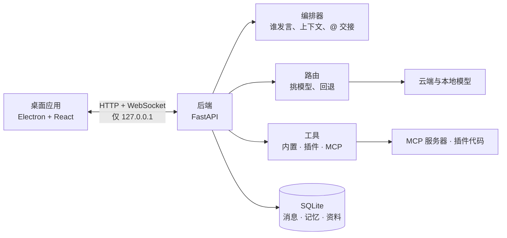
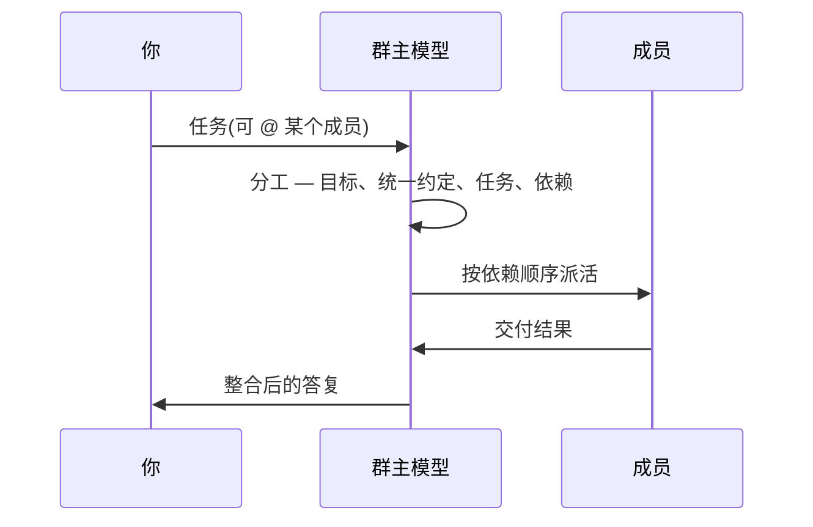

# Team Agent

[English](README.md) · 中文

把国内外的大模型拉进同一个群聊,让它们按各自强项分工、用 `@成员名` 互相交接。面向办公文档、视频制作、
写作与研究场景的桌面工作台。

- **多模型同群。** 每个成员可以是不同的模型;某个模型失败或被限流,请求自动回退到下一个,最后有本地模型兜底。
- **群主负责分工。** 稍复杂的任务由群主拆成任务(负责人、依赖、交付物),执行完再由群主整合。
- **工具真的能被调用。** 工具调用走纯文本协议,云端与本地模型都能用。
- **本地资料与记忆。** 可检索的资料库,以及跟着群走的记忆。
- **数据留在本机。** 后端只监听回环地址,密钥存在系统钥匙串里。

界面语言:**默认英文**,可在 *设置 → 外观 → 语言* 切换成中文。内置内容(模型目录、本地型号清单、强项标签、模板中心)同样双语并跟随该设置;所有接口都接受 `?lang=zh` 或 `Accept-Language` 请求头。

## 工作原理



一轮对话:



## 快速开始

```bash
scripts/dev-setup.sh            # 建 venv、装后端与前端依赖
scripts/setup_local_model.sh    # 可选:安装 Ollama 并拉取本地兜底模型
cd desktop && npm run dev       # 启动后端并打开桌面窗口
```

首次打开后在 *设置 → 模型服务* 填入 API 密钥(不填则全部走本地模型),回到首页选一个场景或群聊模板,
写下任务即可。

只在浏览器里看:`cd backend && python -m app`,再 `cd desktop && npm run dev:web`,打开
<http://localhost:5173>。

## 功能

| 模块 | 说明 |
| --- | --- |
| 群聊 | 成员、群主、`@` 交接、分工声明、实时任务板 |
| 分工 | 自动 / 总是 / 不分工,可按群设置;计划先校验再执行 |
| 模型 | 内置目录 + 实时清单、按强项挑模型、路由链、自动回退、每个模型一盏连通指示灯 |
| 工具 | 文本协议调用(每条回复最多 3 次)、5 个内置工具、Python 插件、stdio / SSE / HTTP 的 MCP |
| 资料库 | txt、md、csv、json、html、pdf、docx → 分片 → BM25 检索(支持中文);可按群限定范围;`#文档标题` 引用 |
| 记忆 | 全局 / 群 / 成员 × 偏好、事实、决定、教训、做法;自动提炼;与 Obsidian 双向同步 |
| 提示词 | 可编辑的全局系统提示词、提示词库、群提示词、`{{变量}}` |
| 模板中心 | 51 条现成的团队、岗位、技能、提示词与 MCP 用法,一键安装;也支持放自己的 JSON |
| 本地模型 | 推荐目录、硬件适配估算、新版本发现 |
| 外部智能体 | 把命令行智能体当群成员用,只读 / 可改 / 完全三级权限,默认关闭 |
| 数据 | 备份与恢复、聊天导出 Markdown、使用统计 |

## 安全

- 后端只监听 `127.0.0.1`,每次启动生成随机令牌,所有请求都要带上。
- API 密钥与 GitHub 令牌存在**系统钥匙串**里,数据库只留引用。
- 备份、导出与接口返回都不含明文密钥。
- **默认不自动外联**:自动检查更新默认关闭。
- 「禁止调用云端模型」开关会拦住所有云端请求,包括更新检查与远程 MCP。
- 插件与 MCP 服务器以你的权限运行代码,请只启用信任的。

## 许可

**[Business Source License 1.1](LICENSE)**,权利人 **zifulifufu**。

- 非生产用途免费:可阅读、修改、再分发、评估。
- 生产环境使用需取得商业授权(`Additional Use Grant` 为 `None`)。
- **2030-09-21** 起本版本转为 **MPL 2.0**,不再有商业限制。
- 不授予商标权。BUSL-1.1 属于源码可见(source-available)许可,不是 OSI 开源许可。
- 分发副本时请一并展示本许可。

第三方组件见 [THIRD_PARTY_NOTICES.md](THIRD_PARTY_NOTICES.md):全部是宽松许可(MIT / BSD / Apache-2.0 /
ISC),没有 GPL / AGPL,不会要求你开源自己的代码;但再分发时要保留它们的声明。仓库不附带任何其它项目的内容。

## 已知限制

- 只在 macOS 上验证过。尚未做代码签名、公证与自动更新。
- 模型目录是快照;强项标签是启发式的,不是评测成绩。
- 分工质量取决于群主模型是否遵守计划格式;格式不对会降级为普通接力。
- PDF 抽取不做 OCR,扫描版读不了。
- 资料库文件夹重新导入按文件大小判断变化,同样大小的修改会被漏掉。
- 只有一家服务商时,按强项挑模型的效果有限,接入更多模型才能体现价值。

## 路线图

1. 打包:macOS 与 Windows 的签名安装包,以及自动更新。
2. 群聊支持附件(图片、音视频)。
3. 插件沙箱。
