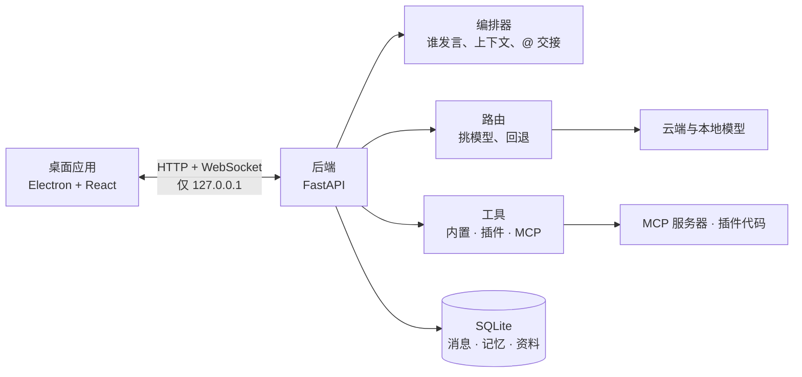
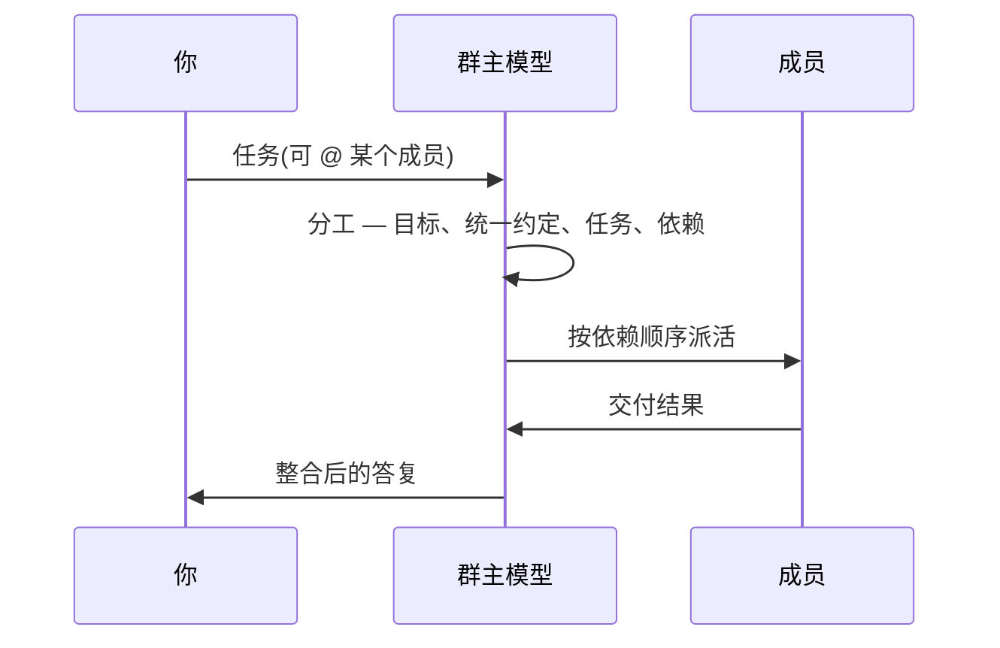

# Team Agent

[English](README.md) · 中文

把国内外的大模型拉进同一个群聊,让它们按各自强项分工、用 `@成员名` 互相交接。面向办公文档、视频制作、
写作与研究场景的桌面工作台。

- **多模型同群。** 每个成员可以是不同的模型;某个模型失败或被限流,请求自动回退到下一个,最后有本地模型兜底。
- **群主负责分工。** 稍复杂的任务由群主拆成任务(负责人、依赖、交付物),执行完再由群主整合。
- **工具真的能被调用。** 工具调用走纯文本协议,云端与本地模型都能用。
- **本地资料与记忆。** 可检索的资料库,以及跟着群走的记忆。
- **数据留在本机。** 后端只监听回环地址,密钥存在系统钥匙串里。

界面语言:**默认英文**,可在 *设置 → 外观 → 语言* 切换成中文。内置内容(模型目录、本地型号清单、强项标签、模板中心)同样双语并跟随该设置;所有接口都接受 `?lang=zh` 或 `Accept-Language` 请求头。

## 工作原理



一轮对话:



## 快速开始

```bash
scripts/dev-setup.sh            # 建 venv、装后端与前端依赖
scripts/setup_local_model.sh    # 可选:安装 Ollama 并拉取本地兜底模型
cd desktop && npm run dev       # 启动后端并打开桌面窗口
```

首次打开后在 *设置 → 模型服务* 填入 API 密钥(不填则全部走本地模型),回到首页选一个场景或群聊模板,
写下任务即可。

只在浏览器里看:`cd backend && python -m app`,再 `cd desktop && npm run dev:web`,打开
<http://localhost:5173>。

## 测试

```bash
cd backend && ../.venv/bin/python -m pytest    # 全量,约一分钟
cd desktop && npx tsc --noEmit                 # 前端类型
python3 scripts/check-i18n.py                  # 在仓库根目录运行:查词典缺口与语言被冻结
```

有 **1 个测试默认跳过**:`test_real_keychain_round_trip`。它会往你真实的登录钥匙串写一条
(service `team-agent`、account `selftest:roundtrip`),读回来再删掉,所以平时跑测试不会碰到你的密钥。
要连它一起跑:

```bash
cd backend
TEAM_AGENT_KEYCHAIN_TEST=1 ../.venv/bin/python -m pytest tests/test_compliance.py::test_real_keychain_round_trip
```

其余测试一律走内存里的假钥匙串——`tests/conftest.py` 用 `TEAM_AGENT_NO_KEYCHAIN=1` 维持这一点,
把这行去掉才会碰到真实钥匙串。

## 功能

| 模块 | 说明 |
| --- | --- |
| 群聊 | 成员、群主、`@` 交接、分工声明、实时任务板 |
| 文件 | 任何文件都能作为附件(截图、PDF、Word、Excel、PPT、视频、压缩包);文档在本机读出正文,图片与视频画面交给能看图的模型或先描述成文字;`@file:` / `@dir:` / `@msg:` / `@doc:` 引用带自动联想 |
| 工作目录 | 每个群都有,建群时就创建;每个任务在自己的子目录里交付,面板里可查看与下载 |
| 分工 | 自动 / 总是 / 不分工,可按群设置;计划先校验再执行 |
| 模型 | 内置目录 + 实时清单、按强项挑模型、路由链、自动回退、每个模型一盏连通指示灯 |
| 工具 | 文本协议调用(每条回复最多 3 次)、5 个内置工具、Python 插件、stdio / SSE / HTTP 的 MCP |
| 资料库 | txt、md、csv、json、html、pdf、docx、xlsx、pptx → 分片 → BM25 检索(支持中文);可按群限定范围;`#文档标题` 引用 |
| 记忆 | 全局 / 群 / 成员 × 偏好、事实、决定、教训、做法;自动提炼;与 Obsidian 双向同步 |
| 提示词 | 可编辑的全局系统提示词、提示词库、群提示词、`{{变量}}` |
| 模板中心 | 51 条现成的团队、岗位、技能、提示词与 MCP 用法,一键安装;也支持放自己的 JSON |
| 本地模型 | 推荐目录、硬件适配估算、新版本发现 |
| 外部智能体 | 把命令行智能体当群成员用,只读 / 可改 / 完全三级权限,默认关闭 |
| 数据 | 备份与恢复、聊天导出 Markdown、使用统计 |

## 安全

- 后端只监听 `127.0.0.1`,每次启动生成随机令牌,所有请求都要带上。
- API 密钥与 GitHub 令牌存在**系统钥匙串**里,数据库只留引用。
- 备份、导出与接口返回都不含明文密钥。
- **默认不自动外联**:自动检查更新默认关闭。
- 「禁止调用云端模型」开关会拦住所有云端请求,包括更新检查与远程 MCP。
- 插件与 MCP 服务器以你的权限运行代码,请只启用信任的。
- **钩子**也是你自己的代码。它在子进程里跑、环境被裁剪过(没有本应用令牌、不继承 API 密钥)、有超时、
  默认关闭,而且闸门只能**否决或改写**,不能放行「权限与操控」里已经禁止的事。

## 钩子

*侧边栏 → 工具 → **钩子***。把你自己的代码挂在群聊的六个固定节点上。一个钩子就是一个文件夹、两个文件,
而且**默认关闭,要你亲自打开**:

```
hooks/my-hook/HOOK.json     要哪些事件、超时、出错时怎么办、对哪些群生效
hooks/my-hook/hook.py       def handle(event, payload): ...
```

| 事件 | 类型 | 用来做什么 |
|---|---|---|
| `round.start` / `round.end` | 旁观 | 一条用户消息进、一个答复出:记日志、计数、推到别处 |
| `agent.reply` | 旁观 | 某个成员说完了(谁、哪个模型、多久、用了哪些工具) |
| `tool.called` | 旁观 | 工具跑完了:名字、参数、是否成功、耗时、截断后的结果 |
| `pre_tool_use` | 闸门 | 工具执行前:否决(`{"block": true, "reason": …}`)或改写参数 |
| `before_send` | 闸门 | 消息离开本机前(聊天通道):否决,或替换正文 |

有四件事是**强制**的,不只是写在文档里——因为钩子文件会在机器之间被拷贝:

- **闸门只能收紧。** 先看你的权限设置,而钩子没有「放行」这个词,只有「否决」;它把整份载荷原样回传,
  也不能把没让它看见的字段变回真值。
- **跑在子进程里**,用的是成员代码那套裁剪过的环境(无本应用令牌、不继承 API 密钥),独立进程组,
  超时会连整个进程组一起杀。
- **失败会被记下来,而不是拖垮主流程。** 原因显示在钩子页,并写进数据目录旁的 `hook-log.jsonl`;
  默认策略是:只读工具放行,写入与对外发送拦住。
- **可以在页面上「跑一次」**(带一份样例载荷)——「装上了」和「能用」是两回事,页面给你看的是后者。

## 文件、工作目录与看图

每个群都有一个工作目录,建群时就创建。成员跑代码时只能用这个目录作为工作目录,群里的产出也都
落在这里——包括每个任务自己的子目录(`tasks/<任务名>/`),所以同一份计划里的两个任务不会互相覆盖。
聊天头部的「工作目录」按钮可以查看和下载里面的文件。

附件可以是任何文件,类型由**文件本身的字节**决定,而不是它的名字:

| 类型 | 成员拿到什么 |
| --- | --- |
| 文档(pdf、docx、xlsx、pptx、txt、md、csv、json、html) | 上传时在本机抽出的正文。**不需要任何视觉模型**,所以任何模型都能用。 |
| 图片 | 回答的成员自己的模型能看图时,直接交给它;否则由**视觉模型**看一次并描述,成员读的是描述。 |
| 视频 | 时长与分辨率,加上均匀抽取的若干帧(用 ffmpeg),之后按图片处理。音轨不做转写。 |
| 音频、其它文件 | 显示名称与大小,文件就在工作目录里,成员可以用自己的工具打开它。 |

图片能不能离开本机由两个**刻意分开**的开关决定:「权限与操控」里的**允许外呼**,以及**云端视觉**
(`vision_cloud`)。关闭云端视觉时,只要本机有能看图的模型就由它来看,图片不出本机;本机确实没有能
看图的模型时,会明确告诉成员「你看不到这张图」——成员会直说看不到,而不是编内容,设置页也会告诉你
该装什么(本地推荐 `ollama pull qwen2.5vl:3b`)。

在输入框里用 `@` 可以引用成员、文件、文件夹与资料,插入的是后端能识别的标记:

```
@file:reports/q3.xlsx     工作目录里的一个文件,正文直接带入(按预算截断)
@dir:reports/             文件夹清单,附每个文件的开头几句
@msg:<id>                 这段对话里的某条既往消息,原文引用
@doc:<id>                 本群能看到的一份资料
#标题                     同上,按标题引用的老写法
```

路径都在群的工作目录内解析,解析链接后会再复核一次,因此引用不到目录之外。一次提示词里能带入多少
引用内容,由「设置 → 通用」的 `refs_budget` 决定。

## 外部智能体

群成员可以直接**是**另一个应用自带的命令行智能体——WorkBuddy 就自带一个——而不是一个经路由层访问的模型。
**设置 → 外部智能体** 里有总开关(默认关闭)、权限档位(只读 / 可改文件 / 完全)、可选的工作目录,以及接话规则。

**两种形态,差别是刻意的。** 默认情况下引擎运行在本程序为它设定的隔离环境里,而**正因为这份隔离**,
它的回答并不总是你直接使用那个应用时得到的结果:

| | 隔离(默认) | 「沿用该应用自己的配置」 |
|---|---|---|
| MCP 连接器 | 不加载(`--strict-mcp-config`) | 用那个应用里配好的 |
| 轮次上限 | `--max-turns 20` | 无——沿用引擎自己的默认值 |
| 会话 | 每轮全新进程 | 保留它自己的一个会话,跨轮延续 |
| 系统提示 | 会说明权限档位与工作目录 | 只保留群聊本身需要的部分 |

希望某个成员的回答与直接使用该应用一致时,把这个开关打开;想让它始终被拴住时,保持关闭。
无论哪种形态,它的回复都只是聊天正文(不会被当成 `<plan>` / `<tool_call>` 解析),子进程的环境变量是白名单,
既不带本程序的令牌,也不带任何服务商的密钥。

## 聊天通道

这里的群聊可以接到聊天平台上,群里产出的成果也可以推送到平台上。**设置 → 聊天通道** 里共六个,默认都是关闭的:

| 通道 | 方向 | 需要公网地址 | 说明 |
|---|---|---|---|
| **WhatsApp**(Cloud API) | 收消息并回复 | **需要** | Meta 把每个事件 POST 到回调地址,所以必须有隧道或公网服务器;在中国大陆访问 `graph.facebook.com` 还需要代理 |
| **Telegram** | 收消息并回复 | **不需要** | 由本应用主动去 Telegram 取消息,所以内网机器、没有隧道也能收 |
| **企业微信** | 只推送 | 不需要 | 群机器人无法接收消息 |
| **飞书** | 只推送 | 不需要 | 自定义机器人,可选签名 |
| **钉钉** | 只推送 | 不需要 | 自定义机器人,支持关键词 / IP / 加签三种安全设置 |
| **Slack** | 只推送 | 不需要 | Incoming Webhook |

**能收消息的通道会回复发信人。** 只承载文本,只接受白名单里的来源,并且每条请求都用平台自己的签名校验——密钥没配就是拒绝,不是放行。由外部触发的一轮**只能使用只读工具**:可以检索资料库和记忆,但永远不能运行代码或写文件,因为这台机器前没有人能替你点确认。

**只推送的通道会把群里每一条完成的回答转发出去**,所以企业微信、飞书群里可以直接看到团队的成果,不必打开这个应用。

**WhatsApp 要额外准备三件事。**(1)一个公网 HTTPS 地址:Meta 不接受 `localhost`、内网地址和明文 HTTP,通常用隧道解决(`cloudflared tunnel --url http://127.0.0.1:8765`),把它的域名填进「公网域名」。这个域名是本 API「只监听回环」的唯一例外,该地址上的请求靠 Meta 的签名而不是应用令牌鉴权——改完要重启应用。(2)一个开通 WhatsApp 产品的 Meta 应用:把 `<你的域名>/hooks/whatsapp` 和你的 verify token 填进 *WhatsApp → Configuration → Webhook*,并订阅 `messages` 事件。请用永久访问令牌,临时令牌 24 小时就过期。(3)在中国大陆还需要代理。

**Telegram 的准备最少:** 找 `@BotFather` 执行 `/newbot`,把 token 填进来;先给机器人发一条消息让它知道你的 chat id,把该 id 加进白名单,打开开关即可——不需要隧道、证书或公网地址。唯一会静默失效的配置是「机器人上还挂着 webhook」,「检查连通性」会明确报出来。

**每条通道都有两个按钮:**「检查连通性」(读取平台对自身配置的回报,什么都不发)和「发送测试」(真的发一条,因为对群机器人来说这是唯一靠得住的验证)。下面的计数——已受理 / 已拒绝 / 已忽略——才是让配置错误看得见的东西:webhook 的典型症状就是「什么都没发生」。

## 从其他 AI 应用导入定义

*设置 → MCP 服务器 / 技能 → **从其他应用导入***,以及*成员 → **导入专家***,会读取那些应用已经
留在本机的定义,把其中的内容导进来,不必再手工复制一份配置。

**什么能搬、什么搬不了。** 「插件」在这个生态里已经收敛到 MCP 这一个标准:Claude Desktop、
Claude Code、Codex、Cursor、Windsurf、Cline、Roo Code、Continue、LM Studio、Zed 存的都是同一套
`command` / `args` / `env` 或 `url` / `headers` 结构。Claude 风格的 `SKILL.md` 目录也能按文本搬过来,
因为本项目自己的技能就是同一个格式。除此之外都不行:**本项目的插件是调用 `register()` 的 Python 文件**,
别的应用不会产出这种东西;ChatGPT 的 GPT 是「提示词 + 登录后的动作」;Cursor / VS Code 扩展是针对另一套
宿主 API 的 TypeScript。导入界面会直接把这一点说清楚,而不是摆几个「点了也没反应」的按钮。

**如果你也装了 WorkBuddy,它有三样东西能搬。** 三者在磁盘上的形态各不相同,所以三条路都读:

| 资产 | 从哪里读 | 变成什么 |
| --- | --- | --- |
| 技能 | `~/.workbuddy/skills`,以及它已安装插件里的 `skills/` | 技能(同一个 `SKILL.md` 格式,文本原样搬) |
| 专家 | 已安装插件与专家包里的 `agents/*.md` | 一位成员:名称、专业方向与提示词都来自那个包 |
| 连接器 | `~/.workbuddy/connectors/*/mcp.json`,以及它的整个连接器目录 | MCP 服务器(远端),导入后为停用状态 |

有两样东西是**故意不搬**的:专家包的头像图——本应用的头像是一个 emoji,改为按专家讲的领域挑一个;
以及连接器上的**授权**——授权留在 WorkBuddy 那边,所以导入的连接器在你自己补上凭据之前,第一次调用
就会被拒。每一条连接器都会把这一点写在行内。连接器目录有几百条,因此不参与整体扫描,想看得点名让它列。
另外,有些 agent 文件只是一行模板引用(``),真正的提示词在另一个模板文件里;这些会被
计数并报出来,而不是导成一位「什么也没说」的成员。

**怎么读。** 只读一份固定清单里的路径(上面十个应用,外加已安装的 Claude Code / WorkBuddy 插件自带的
技能与 MCP 服务器)。不会遍历你的个人目录,不跟随符号链接,单文件有大小上限,条目数也有上限。
WorkBuddy 的插件路径取自它自己的已安装记录而不是通配符——这也正是同一个插件存了三个版本却只出现一次的
原因——这份记录里指向个人目录之外的路径一律忽略。配置损坏时会报告出来,而不是整体失败。

**什么都不运行。** 扫描只读文本,导入只写数据库。源配置里的密钥(`env`、`headers`)在预览里是脱敏的,
也不会发给界面——导入时由服务端重新读一次文件,所以密钥不必经浏览器中转就能搬过来。导入的条目**一律
落到停用状态**,无论那个应用里原本是开是关;MCP 服务器在你自己打开并确认之前不会接到任何群。每条都会
显示它将来会执行的命令行,并对值得再看一眼的情况给出提示:会下载并运行包的启动器(`npx`、`uvx`)、
参数里含 shell 符号、你个人目录之外的程序、明文 URL、没能一起带过来的环境变量值。

## 使用「一个密钥通吃」的聚合平台

**MetaChat**、**Cherry Studio** 这类平台把很多模型放在一个密钥后面。它们在本项目里已经以两种形态接进来了:

* **作为外部智能体引擎** —— 一种成员,它的回复来自那个平台的对话接口(设置 → 外部智能体)。
  Cherry Studio 的本地网关与 MetaChat 的 OpenAI 兼容地址都是内置的。
* **作为模型服务商** —— 同样的平台出现在服务商预设里,于是它们的对话模型能通过常规路由层给成员用。

它们**实际**开放了什么(以 MetaChat 官方文档为准,不是猜的):

| 能力 | 能否调用 | 说明 |
|---|---|---|
| 文本模型 | **能** | OpenAI / Anthropic / Gemini 三种兼容地址,一个密钥全都能用 |
| 图像生成 | **能** | OpenAI 兼容的 `/images/generations`(GPT-Image),另有 MetaChat 自己的异步接口(Seedream、FLUX、Z-Image、Grok Imagine)与 Midjourney(含放大/微调/变焦等操作) |
| 视频生成 | **能** | Grok Imagine 与 Midjourney,都是异步任务 |
| 账户余额 | 能 | MetaChat 提供余额与用量查询 |
| **智能体** | **不能** | 智能体是**网页应用**里的东西:一段提示词 + 选定的模型。没有任何接口能「运行某个智能体」,所以那个列表搬不过来 |
| **音频 / 语音** | **不能** | MetaChat 没有发布 TTS/STT 接口,也没有音频模型,所以「音频」这条路走不通 |

也就是说:你在那个网站上喜欢的智能体无法被直接调用,但可以**在这里复现** —— 本项目的成员本身就是
「模型 + 角色提示词」:加一个成员,选同一个模型,把要求写进去即可。参见「成员与角色」。

**绘画已经接好了**(「权限与操控 → 绘画」):先在「模型服务商」里添加服务商
(预设「绘画(OpenAI 兼容)」指向 MetaChat 的 OpenAI 兼容入口),填上密钥,再打开开关。成员会得到
`generate_image` 工具,图片落在本群自己的工作目录里,并显示在对话中。**不需要 GPU** —— 一个密钥加一个
模型名就是全部准备。旁边的「检查」按钮会读取服务方的模型清单,让你在花钱之前就知道模型名对不对。

**尚未接通**:MetaChat 的**异步**图像接口(Seedream / FLUX / Grok Imagine / Midjourney)与它们的视频接口。
本项目的视频工具说的是自建 H3 的方言(`/v1/videos` + 轮询),而那些是另一种任务形态 —— 需要一个新的服务商
kind 配它自己的提交/轮询方言。这是顺理成章的下一步,而不是可以假装已经能用的东西。

## 许可


**[Apache License 2.0](LICENSE)**,Copyright 2026 **zifulifufu**。

- 可自由使用、修改、再分发与出售,包括商业用途。
- 分发副本时保留版权声明、许可全文与 [NOTICE](NOTICE),并注明你改动了哪些文件。
- 含明确的专利授权:若你以本软件的专利起诉贡献者,该授权自动终止。不授予商标权,亦不提供担保。
- **0.5.0 及更早**的版本以 Business Source License 1.1 发布;**0.5.1 起**本仓库改用 Apache-2.0。
  你此前按 BUSL-1.1 取得的副本,仍适用当时的条款。

第三方组件见 [THIRD_PARTY_NOTICES.md](THIRD_PARTY_NOTICES.md):全部是宽松许可(MIT / BSD / Apache-2.0 /
ISC),没有 GPL / AGPL,不会要求你开源自己的代码;但再分发时要保留它们的声明。仓库不附带任何其它项目的内容。

## 已知限制

- 只在 macOS 上验证过。尚未做代码签名、公证与自动更新。
- 模型目录是快照;强项标签是启发式的,不是评测成绩。
- 分工质量取决于群主模型是否遵守计划格式;格式不对会降级为普通接力。
- PDF 抽取不做 OCR,扫描版读不了。
- 资料库文件夹重新导入按文件大小判断变化,同样大小的修改会被漏掉。
- 只有一家服务商时,按强项挑模型的效果有限,接入更多模型才能体现价值。

## 路线图

1. 打包:macOS 与 Windows 的签名安装包,以及自动更新。
2. 群聊支持附件(图片、音视频)。
3. 插件沙箱。
