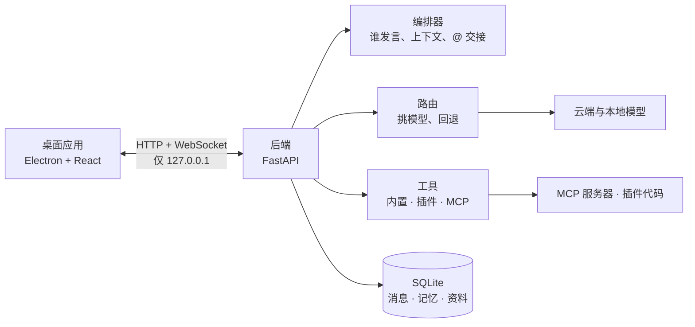
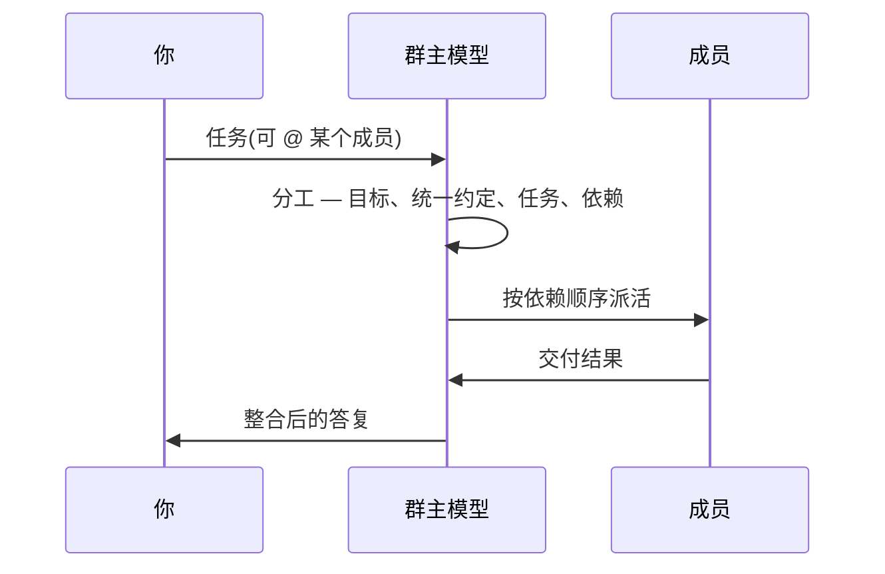

# Team Agent

[English](README.md) · 中文

把国内外的大模型拉进同一个群聊,让它们按各自强项分工、用 `@成员名` 互相交接。面向办公文档、视频制作、
写作与研究场景的桌面工作台。

- **多模型同群。** 每个成员可以是不同的模型;某个模型失败或被限流,请求自动回退到下一个,最后有本地模型兜底。
- **群主负责分工。** 稍复杂的任务由群主拆成任务(负责人、依赖、交付物),执行完再由群主整合。
- **工具真的能被调用。** 工具调用走纯文本协议,云端与本地模型都能用。
- **本地资料与记忆。** 可检索的资料库,以及跟着群走的记忆。
- **数据留在本机。** 后端只监听回环地址,密钥存在系统钥匙串里。

界面语言:**默认英文**,可在 *设置 → 外观 → 语言* 切换成中文。内置内容(模型目录、本地型号清单、强项标签、模板中心)同样双语并跟随该设置;所有接口都接受 `?lang=zh` 或 `Accept-Language` 请求头。

## 工作原理


```mermaid
flowchart LR
  UI["桌面应用<br/>Electron + React"] <-->|"HTTP + WebSocket<br/>仅 127.0.0.1"| API["后端<br/>FastAPI"]
  API --> ORCH["编排器<br/>谁发言、上下文、@ 交接"]
  API --> ROUTE["路由<br/>挑模型、回退"]
  API --> TOOLS["工具<br/>内置 · 插件 · MCP"]
  ROUTE --> MODELS["云端与本地模型"]
  TOOLS --> EXT["MCP 服务器 · 插件代码"]
  API --> DB[("SQLite<br/>消息 · 记忆 · 资料")]
```

一轮对话:


```mermaid
sequenceDiagram
  participant U as 你
  participant H as 群主模型
  participant M as 成员
  U->>H: 任务(可 @ 某个成员)
  H->>H: 分工 — 目标、统一约定、任务、依赖
  H->>M: 按依赖顺序派活
  M->>H: 交付结果
  H->>U: 整合后的答复
```

## 快速开始

```bash
scripts/dev-setup.sh            # 建 venv、装后端与前端依赖
scripts/setup_local_model.sh    # 可选:安装 Ollama 并拉取本地兜底模型
cd desktop && npm run dev       # 启动后端并打开桌面窗口
```

首次打开后在 *设置 → 模型服务* 填入 API 密钥(不填则全部走本地模型),回到首页选一个场景或群聊模板,
写下任务即可。

只在浏览器里看:`cd backend && python -m app`,再 `cd desktop && npm run dev:web`,打开
<http://localhost:5173>。

## 测试

```bash
cd backend && ../.venv/bin/python -m pytest    # 全量,约一分钟
cd desktop && npx tsc --noEmit                 # 前端类型
python3 scripts/check-i18n.py                  # 在仓库根目录运行:查词典缺口与语言被冻结
```

有 **1 个测试默认跳过**:`test_real_keychain_round_trip`。它会往你真实的登录钥匙串写一条
(service `team-agent`、account `selftest:roundtrip`),读回来再删掉,所以平时跑测试不会碰到你的密钥。
要连它一起跑:

```bash
cd backend
TEAM_AGENT_KEYCHAIN_TEST=1 ../.venv/bin/python -m pytest tests/test_compliance.py::test_real_keychain_round_trip
```

其余测试一律走内存里的假钥匙串——`tests/conftest.py` 用 `TEAM_AGENT_NO_KEYCHAIN=1` 维持这一点,
把这行去掉才会碰到真实钥匙串。

## 功能

| 模块 | 说明 |
| --- | --- |
| 群聊 | 成员、群主、`@` 交接、分工声明、实时任务板;**建群时先选工作空间、再勾选成员**,两者之后都能改 |
| 生成成员 | 视频 / 绘画模型本身可以作为成员入群:**群里先讨论,再点名它说「就按这个来」** —— 有一个对话模型会把讨论读成一条提示词再交给它,产物发回群里。它自己不参与对话、不做规划 |
| 看懂参考片 | `study_video`:给一个链接或工作目录里的视频,用 ffmpeg 量出画幅/时长/**每一次切点**/音量,本机转写口播,并让能看图的模型逐帧看,最后在工作目录与群知识库留下一份 `参考风格-….md` 规格(版式/分镜/屏上文字/声音/必须另做的部分)。**沿用形式,不沿用素材** |
| 做成一条片子 | 画面按「真实影像 / 真图加标注 / 自绘示意图」三级定来源,**禁止让生成模型凭空画解剖**;`make_figure` 负责教学图,`make_animation` **逐帧画出真正的运动**(血流、鼓出、弹簧圈填塞),`assemble_video` 用本机语音录旁白、把字幕画进画面(本机 `ffmpeg` 没有 `drawtext`,所以字幕是 Pillow 画好再叠上去的),产出 `.mp4` 外加 `.srt` 和一份**逐镜记录画面来源与许可**的分镜表 |
| 交付成品文件 | `write_document` 把**写完的稿子**变成用户真正打开的那个文件 —— `.docx`(Word)、`.pptx`(幻灯片)、`.xlsx`(表格)、`.md` —— 落在本群工作目录,并**在同一轮**索引进本群知识库。一份 Markdown 风格正文四种格式通用(`#`/`##` 标题、`- ` 条目、`1. ` 编号、`| a | b |` 表格);`.pptx` 里每个 `##` 是一页,`.xlsx` 里每个 `##` 是一张表。它只负责把字排好(不代写、不核对),而**凡 deliverable 里写了文件名的任务,程序会去工作目录核对** —— 「报告写好了」和「真有一份报告.docx」从此是同一件事 |
| 文件 | 任何文件都能作为附件(截图、PDF、Word、Excel、PPT、视频、压缩包);文档在本机读出正文,图片与视频画面交给能看图的模型或先描述成文字;`@file:` / `@dir:` / `@msg:` / `@doc:` 引用带自动联想 |
| 工作空间 | 每个群都有;可以是**你自己的项目目录**(新建群聊时选,之后随时改),不然就用程序管理的目录。每个任务在自己的子目录里交付,面板里可查看与下载 |
| 盯着流程 | 内置**流程工程师**会在**每个群里都有一个、而每个群里都看不见**:不在成员列表、@ 不到、不发言、也不会当群主。每一轮结束后,它把程序**量得出来**的毛病记进本群的 `流程日志.md` —— 任务判完成但文件不在、任务里每个工具调用都失败、分工计划没能用上、同一个调用失败了两次;同一个毛病再出现是**计数**(`seen ×N`)而不是多写一条;随后用一次很短的调用请一个**不属于本群**的模型补上最可能的根因和一条具体修法,而且**绝不覆盖**手写过的根因。它自己只在「设置 → 通用」里露面:开关和它记下的一切都在那一页。可见成员仍然有 `process_log`(量、记账、把条目从 `open → fixed → verified` 推进,而**只有重跑过才能算 verified**)和 `ask_advisor`(把窄问题交给本机的 codex / Claude Code,**只读、在本群工作目录里跑**,每次都要用户批准) |
| 分工 | 自动 / 总是 / 不分工,可按群设置;计划先校验再执行 |
| 模型 | 内置目录 + 实时清单、按强项挑模型、路由链、自动回退、每个模型一盏连通指示灯 |
| 工具 | 文本协议调用(每条回复最多 3 次)、18 个内置工具、Python 插件、stdio / SSE / HTTP 的 MCP |
| 资料库 | txt、md、csv、json、html、pdf、docx、xlsx、pptx → 分片 → BM25 检索(支持中文);可按群限定范围;`#文档标题` 引用;**笔记自带的真实配图**也能按文档取用 |
| 记忆 | 全局 / 群 / 成员 × 偏好、事实、决定、教训、做法;自动提炼;与 Obsidian 双向同步 |
| 提示词 | 可编辑的全局系统提示词、提示词库、群提示词、`{{变量}}` |
| 模板中心 | 81 条现成的团队、岗位、技能、提示词与 MCP 用法,一键安装;也支持放自己的 JSON |
| 本地模型 | 推荐目录、硬件适配估算、新版本发现 |
| 外部智能体 | 把命令行智能体当群成员用,只读 / 可改 / 完全三级权限,默认关闭 |
| 数据 | 备份与恢复、聊天导出 Markdown、使用统计 |

## 安全

- 后端只监听 `127.0.0.1`,每次启动生成随机令牌,所有请求都要带上。
- 界面(Electron 渲染进程)跑在严格的 CSP 下:不允许远程脚本与样式,只连得上本机接口。
  图片与视频是用 `blob:` 显示的(产物先带令牌取回字节,再转成对象 URL),所以 CSP 显式放开了这两种
  媒介的 `blob:` —— 少这一条会**静默地**把所有图片和视频变成加载不出来的样子。
- API 密钥与 GitHub 令牌存在**系统钥匙串**里,数据库只留引用。
- 备份、导出与接口返回都不含明文密钥。
- **默认不自动外联**:自动检查更新默认关闭。
- 「禁止调用云端模型」开关会拦住所有云端请求,包括更新检查与远程 MCP。
- 插件与 MCP 服务器以你的权限运行代码,请只启用信任的。
- **钩子**也是你自己的代码。它在子进程里跑、环境被裁剪过(没有本应用令牌、不继承 API 密钥)、有超时、
  默认关闭,而且闸门只能**否决或改写**,不能放行「权限与操控」里已经禁止的事。

## 钩子

*侧边栏 → 工具 → **钩子***。把你自己的代码挂在群聊的八个固定节点上。一个钩子就是一个文件夹、两个文件,
而且**默认关闭,要你亲自打开**:

```
hooks/my-hook/HOOK.json     要哪些事件、超时、出错时怎么办、对哪些群生效
hooks/my-hook/hook.py       def handle(event, payload): ...
```

| 事件 | 类型 | 用来做什么 |
|---|---|---|
| `round.start` / `round.end` | 旁观 | 一条用户消息进、一个答复出:记日志、计数、推到别处 |
| `agent.reply` | 旁观 | 某个成员说完了(谁、哪个模型、多久、用了哪些工具) |
| `tool.called` | 旁观 | 工具跑完了:名字、参数、是否成功、耗时、截断后的结果 |
| `pre_prompt` | 注入 | 成员的提示词发出前:往里面追加内容(`{"append": "…"}`) |
| `post_reply` | 闸门 | 回复落库前:否决,或改写——这是**记录**还来得及保持干净的最后一刻 |
| `pre_tool_use` | 闸门 | 工具执行前:否决(`{"block": true, "reason": …}`)或改写参数 |
| `before_send` | 闸门 | 消息离开本机前(聊天通道):否决,或替换正文 |

**模板**:「设置 → 模板中心 → 钩子」自带四个可以直接读、直接改的起点(本群规范、别把密钥写进对话、
外发前检查、审计留痕)。装进来是关闭状态,文件写在 `hooks/<名字>/` 下,就是你自己的了。

有四件事是**强制**的,不只是写在文档里——因为钩子文件会在机器之间被拷贝:

- **闸门只能收紧。** 先看你的权限设置,而钩子没有「放行」这个词,只有「否决」;它把整份载荷原样回传,
  也不能把没让它看见的字段变回真值。
- **注入只能追加。** `pre_prompt` 只能加行,不能替换或删除本应用写好的内容,所以钩子没法悄悄把本群的
  规范或记忆从提示词里拿掉;它拿到的是「谁在说、在做什么」,永远拿不到提示词本身。
- **跑在子进程里**,用的是成员代码那套裁剪过的环境(无本应用令牌、不继承 API 密钥),独立进程组,
  超时会连整个进程组一起杀。
- **失败会被记下来,而不是拖垮主流程。** 原因显示在钩子页,并写进数据目录旁的 `hook-log.jsonl`;
  默认策略是:只读工具放行,写入与对外发送拦住。
- **可以在页面上「跑一次」**(带一份样例载荷)——「装上了」和「能用」是两回事,页面给你看的是后者。

## 文件、工作空间与看图

每个群都有一个工作空间,建群时就创建。成员跑代码时只能用这个目录作为工作目录,群里的产出也都
落在这里——包括每个任务自己的子目录(`tasks/<任务名>/`),所以同一份计划里的两个任务不会互相覆盖。
聊天头部的「工作目录」按钮可以查看和下载里面的文件。

**这个目录由谁来定,你说了算。** 新建群聊时先选它,之后在「工作空间」面板里随时可以改:

* **你自己选一个目录**(原生文件夹选择器)——那就直接在**你那个项目目录**里干活,产出的文件就在你
  本来放着那个项目的地方,而不是埋在程序的数据目录里。这个目录必须**已经存在**:路径打错时程序会
  拒绝并告诉你,而不是替你凭空建一棵目录树出来。
* **不选**就用程序管理的目录(`<数据目录>/workspaces/<群 id>`;「权限与操控」里的 `code_workdir`
  可以改这个基目录)。

两处都点明一下,免得误会:

* **选中的目录就是工作空间本身**,不会再套一层群 id 子目录。
* **换目录不会搬文件。** 已经写出来的东西留在原地;这个开关只决定**之后**的活干在哪儿。
* 程序启动时**不会**重建你手删掉的自选目录——那不该是启动例程替你做的决定;等真的要用到它时才会
  建回来。

**成员也是你自己挑的。** 新建群聊时勾选谁进这个群(第一个勾选的当群主),不勾就不建。
以前每个场景会预置三个基础成员直接塞进新群,现在是空的。场景页签仍然有用:它给的提示词示例还在,
并且提供一句「用这套成员」由你一键采纳——不点就不会替你加人。首次运行自带的那个示例群
(「产品发布小组」)还没动,想要它一起去掉说一声。

附件可以是任何文件,类型由**文件本身的字节**决定,而不是它的名字:

| 类型 | 成员拿到什么 |
| --- | --- |
| 文档(pdf、docx、xlsx、pptx、txt、md、csv、json、html) | 上传时在本机抽出的正文。**不需要任何视觉模型**,所以任何模型都能用。抽不出正文时(例如扫描件 PDF)会**明说**「本机没抽出文字」,而不是只丢一个文件名过去。 |
| 图片 | 回答的成员自己的模型能看图时,直接交给它;否则由**视觉模型**看一次并描述,成员读的是描述。 |
| 视频 | 时长与分辨率,加上均匀抽取的若干帧(用 ffmpeg),之后按图片处理。音轨不做转写。 |
| 音频 | 装了转写工具时在本机转写成文字(见下)。没装就显示名称与大小,文件留在工作目录里。 |
| 其它文件 | 显示名称与大小,文件就在工作目录里,成员可以用自己的工具打开它。 |

图片能不能离开本机由两个**刻意分开**的开关决定:「权限与操控」里的**允许外呼**,以及**云端视觉**
(`vision_cloud`)。关闭云端视觉时,只要本机有能看图的模型就由它来看,图片不出本机;本机确实没有能
看图的模型时,会明确告诉成员「你看不到这张图」——成员会直说看不到,而不是编内容,设置页也会告诉你
该装什么(本地推荐 `ollama pull qwen2.5vl:3b`)。

「设 置 → 通用 → 看图用哪个模型」里列的**只有真能看图的模型**:一个网关会把对话模型和**生成图片的模型**
放在同一张列表里(`gpt-image-…`、`gemini-…-image`),名字看上去很像「处理图片的模型」,选错了它,
**任何一个群里的任何一张图都不会被读**。这一条现在有三重保障:

* 生成图片/视频的模型(判据只有一处:`media.purpose_of`,和「生成器不能当成员」用的是同一个)不会再被打上
  「多模态」标签,因此不会出现在候选里;
* 你选中的模型看不了图时**不再静默失明**:仍然按「本地优先、云端需开关」回退到能看图的模型,图片不会因为
  一次误选就离开本机;
* 「云端视觉」是**唯一**决定图片能不能出本机的开关:你手动指定的云端视觉模型同样要它打开才生效。以前手选
  一个云端模型会绕过这个开关——选过一次,之后每个群里的每张图都会发给那家服务商,而开关在界面上还写着「关」;
* 谁也看不了时,给成员的说明会**点名**那个模型(「被指定『看图』的模型 X 看不了图;它是生成图片的模型」),
  而不是笼统说「这台机器上没有能看图的模型」——否则读者看着自己刚选的模型,根本不知道该改哪里。

**「自动」不是一个盲选。** 设置页会把「自动会选中谁」写出来(名字后面加 ★),并说明它意味着什么:
本地模型就是「图片不出本机」,云端模型就是「图片会发给那家服务商」。列表里只有真能看图的模型,
而**推荐就是自动会选的那一个**——两者用的是同一条规则,不会出现「界面推荐 A、实际用 B」。
另外,某个模型**被服务商下架之后**不会再出现在候选里、也不会被推荐(判据与「模型选择」里那个
「已下架」标记同源:`discovery.still_listed`):一个启用了、有密钥、看着也很多模态的模型,
其实是查不到的死模型,拿它当推荐比不给推荐更糟。

**语音是唯一需要「程序」而不是「模型」的一类。** 本程序不捆绑、也不会替你下载:一个 whisper 模型有
几百 MB,在别人等着答复的时候悄悄去拉,不是这个应用该替你做的决定。机器上已经有 `mlx_whisper` 或
`whisper` 时就用它;「设置 → 通用 → 群聊里的文件」里可以填任何别的转写命令——`{out}` 是文本写出的
目录,`{audio}` 标出文件放在哪。转写只在第一次做,结果记在附件上。什么都没装时,会明确告诉成员
「这段音频没有被读到」,而不是丢给它一份谁也没听过的摘要。
设置页那一行**不再只写「没找到」**:它会把**这台机器上能用的那条安装命令**写出来(Apple 芯片优先
`mlx-whisper`,其它平台 `openai-whisper`;有 `uv`/`pipx` 就用它们,因为装出来的可执行文件会落在
`~/.local/bin`,而程序会去那里找),旁边还有「重新检测」——装完不用重启本程序。
⚠️ 转写器和 `ffmpeg` 一样是**按名字**在 PATH 与 `/opt/homebrew/bin`、`/usr/local/bin`、`~/.local/bin`、
`/usr/bin`、`/bin` 里找的:`pipx install mlx-whisper`、`pip install --user …` 默认就落在 `~/.local/bin`,
所以这两种装法能被直接认出来;装进应用自己的 venv 则**看不到**,那种情况请在「转写命令」里写绝对路径。

在输入框里用 `@` 会**先列出本群成员**;再打一个字符,文件、文件夹与资料也会一起列出来,插入的是后端
能识别的标记。空查询只列成员是**有意为之**:候选框有高度上界,而把工作目录里的每个文件和每份资料都
和成员挤在一起,正是把人埋掉的原因。

```
@file:reports/q3.xlsx     工作目录里的一个文件,正文直接带入(按预算截断)
@dir:reports/             文件夹清单,附每个文件的开头几句
@msg:<id>                 这段对话里的某条既往消息,原文引用
@doc:<id>                 本群能看到的一份资料
#标题                     同上,按标题引用的老写法
```

路径都在群的工作目录内解析,解析链接后会再复核一次,因此引用不到目录之外。一次提示词里能带入多少
引用内容,由「设置 → 通用」的 `refs_budget` 决定。

### 本群自己的资料:工作目录、附件、知识库三件事连起来

一个群就是一个工作目录,所以它也有**自己的一份知识库**——**建群的那一刻就存在**(按群名命名,重名时自动编号),
这就是「本群自己的资料」的落点。以前分散在三处的三样东西,现在都并进它:

* **已经从本群附件里读出来的内容**——文档正文、图片描述、录音转写。这里**不额外做抽取**:用的就是程序
  已经做过、缓存下来的结果。所以没人看过的图片暂时不在里面(打开云端视觉、让某个成员看一眼,它就会出现);
* **工作目录里的文档**——成员写的脚本、有人丢进来的表格;
* 以及照旧手工导入的一切(笔记、链接、文件夹、上传文件)。

这个合并**在每次发言之前**跑一遍,所以一分钟前刚写的文件、刚加进去的文档,下一次检索就能找到。它的开销
是刻意压住的:遍历目录时把机器产物(.frames、代码仓库、虚拟环境)原地剪掉,只收文档类文件,一次最多 40 份、
几 MB,内容没变就不重写。**变了的文档是替换而不是叠加**——旧版本的片段会被删掉,否则检索还会找到它以前说过的话。

两个开关决定它走多远,都由你定:群能用哪些知识库,还是原来的「全部 / 指定 / 关闭」;紧挨着它的
**「把本群自己的资料收进本群知识库」**决定工作目录要不要喂给本群那份知识库。工作目录由本程序管理时默认开启;
是你自己选的目录时默认关闭——你选的很可能是项目而不是资料(同一个面板上一下就打开)。

还有一类素材**没法自己进库**:文档到了就会被读,而**图片必须有人看过**;没人看过的图片还不算资料。
按定时去描述等于没问过你就花钱,所以面板上是**数量 + 一个按钮**——「有 N 张图片从没被看过 → 描述它们」,
每按一次描述一批(默认 12 张、最多 50 张),逐张缓存描述,并随之收进本群自己的知识库;它会告诉你还剩多少,
在没有模型能看图时也会说明原因(和设置页那句「哪个模型看图」是同一个答案)。

而当检索仍然没有命中时,成员会被告知**这个群到底能搜什么**:它能搜到的文档标题,以及「知识库的语言可能和
这段对话不同」这句提醒。这就是「死路」和「下一步」的区别——BM25 认的是词,中文提问和英文文档之间几乎没有
共同的词,而这正是这里最常见的那种库(图谱、论文、手册)。

## 视频制作:把成熟的视频工具接进来

前面几节讲的是本程序**自己生成**视频(`generate_video`,以及自建 H3 / MetaChat / 火山方舟三种方言)。
这一节讲的是另一件事:**把已经成熟的外部视频工具接进群聊**。它们的形态差别很大,接的位置也就不同——
不是「都塞进服务商列表」,那只会让每个都只对一半。

| 工具 | 形态 | 在哪儿接 | 代价 / 前提 |
|---|---|---|---|
| **Remotion** | 本机 npm 命令行(`npx remotion render`) | 内置技能「程序化视频(Remotion)」 | 需要 Node.js 22+。第一次要装依赖并下载无头浏览器(几百 MB),可能超过一次 `run_code` 的上限 |
| **HyperFrames**(HeyGen 开源框架) | 本机 npm 命令行(`npx hyperframes render`) | 内置技能「HTML 变视频(HyperFrames)」 | 需要 Node.js 22+ 与 `ffmpeg`。它的**云端渲染 API** 本程序没有接(要密钥、按出片分钟计费) |
| **Voicebox** | 本机桌面应用,**自带 MCP**(HTTP) | 模板中心 → MCP →「Voicebox(本机语音)」 | 要先装并启动 Voicebox;它的 MCP 监听 `127.0.0.1:17493`。朗读从你的音箱出来 |
| **HeyGen** | stdio MCP(`uvx heygen-mcp`) | 模板中心 → MCP →「HeyGen(数字人视频)」 | 需要 HeyGen 账号的 API key;渲染在它服务器上,**按你那个账号计费** |
| **ChatCut** | **托管** HTTP MCP + Bearer | 模板中心 → MCP →「ChatCut(用描述剪视频)」 | 要自己按它的接入说明换一个 token;有效期约 1 小时,**之后报 401 通常是该换 token,不是填错** |
| **达芬奇** | stdio MCP(`uvx --python 3.11 --with 'mcp<2' davinci-resolve-mcp`) | 模板中心 → MCP →「达芬奇(DaVinci Resolve 剪辑)」 | 要 **Resolve Studio**(免费版没有对外脚本 API)、外部脚本设为 Local、**按测试前 Resolve 已开着**。`--python 3.11` 与 `mcp<2` 两个钉子不是可选项,少一个服务器就在导入阶段死掉 |
| **剪映** | 没有可装的 MCP,走**代码**:`uv run --with pyJianYingDraft` | 内置技能「剪映草稿(Jianying / CapCut)」 | 生成的是剪映自己的草稿文件,**草稿目录必须问用户**(写错地方等于他打开剪映什么都看不到) |

### 画面只能从哪儿来

一次生成的片段是 4-30 秒,而群里真正要做的那支科普片是按分钟算的。这中间那一步**不是生成**,所以它不是一个服务商;它也不能丢给每个成员自己去写 ffmpeg 命令 —— 十二个人写出的十二条命令,彼此对不上。它是一个**每个成员都拿得到的内置工具**:`assemble_video`。它在本机上只需要 `ffmpeg`:不要密钥、不要账号、不需要按群配置、跑多少次都不花钱。它负责把镜头接起来、把旁白录上、把字放上屏。

**但「哪些画面能进这条片子」是另一个决定,而且它决定这条片子有没有价值。** 画面分三级,级别决定它只能从哪来:

| 级别 | 是什么 | 只能从哪来 |
|---|---|---|
| **A 真实影像** | 血管造影、解剖图版、术中照片、手术录像 | **只能**是真实素材。解剖结构、病变、器械、操作步骤的唯一合法来源 |
| **B 真实影像 + 标注** | 同一张真图加箭头、圈注、放大 inset、结构名,或术前/术后对比 | 真实图片,标注在这里画(`make_figure`) |
| **C 说明性图形** | 流程箭头、标题卡、数据图、色块,以及「一根血管 + 壁上鼓包」这类示意图 | 在这里画(`make_figure` 的 `schematic`),或生成 —— **因为它不声称任何东西长什么样** |

让文生视频模型画一条「写实的动脉」,就是让它猜:它没有解剖知识,只有提示词里那个比喻,于是「管壁上一处薄弱鼓包」就变成它随手的形状。**医学片子变得丢人的头号原因就是这个,而且装配修不了 —— 装配只能接住给它的东西。** 就在这条链路上实测过:四段片段全部由纯文本提示词生成、**零参考图**,提示词写的是「半透明蓝色水管」「管壁鼓包」,没有一段是动脉瘤。

所以干活的顺序是:**先找真东西**(`list_figures` 会列出某篇文档自带的图 —— 从笔记或图谱导入的知识库通常有几百张,而且本来是对的、本来就有图注),**再定下每一镜怎么动**,**再做那张要被看的画面**,最后才渲染。一张图能被读、能被否掉;一段渲染好的片段不能。省掉这道闸门,就是一张错图一路活到成片。

两个工具扛这件事:

* **`list_figures`** —— 本群某篇文档自带的真实图片与录像。程序会读笔记里的 `![[...]]` 引用,逐个相对笔记所在目录解析,**不落在那个目录里真实文件上的链接一律拒收**,并把笔记记录的 `source` 一并带回来。这篇文档没有图时,答案会说明,并且**点名哪些文档有**。
* **`make_figure`** —— 用**唯一一个**来源做一张教学图:工作目录里的图片、某篇文档自带的配图、或在这里自绘的示意图。箭头、圈注、结构名、放大 inset 都叠在上面;每张帧都带标题带、图注和**来源行**。标注用**部件名**(`at_part: "sac"`)来放,而不是让你估一个比例 —— 画的时候它自己知道每个部件在哪,并把这些位置报回来,因为估出来的标注指的一定是别的地方。示意图还会在画面上写明它是示意图。

### 先看懂别人的片子,再做自己的（`study_video`）

「照这个做一个」不是一句能直接执行的话。所以这里有一个工具专门干这件事:**`study_video`** —— 给它一个链接
(YouTube、B 站、抖音等 `yt-dlp` 支持的站)或工作目录里的一个视频文件,它会

1. **先用 ffmpeg 量**:时长、画面尺寸与画幅、帧率、**每一次切点及其时刻**(节奏是数出来的,不是形容出来的)、
   音轨电平均值与峰值(用来分辨口播、垫乐还是近乎无声);
2. **听**:在本机转写说话内容(没装转写器就**明说「没读到」**,绝不猜旁白);
3. **看**:均匀抽取若干帧,交给能看图的模型逐帧描述 —— 文字在什么位置多大、配色、构图、是实拍/手绘/动画/录屏,
   以及**哪些帧之间一样、哪些在变**;
4. **写成一份规格**,落在工作目录 `参考风格-<标题>.md`,并自动进本群知识库,标题带「参考风格」——
   于是**全群都能搜到**,而不是只有一个成员的上下文里知道。

规格有固定结构:版式 / 分镜 / 屏上文字 / 声音 / 让人一眼认出的特征 / **必须另做的部分**。最后一段是硬性的:
**可以照搬的是形式(画幅、节奏、字幕位置、构图),参考片自己的画面、音乐与人物不可以** —— 每个镜头都要另做。
这一行跟着规格走,所以下一个成员不会把它读成「照着抄」。

配一条内置技能「**照着参考片做**」把顺序写死:先 `study_video` → 分镜照规格里的数字写(规格说平均 1.8 秒一个镜头,
就写 1.8 秒的镜头)→ 每镜另做素材 → 装配 → **看帧、听声、拿成片和规格对数字**,再宣布完成。

**它做不到什么**(都会如实报出来,不会猜着往下做):

* 链接需要登录、会员或地区限制 → `yt-dlp` 的失败原因会原文转述给你;
* 这台机器没有 `yt-dlp` → 说明并给出安装命令(`brew install yt-dlp` 或 `uv tool install yt-dlp`),
  **本地文件仍然可用**;
* 没有能看图的模型 → 说明是哪一项缺失(和设置页那句「哪个模型看图」是同一个答案);
* 一次只读前 10 分钟(工具调用有时间预算),而且**它不是剪辑软件**:它产出的是文字规格,不是复刻。

#### 每一镜都必须有「怎么动」—— 一串静帧就是幻灯片

让一条成片看起来像幻灯片的,不是片段有多短,而是**画面里头什么都不动**:血流不流、动脉瘤第一帧就已经鼓在那里、"
弹簧圈一出现就是盘好的 —— 它什么都没讲清旁白在说的那个机制。所以每一镜都要有一个「怎么动」,按这个顺序挑:

1. **真实运动** —— 真实手术录像,或一组连续的造影帧。要表现解剖、病变、器械、操作步骤,这是唯一诚实的运动来源。
2. **程序动画** —— `make_animation`,或者在 `assemble_video` 里给某镜写 `anim`。**每一帧都是本程序自己画的**,
   所以解剖与静帧用的是同一张图、不会凭空编造:

   | 动画 | 画的是什么 |
   |---|---|
   | `blood_flow` | 血液沿血管穿行,从瘤体旁边流过 |
   | `aneurysm_grow` | 管壁薄弱处逐渐鼓出成瘤,并用虚线画出原来管壁的位置 |
   | `coil_fill` | 弹簧圈一圈圈盘进瘤腔,导管尖端与正在推送的那一圈之间能看到导丝 |
   | `catheter_advance` | 微导管沿血管腔前进、再拐进瘤腔 |
   | `contrast_fill` | 造影剂沿血管上行、病变逐渐显影 |

   不花钱,而且是**确定性的** —— 同一份输入给出同样的帧,所以「让弹簧圈慢一点」是一个可以调的参数,
   而不是重新掷一次骰子。而**静帧就是同一张画的最后一帧**:`make_figure` 与 `make_animation` 是同一套词汇,
   不是两套,所以审阅者点头的那张图,就是后面那条片子里的一帧。
3. **一张被看过的静帧** —— 标题卡、数据图、加了标注的真实图片。只用缓慢推近撑住,而且**只有当这一镜确实没有机制可讲**时才是对的。
4. **生成的运动** —— 图生视频,**必须给真实的静帧当首帧**,并且要等那张帧被看过。文生视频仍然只限 C 级图形,原因见上。

`assemble_video` 的每一镜可以给文件(`clip`),也可以给动画(`anim`);**动画镜头会按它旁白真正需要的长度画出来** —— "
运动铺满这句话实际占用的时间,而不是被拉长去凑。它还会数一数动了多少:回复里会说明有几镜是本程序画的、
有几镜是真实录像、有几镜是静帧撑住的 —— 而如果**每一镜**都是静帧,它会直接告诉你「这条片子是幻灯片」,
而不是等你渲染完才发现。

`assemble_video` 随后会向每个镜头要 `credit`(画面从哪来、以什么条件使用),写进分镜表,并**点名那些没有来源的镜头**。一条答不出这个问题的片子,是谁都不能发布的;而这个问题总是在活干完之后才来。

> **关于素材本身。** 图谱或别人的病例库,**拿来自查正确性、拿来学习是可以的**;把它放进对外发布的成片里是**授权问题,不是技术问题** —— 那些笔记里只有 `source` 链接、没有许可字段,来源行就是这件事被定下来的地方:由你、有意地定,而不是不小心定。

### 把镜头拼成一条成片:时长、配音、字幕

一次生成的片段是 4-30 秒,而群里真正要做的那支科普片是按分钟算的。这中间那一步**不是生成**,所以它不是
一个服务商;它也不能丢给每个成员自己去写 ffmpeg 命令 —— 十二个人写出的十二条命令,彼此对不上。
它是一个**每个成员都拿得到的内置工具**:`assemble_video`。它在本机上只需要 `ffmpeg`:不要密钥、不要账号、
不需要按群配置、跑多少次都不花钱。它负责把镜头接起来、把旁白录上、把字放上屏。

它怎么做出来的,是在这台机器上**量**出来的,不是照文档假设的 —— 三条看起来最顺的路,有两条在这里是断的:

* **字幕没法用滤镜烧进画面。** 本机这个 `ffmpeg` 里**没有 `drawtext`、没有 `subtitles`、也没有 `ass`**
  —— 它编译时就没有 freetype 和 libass,不管教程怎么说。所以每一行字都是用 Pillow 画成一张透明 PNG
  (自动折行、挑一个认识这些字的字体、带描边阴影、底下垫一块半透明板),再用 `overlay` 叠到画面上,
  而这个滤镜它是有的。同时也会写出 `.srt`,而且和给片子定时的**是同一份计划**,所以外挂字幕和烧进画面的字
  不可能对不上。
* **旁白用 `say`。** macOS 自带的语音能离线读中文(`Tingting`)和英文,所以**片子可以在渲染之前就把时间定下来**,
  不要密钥也不产生费用。它是**小样试听音质,不是棚里的录音**,工具的回复和分镜表里都会写明这一点:
  群里不能把合成的试听当成成品配音拿出去。
* **画幅不匹配的素材不会被悄悄裁掉。** 16:9 的片段放进 9:16 的成片,默认是**完整缩进画面、四周用
  它自己的模糊副本填满**(`fit: "blur"`)。`cover` 靠裁掉两侧铺满 —— 在群里那段真实片段上量过:
  它会切掉两根血管里的一根,以及画面自带的免责声明一大半;`contain` 则是留黑边。整片或单镜都能指定。
* **镜头长度跟着旁白走。** 一个要求 5 秒、而这句旁白实际要 6.7 秒的镜头,会被延长并明确告知 ——
  一句话被截断,是拼出来的片子最显眼的坏法。要求了 `total_seconds` 时,靠延长静帧和标题卡来凑
  (回复里会说延长了多少);没有静帧可延长时,**如实报告差多少,不会假装凑够**。
  也绝不会为了凑时长删掉内容,那等于把群里商定的活删了。
* **产物是三个文件,不是一个。** `.mp4`、`.srt`,以及一份分镜表,逐镜写明素材、时长和台词。
  分镜表才是群里下轮要改的东西 —— 改一行就能重装配一次,这是第二版便宜的原因。

画面定稿之后,更重的工具该用在哪里:

| 片子需要什么 | 用什么 |
|---|---|
| 若干生成镜头、旁白、字幕、指定总时长 | `assemble_video` —— 本机、免费、每个成员都有 |
| 会动的图表、动态字体、必须运动的设计 | `run_code` 里的 Remotion 或 HyperFrames(需 Node 22+) |
| 真正的配音、调色、逐帧精剪 | 交给人:一份剪映草稿,或通过 MCP 用达芬奇 / ChatCut |

有两件事它是**刻意不做**的,群面板上也都看得到:它从不描述画面长什么样(参与的人里没人看得到),
也从不说一条片子「已经做完」—— 生成的画面加合成的语音就是粗剪,把这一点说清楚本身就是交付物的一部分。
只有在 `ffmpeg` 真的存在时,成员才会拿到这个工具;没有的时候面板会直接说要装什么,而不是把一个必定失败的
工具塞给成员。它的时间预算是一个独立设置(**「权限与操控 → 装配时限」**),因为三分钟的竖屏成片有几千帧。

三条约定,和本程序其他部分一致:

* **两条本机路线是「技能」,不是「服务商」** —— 技能是写给模型看的纯文本,**本身不执行任何东西**。
  真正跑起来靠的是 `run_code`:成员在工作目录里建项目、写 composition、跑渲染命令,产物落在工作目录,
  于是它成为群里的一个文件。所以视频技能要能用,得先打开
  **「权限与操控 → 允许成员写并运行代码」**(默认关闭),并且 `run_code` 是 exec 类工具,**默认每次都会问你**。
* ⚠️ **渲染是分钟级的,而 `code_timeout` 默认 60 秒、上限 600 秒。** 两个技能里都写明了这一点:
  超时被终止时成员要**直说**并请你放宽,而不是偷偷把画质或帧数降下来凑时间。第一次装依赖最好在
  终端里先做掉。
* **MCP 条目导入后一律是停用状态**,本程序不会替你启用,也不会替你填任何密钥(填了也是进钥匙串,
  不是明文落库)。
* **成员看不到成片。** 两个技能都要求它只说「我编了什么、跑了哪条命令」,**不许描述画面**。

> ChatCut 桌面版会自己把它的**本地** MCP 注册进 Claude Code / Codex 的配置里;那些文件本程序本来就能读——
> 「设置 → 从其他 AI 应用导入」里选上对应来源即可,不需要知道地址。

## 常用服务的 MCP 接入

模板中心 → MCP 里还有这一类。**每个地址都在写进本程序之前真打通过**:一个错的地址不是「模板坏了」,而是
「看着正常、却永远连不上」,而且只会一次给你一个含糊的失败。

| 服务 | 形态 | 你要准备的 |
|---|---|---|
| **Playwright**(浏览器自动化) | 本机 `npx`(`@playwright/mcp@latest`) | 无。属执行类工具,默认每次调用前都会问你;首次用可能要下载浏览器内核 |
| **Context7**(库的当前文档) | 托管 HTTP,**免密钥** | **什么都不用填**——实测直接可用。想提高速率上限再自己加一条 `Authorization: Bearer <key>` |
| **GitHub** | 托管 HTTP + `Authorization` | 一个 PAT,写成 `Bearer ghp_…`。**scope 决定成员能做什么**,第一次建议只给只读 |
| **Supabase** | 托管 HTTP + `Authorization` | 地址默认带 `read_only=true`,**建议留着**(这服务器也能写库);加 `&project_ref=<ref>` 限定一个项目;令牌写成 `Bearer sbp_…` |
| **Sentry** | 托管 HTTP + `Authorization` | 用户令牌,写成 **`Sentry-Bearer sntrys_…`**(注意不是普通的 `Bearer`,那个前缀被它留给 OAuth 令牌了) |
| **Figma**(直接给设计稿) | **本机** `http://127.0.0.1:3845/mcp` | 不需要账号、内容不出本机;但要 Figma 桌面版正在运行且已启用本地 MCP 服务器,并需要付费版的 Dev / Full 席位 |
| **Vercel**(部署与日志) | `npx -y mcp-remote https://mcp.vercel.com` | 在浏览器里登录一次。只读服务器(beta 期间它还维护一份「允许的客户端」名单) |
| **Linear**(issue 与项目) | `npx -y mcp-remote https://mcp.linear.app/mcp/readonly` | 浏览器登录一次。地址默认 `/readonly`,去掉后缀才有写权限 |

三条约定的和前面一样,但这里更值得重复:

* **全部导入后是停用状态**,本程序不替你启用,也不替你填任何密钥(填了也进钥匙串,不是明文落库)。
* **OAuth 类(Vercel / Linear)第一次点「测试连接」很可能超时**——那是在浏览器页面还开着的时候超时了。
  令牌会缓存在 `~/.mcp-auth`,所以再点一次同一个按钮就通;要是一直不行,就在终端里跑一次
  `npx -y mcp-remote <地址>`,在那边登录完,再回来测试。失败信息里会带上那个进程打印的话,通常就是它让你去打开的登录链接。
* ⚠️ **这些服务器能改你线上的东西。** GitHub 的 scope、Supabase 的 `read_only`、Linear 的 `/readonly`
  都是你真要读一眼的旋钮,别一律给写权限。

顺带一句:本程序会给 MCP 子进程补上它找程序的那几个目录,所以从访达启动时 `npx` / `uvx` 一样能找到——
否则这些模板会以 `command not found` 失败,而那条报错和「Node 没装」长得一样。

## 外部智能体

群成员可以直接**是**另一个应用自带的命令行智能体——WorkBuddy 就自带一个——而不是一个经路由层访问的模型。
**设置 → 外部智能体** 里有总开关(默认关闭)、权限档位(只读 / 可改文件 / 完全)、可选的工作目录,以及接话规则。

WorkBuddy 就是这台机器上的一个命令行,所以这样的成员**只能有一个**:已经有一个之后,添加成员列表会把那个引擎
置灰,硬要再加会被拒绝,并告诉你挡路的是哪个成员。对话网关不受此限——两个成员可以指向两个不同的网关,或同一个
网关的两个模型。

**两种形态,差别是刻意的。** 默认情况下引擎运行在本程序为它设定的隔离环境里,而**正因为这份隔离**,
它的回答并不总是你直接使用那个应用时得到的结果:

| | 隔离(默认) | 「沿用该应用自己的配置」 |
|---|---|---|
| MCP 连接器 | 不加载(`--strict-mcp-config`) | 用那个应用里配好的 |
| 轮次上限 | `--max-turns 20` | 无——沿用引擎自己的默认值 |
| 会话 | 每轮全新进程 | 保留它自己的一个会话,跨轮延续 |
| 系统提示 | 会说明权限档位与工作目录 | 只保留群聊本身需要的部分 |

希望某个成员的回答与直接使用该应用一致时,把这个开关打开;想让它始终被拴住时,保持关闭。
无论哪种形态,它的回复都只是聊天正文(不会被当成 `<plan>` / `<tool_call>` 解析),子进程的环境变量是白名单,
既不带本程序的令牌,也不带任何服务商的密钥。

**引擎得有个模型,而「替它登录」不是本程序能做的事。** WorkBuddy 窗口登录了,并不代表这套命令行也登录了
——这是大多数人遇到的第一个坑:「测试连接」会回你引擎自己那句
`Authentication required. Please use /login command to sign in to your account`。能修好它的只有两条路,
走哪条是**量出来的,不是猜的**:

* **给这个成员指定一个你自己的模型**(随时可用)。在成员设置里填上 OpenAI 兼容地址、该服务的密钥和模型名
  ——和对话网关填的是同样三个字段。地址与密钥分别以 `CODEBUDDY_BASE_URL`、`CODEBUDDY_API_KEY` 交给引擎,
  模型名以 `--model` 传给引擎,之后它直接调用那个服务,完全不需要账号。它的工具照常带着。
  在自带引擎上实测:决定调用去哪的是**地址**(填错会报「无法解析服务器地址」),而**只有密钥**时它仍然去
  账号自己的端点、回「API key verification service unavailable」;-> **三个要一起给**;而且**只有地址、没有密钥**
  同样会回到「Authentication required」(密钥在,它才肯改用你给的地址),所以本来不带密钥的本地服务也要填一个占位。
  本机回环地址另外还有一层坑:这个引擎的 HTTP 请求会跟着环境里的代理变量走、**不认 `NO_PROXY`**,所以本地服务
  尽量别用 `127.0.0.1` 直连。
  不想把密钥存在这里时,也可以在系统层面 `launchctl setenv CODEBUDDY_BASE_URL … ` /
  `CODEBUDDY_API_KEY … ` 后重开本程序;注意只在 shell 里 `export` 的变量到不了从访达启动的 app。
* **手动给它登录一次**(只在可行时)。`/login` 是**交互式**产物的命令,所以这条只在那个产物随引擎一起发布时
  才成立。「测试连接」会告诉你是哪种情况;成立时它会把本程序实际会执行的那条命令行一并给出(引擎在 app 包内,
  `codebuddy` 通常不在你的 `PATH` 里)。

两条路都做不到的是:**用 WorkBuddy 账号自带的那些模型**(`glm-5.1`、`kimi-k2.5` 等)——跑那些正是账号登录要
做的事。本程序任何情况下都不读引擎自己的账号与会话文件。

## 聊天通道

这里的群聊可以接到聊天平台上,群里产出的成果也可以推送到平台上。**设置 → 聊天通道** 里共六个,默认都是关闭的:

| 通道 | 方向 | 需要公网地址 | 说明 |
|---|---|---|---|
| **WhatsApp**(Cloud API) | 收消息并回复 | **需要** | Meta 把每个事件 POST 到回调地址,所以必须有隧道或公网服务器;在中国大陆访问 `graph.facebook.com` 还需要代理 |
| **Telegram** | 收消息并回复 | **不需要** | 由本应用主动去 Telegram 取消息,所以内网机器、没有隧道也能收 |
| **企业微信** | 只推送 | 不需要 | 群机器人无法接收消息 |
| **飞书** | 只推送 | 不需要 | 自定义机器人,可选签名 |
| **钉钉** | 只推送 | 不需要 | 自定义机器人,支持关键词 / IP / 加签三种安全设置 |
| **Slack** | 只推送 | 不需要 | Incoming Webhook |

**能收消息的通道会回复发信人。** 只承载文本,只接受白名单里的来源,并且每条请求都用平台自己的签名校验——密钥没配就是拒绝,不是放行。由外部触发的一轮**只能使用只读工具**:可以检索资料库和记忆,但永远不能运行代码或写文件,因为这台机器前没有人能替你点确认。

**只推送的通道会把群里每一条完成的回答转发出去**,所以企业微信、飞书群里可以直接看到团队的成果,不必打开这个应用。

**WhatsApp 要额外准备三件事。**(1)一个公网 HTTPS 地址:Meta 不接受 `localhost`、内网地址和明文 HTTP,通常用隧道解决(`cloudflared tunnel --url http://127.0.0.1:8765`),把它的域名填进「公网域名」。这个域名是本 API「只监听回环」的唯一例外,该地址上的请求靠 Meta 的签名而不是应用令牌鉴权——改完要重启应用。(2)一个开通 WhatsApp 产品的 Meta 应用:把 `<你的域名>/hooks/whatsapp` 和你的 verify token 填进 *WhatsApp → Configuration → Webhook*,并订阅 `messages` 事件。请用永久访问令牌,临时令牌 24 小时就过期。(3)在中国大陆还需要代理。

**Telegram 的准备最少:** 找 `@BotFather` 执行 `/newbot`,把 token 填进来;先给机器人发一条消息让它知道你的 chat id,把该 id 加进白名单,打开开关即可——不需要隧道、证书或公网地址。唯一会静默失效的配置是「机器人上还挂着 webhook」,「检查连通性」会明确报出来。

**每条通道都有两个按钮:**「检查连通性」(读取平台对自身配置的回报,什么都不发)和「发送测试」(真的发一条,因为对群机器人来说这是唯一靠得住的验证)。下面的计数——已受理 / 已拒绝 / 已忽略——才是让配置错误看得见的东西:webhook 的典型症状就是「什么都没发生」。

## 技能:一个技能只有一份,并且按用途分组

**技能是写给模型看的纯文本**(办公文档怎么写、评审会怎么开),**本身不执行任何东西**。它按 `scope`
分两类:**成员技能**(给某个成员勾上)与**群聊规则**(挂在整群上,所有人都遵守)。两者的名单在
*设置 → 技能*,勾选分别在*成员编辑*和*聊天右栏的群面板*里。

**列表按用途分组,不再是一条按目录名的字母序。** 分组是「写作与文档 / 视频 / 调研与文献 / 数据与表格 /
会议与讨论 / 代码与工具 / 翻译 / 技能与插件本身 / 从别处导入 / 其它」,分组内按**你看到的那个名字**排序。
原来按目录名排,结果是在中文界面上十三个中文名全部排在英文名之后、同一个技能的两份隔着老远、
同类的东西永远不相邻——那正是「很难找」的来源。三个显示这份名单的地方(技能页、成员编辑、群面板)
用的是同一个顺序,由后端一次算好。技能页和成员编辑里都有搜索框。

**同一个内置技能不会再有第二份。** 曾经有过:种子标记是按「技能当时的名字」记账的,而内置文本变成
中英双语时名字从中文改成了英文,于是所有内置技能又被种了一遍——一份中文目录、一份英文目录。因为
技能按任一种拼写都能找到,平时看不出问题,只是列表里同一个技能出现两次、名字与描述一模一样,成员
还可能同时拿到同一条规则。**升级时会自动清理**:只留权威的那份,并且只删「内容还和内置文本一致」的
副本——你手工改过的那份会留下来(它已经不是副本了),它在列表里会多一行「存放目录」以区别于另一份。
勾选了旧名字的成员与群会被自动改写,所以不会出现「勾选悄悄消失」。

**一个技能可以是一个文件夹,不只是那段文字。** 从别的应用导入时,技能自带的 `references/`、`scripts/`
会**一起装进来**,并且提示词里会写明它的目录在哪——因为技能正文里写着「去读 `references/resolve.md`」、
「跑 `scripts/resolve.mjs`」,这些话只有在知道目录的前提下才成立。列表里带文件的技能会显示「N 个文件」,
一眼能看出它是「一段规则」还是「一本要翻的手册」。

⚠️ 早先的版本**只导入 SKILL.md**,所以那些技能装上了却是空的:正文里每一条引用都指向不存在的文件,
而界面上什么都看不出来。**升级时会自动补齐一次**(每个技能只查一次、只补缺失的文件、绝不覆盖你已经
改过的内容),也不用你重新导入。同一件事也适用于 GitHub 安装路径,见「已知限制」。

## 从其他 AI 应用导入定义

*设置 → MCP 服务器 / 技能 → **从其他应用导入***,以及*成员 → **导入专家***,会读取那些应用已经
留在本机的定义,把其中的内容导进来,不必再手工复制一份配置。

**什么能搬、什么搬不了。** 「插件」在这个生态里已经收敛到 MCP 这一个标准:Claude Desktop、
Claude Code、Codex、Cursor、Windsurf、Cline、Roo Code、Continue、LM Studio、Zed 存的都是同一套
`command` / `args` / `env` 或 `url` / `headers` 结构。Claude 风格的 `SKILL.md` 目录也能按文本搬过来,
因为本项目自己的技能就是同一个格式。除此之外都不行:**本项目的插件是调用 `register()` 的 Python 文件**,
别的应用不会产出这种东西;ChatGPT 的 GPT 是「提示词 + 登录后的动作」;Cursor / VS Code 扩展是针对另一套
宿主 API 的 TypeScript。导入界面会直接把这一点说清楚,而不是摆几个「点了也没反应」的按钮。

**⚠️ 搬过来也可能跑不起来,而且原因一定是具体的。** 这一条踩过:某份配置里的两条服务器,
一条是 **相对路径**(`./Xxx.app/…`),另一条干脆是**那个应用自己的可执行文件**。前者永远解析不了——
本程序是以自己的工作目录启动 MCP 服务器的,`cwd` 只有原来那个应用知道,所以现在直接拒绝并说明
「请改成绝对路径」;后者启动后只会往 stderr 打印它自己的日志、永远不说 JSON-RPC,所以**测试连接会把
那个进程输出的最后几行引出来**(以前只说一句「连接超时」,把责任推给网络,什么线索都没有)。
导入时也会**就地把相对路径标出来**,而不是等你去点「测试连接」才发现。

**如果你也装了 WorkBuddy,它有三样东西能搬。** 三者在磁盘上的形态各不相同,所以三条路都读:

| 资产 | 从哪里读 | 变成什么 |
| --- | --- | --- |
| 技能 | `~/.workbuddy/skills`、它已安装插件里的 `skills/`、以及**它随应用自带**的技能与自带插件的技能 | 技能(同一个 `SKILL.md` 格式,文本原样搬;**技能自带的其他文件也会一起搬过来**) |
| 专家 | 已安装插件与专家包里的 `agents/*.md` | 一位成员:名称、专业方向与提示词都来自那个包 |
| 连接器 | `~/.workbuddy/connectors/*/mcp.json`,以及它的整个连接器目录 | MCP 服务器(远端),导入后为停用状态 |

有两样东西是**故意不搬**的:专家包的头像图——本应用的头像是一个 emoji,改为按专家讲的领域挑一个;
以及连接器上的**授权**——授权留在 WorkBuddy 那边,所以导入的连接器在你自己补上凭据之前,第一次调用
就会被拒。每一条连接器都会把这一点写在行内。连接器目录有几百条,因此不参与整体扫描,想看得点名让它列。
另外,有些 agent 文件只是一行模板引用(``),真正的提示词在另一个模板文件里;这些会被
计数并报出来,而不是导成一位「什么也没说」的成员。

**怎么读。** 只读一份固定清单里的路径(上面十个应用,外加已安装的 Claude Code / WorkBuddy 插件自带的
技能与 MCP 服务器)。不会遍历你的个人目录,不跟随符号链接,单文件有大小上限,条目数也有上限。
WorkBuddy 的插件路径取自它自己的已安装记录而不是通配符——这也正是同一个插件存了三个版本却只出现一次的
原因——这份记录里指向个人目录之外的路径一律忽略。配置损坏时会报告出来,而不是整体失败。

**什么都不运行。** 扫描只读文本,导入只写数据库。源配置里的密钥(`env`、`headers`)在预览里是脱敏的,
也不会发给界面——导入时由服务端重新读一次文件,所以密钥不必经浏览器中转就能搬过来。导入的条目**一律
落到停用状态**,无论那个应用里原本是开是关;MCP 服务器在你自己打开并确认之前不会接到任何群。每条都会
显示它将来会执行的命令行,并对值得再看一眼的情况给出提示:会下载并运行包的启动器(`npx`、`uvx`)、
参数里含 shell 符号、你个人目录之外的程序、明文 URL、没能一起带过来的环境变量值。

## 使用「一个密钥通吃」的聚合平台

**MetaChat**、**Cherry Studio** 这类平台把很多模型放在一个密钥后面。它们在本项目里以两种形态接进来:

* **作为模型服务商** —— 同样的平台出现在服务商预设里,于是它们的对话模型能通过常规路由层给成员用。
  对 MetaChat 来说,这是它在本项目里**唯一**的一份配置:地址、密钥、模型列表都在服务商里。
* **作为外部智能体引擎** —— 一种成员,它的回复来自那个平台的对话接口(设置 → 外部智能体)。
  **Cherry Studio** 用的是它自己的本地网关,地址与密钥填在这个成员上;**MetaChat 的引擎则绑定到
  同名的服务商**:地址、密钥、模型都从那里取,成员设置里只剩「其他参数」(点名接力、超时)。
  同一个平台不再被配置两遍,也就不会再出现「服务商里改了、成员那边还是旧的」。
  MetaChat 的模型要进群,走「添加成员 → 我添加的模型」;它不再作为「新增外部智能体」的入口出现,
  但已经在用的成员照旧可以在「设置 → 外部智能体」里调整。

它们**实际**开放了什么(以 MetaChat 官方文档为准,不是猜的):

| 能力 | 能否调用 | 说明 |
|---|---|---|
| 文本模型 | **能** | OpenAI / Anthropic / Gemini 三种兼容地址,一个密钥全都能用 |
| 图像生成 | **能** | 两条路。OpenAI 兼容地址上的绘画模型(GPT-Image、Gemini 的 `*-image`)刷新服务商模型列表后会被识别为绘画模型。而 **Midjourney、FLUX、Seedream、Z-Image、Grok Image 只在另一个域名上**(`api.mmchat.xyz/open/v1` 的异步接口),本程序也**接上了它们**,见下文 |
| 视频生成 | **能,但只有 2 个模型** | 开放平台的视频接口只有两条:`api.mmchat.xyz/open/v1/video/generate`(Grok Imagine Video,`grok-imagine-video-1.5-preview`)与 `api.mmchat.xyz/open/v1/midjourney/video`(Midjourney Video V1,`mj-video-v1`)。**本程序把这两条接上了**,见下文。**Seedance 2.0、Sora 2、可灵 V3、Veo 3.1 只对网页端开放**:API 文档里没有任何一节提到它们,所以刷新永远刷不出来 |
| 账户余额 | 能 | MetaChat 提供余额与用量查询 |
| **智能体** | **不能** | 智能体是**网页应用**里的东西:一段提示词 + 选定的模型。没有任何接口能「运行某个智能体」,所以那个列表搬不过来 |
| **音频 / 语音** | **不能** | MetaChat 没有发布 TTS/STT 接口,也没有音频模型,所以「音频」这条路走不通 |

一个服务商在一个接口上列出多种模型时,本程序按多种模型对待:每个模型都带上服务商自己说的用途——
对话、绘画、视频,或 `responses`(OpenAI 的另一套接口形状)——模型列表里也标出来。这样一来一把
MetaChat 密钥既能给成员用、也能用来画画,同时成员不会被绑到一个根本不能对话的模型上。
绘画与视频设置找的信号是同一个:哪个服务商自报有那个媒介的模型,或者它本身就是那个媒介类的服务商
(自建 H3、MetaChat 媒体接口),它就会出现在那里,不需要再配置一遍。所以 MetaChat 的媒体服务商会同时
出现在两个列表里:一把密钥、两个接口,只在这里配置一次。

也就是说:你在那个网站上喜欢的智能体无法被直接调用,但可以**在这里复现** —— 本项目的成员本身就是
「模型 + 角色提示词」:加一个成员,选同一个模型,把要求写进去即可。参见「成员与角色」。

**绘画已经接好了**(「权限与操控 → 绘画」),有两条路,任一即可:一条是任何实现 `/images/generations` 的服务
(预设「绘画(OpenAI 兼容)」就指向 MetaChat 的 OpenAI 兼容入口),填上密钥再打开开关。成员会得到
`generate_image` 工具,图片落在本群自己的工作目录里,并显示在对话中。**不需要 GPU** —— 一个密钥加一个
模型名就是全部准备。旁边的「检查」按钮会读取服务方的模型清单,让你在花钱之前就知道模型名对不对。
另一条是下面的 MetaChat 媒体接口 —— 不在 OpenAI 兼容地址上的那些绘画模型(尤其 Midjourney)只能走它。

**MetaChat 的媒体接口也接好了**,它一把密钥同时覆盖**绘画**和**视频**(「权限与操控 → 绘画」与「→ 视频生成」)。
在「模型服务商」里添加预设**「MetaChat 媒体接口(绘图与视频)」**(地址 `https://api.mmchat.xyz/open/v1`,
备用 `https://api2.mmchat.xyz/open/v1`;密钥与 OpenAI 兼容地址是同一把),然后到那两个页面里选服务商与模型。

它和自建 H3 是**两套不同的任务方言**,也和 OpenAI 兼容的 `/images/generations` 完全不同 —— 都是
「提交任务、轮询、再按链接下载」的形状,所以 `app/video.py` 与 `app/imagegen.py` 里各写了一套:

```
视频   POST video/generate        -> data.id        轮询 video/result/{id}      -> 按 data.video_url 下载
绘画   POST image/generate        -> data.id        轮询 image/result/{id}      -> 按 data.image_urls 下载
       POST midjourney/imagine    -> data.id        轮询 midjourney/result/{id} -> 按 data.image_url 下载
```

下载那一步**不带密钥** —— 链接指向它的对象存储,密钥只该给 MetaChat。

有四件事必须说清楚,因为它们是接口的性质,不是可以糊过去的:

* **路径和参数逐模型不同,所以是一张表而不是一种形状**。绘画有 15 个型号:`image/generate` 那条管
  Grok Image、FLUX、Seedream、Z-Image,Midjourney 与 niji 走自己的 `midjourney/imagine`,结果是**一张四宫格图**
  而不是列表。每个型号**只被问到它自己文档里列出的参数**(例如 Grok Image 有 `num`/`aspect`,Seedream 只有 `num`),
  因为发一个模型不认识的东西是要花钱的失败。
* **这个接口没有模型清单接口**(实测 `/open/v1/models`、`/open/v1/video/models` 都是 404)。所以这些型号是
  **程序内置**的:预设会把它们种进服务商,「刷新模型列表」给出的是同一份内置名单,不发任何网络请求。
  这与对话模型「问服务商要清单」的做法不同。
* **两个视频模型都是图生视频**,参考图必须是 **http(s) 地址** —— MetaChat 自己去下载图片,也没有上传接口。
  传入工作目录里的本机路径会被明确拒绝,而不是发一个对方取不到的地址过去;`last_frame` 同样会被拒绝,
  因为这个接口只有一个关键帧的位置。
* **接口没有 seed 参数**(H3 有),`video_short_edge` 对它是**换算**关系:不大于 640 像素算 480p,大于算 720p ——
  那个接口收的是档位而不是像素。绘画同理:`image_size` 的三个尺寸被换算成它收的 `aspect`。

### Doubao Seedance(火山方舟)

第三条视频方言,也是唯一一条**云厂商自营**的接口(前面两个一个是自建、一个是聚合网关)。它按自己的形状
收请求:正文是一个 `content` 数组 —— 文本是一段,每份参考素材是另一段,各自带 `role`;用哪个 role 决定
模型跑的是哪类任务(首/尾帧插值,还是全模态参考),而任务类型又反过来限制参数。所以 `app/video.py` 里
这套是单独写的:

```
POST contents/generations/tasks        -> {"id": "cgt-..."}                提交
GET  contents/generations/tasks/{id}   -> {"status": "...", "content": ...} 轮询
GET  content.video_url 指向的地址       -> mp4 字节                          下载
```

在「模型服务商」里添加预设**「Doubao Seedance(火山方舟)」**(地址 `https://ark.cn-beijing.volces.com/api/v3`,
密钥在方舟控制台的「API Key 管理」里创建,**密钥与区域必须一致**),然后到「权限与操控 → 视频生成」里选它。

* **4-30 秒、默认带声音**(`generate_audio` 默认就是 true,所以想要静音才是要特意说的那件事),
  参考素材上限很宽:图最多 30 张、视频 10 段、音频 10 段,合计 50 个。
* **参考素材既可以是公网地址,也可以是本群工作目录里的文件** —— 后者由程序**内联成 base64** 发出去
  (Ark 支持这种形式,而一个群手里的图本来就只存在于自己的目录里,没有别处可放)。单份超过 20 MB 会被
  拒绝并说明原因:Ark 整个请求体上限 64 MB,它的文档也明确说大文件不要用 Base64。
* **给了首帧/尾帧,画幅会被强制为 `adaptive`**(这是它的任务类型规定),本程序会**照做并告诉你**,
  而不是拒绝这次请求。
* **型号名随程序内置**(`doubao-seedance-2-5-260628`)。方舟同样没有模型清单接口可分页查询,所以「刷新」
  给出的是同一份内置名单;BytePlus(同一平台的国际版)把它叫 `dreamina-seedance-2-5-260628`,**一个区域的
  密钥在另一个区域不生效**,地址与型号必须同属一个账号。
* ⚠️ 上一节那句「Seedance 只对网页端开放」说的是 **MetaChat 的**网站 —— 方舟是字节自己的平台,这里的
  Seedance 是能调的,两件事不矛盾。

### 生成成员:把生成模型本身拉进群

前面几节讲的都是「成员通过 `generate_video` / `generate_image` 工具来用生成能力」。而一个视频或绘画
模型**也可以自己当成员**:在群的「添加成员」面板里有一个**「生成成员」**区,列出所有已启用的生成类模型
(包括网关自己列出的绘画模型,比如 MetaChat 的 OpenAI 兼容地址会报出一批 `*-image`)。

* **点名它,它读的是整段讨论,不只是你那句话。**「跟大家商量的方案 → `@名字 就按这个来`」是它存在的
  意义:一个对话模型会把最近的群聊(包括成员们商定的结论、风格、时长与措辞)读成**一条**生成提示词,
  再交给它。**如果那句话本身就已经是一份完整的描述,提示词就是原话** —— 我们明确要求写手不要改写
  已经写好的东西;而当所有对话模型都不可用时,程序会退回用你原话直接生成,并在消息里说明用的是哪个。
  提示词里还会带上**这一家服务商自己的写法**(Seedance 要求按位置指代素材 @图片1、默认带声音;
  H3 要求先分镜再说声音),这是写手唯一猜不出来的东西。产物落进本群工作目录,
  并以和工具调用完全一样的样子显示在对话里(同一个工具药丸、同一个播放器)。
* **提示词建立在群里的素材上,画面只允许说素材说过的事。** 这就是「画面不符合事实」的根子:
  群聊只能说明**这段片子讲什么**,写手手里没有别的东西,于是每一个解剖结构都是它自己编的。
  所以现在会把下面三样单独摆到写手面前:这条消息里附件的正文(文档是上传时抽好的正文,
  图片是它对应的描述)、消息里引用到的内容(`@file:` / `@doc:` / `#title` / `@msg:`),
  以及**群里能搜到的知识库内容**(由程序替它检索,作用域与 `library_top_k` 和成员自己搜时完全一致)。
  然后明确要求:画面里一切**事实性**的东西(结构、器械、部位、数字、画面文字、操作顺序)只能来自这些素材,
  **讨论本身不算事实来源**;素材没写到的宁可不写、不许拿近义词猜;而审美取舍(构图、光线、色彩、
  节奏、风格)仍由写手自己决定。
* **每件产物都说明自己依据了什么。** 产物下面会写明这次交给了写手哪些材料
  (`(这条提示词依据的材料:…)`),以及写手**自己**说出的、它无法从材料确证因而没有写进画面的东西。
  什么都没找到时会直接说出来,并且把两种「没有」分开:知识库里没有可检索的内容,还是有 *N* 份文档但一个词都没命中
  (后者通常是「换个说法再试」,而不是去找资料)。写手没写这一行也不影响:整段回答就都是提示词。
* **中文的请求能找到英文的文档。** 外科图谱类知识库通常是英文的,而群聊是中文的,知识库又是按词与双字切分的
  BM25 —— 两边几乎没有共同的词。所以只要这个群有可检索的知识库,就会先用一次很短的调用把主题用**中英两种语言**
  写出来,检索同时使用群里的话和这些词。实测:只用群里的话,"动脉瘤栓塞"这类词命中的是合集目录与剪夹闭短片;
  补上中英专业名之后,命中的正好是那一段真正要讲的两例弹簧圈栓塞病例。
* **它固定用自己所依据的那个服务商和型号** —— 群设置里选的视频服务商/型号管不到它,否则「@Seedance」
  会偷偷渲染成别的东西。
* **总开关还是总开关**:「权限与操控 → 视频生成 / 绘画」关着,它就不动手,并说明是哪个开关挡着。
  每次生成仍然受**审批策略**约束(默认 `generate_video` 是「询问」,不想每次点确认就去「权限与操控」里
  把它加到「总是允许」)。
* **消息里的图片/视频/音频附件会自动变成参考素材**(只有火山方舟支持后两者)。图片用的是 `reference_image`
  而不是 `first_frame`:后者会把画幅锁成 `adaptive`,而「传了图又要求 16:9」的人是两个都想要。
* **它不做规划、不当群主、也不转交** —— 它没有判断力可加,而且它「说」的那句话是本程序写的,
  里面的 `@` 不构成委托。
* 它不是对话模型,所以**不会**出现在「对话模型」名册、路由链或模型选择器里;模型被删掉时,由它派生出来的
  成员也随之删除。

## 许可


**[Apache License 2.0](LICENSE)**,Copyright 2026 **zifulifufu**。

- 可自由使用、修改、再分发与出售,包括商业用途。
- 分发副本时保留版权声明、许可全文与 [NOTICE](NOTICE),并注明你改动了哪些文件。
- 含明确的专利授权:若你以本软件的专利起诉贡献者,该授权自动终止。不授予商标权,亦不提供担保。
- **0.5.0 及更早**的版本以 Business Source License 1.1 发布;**0.5.1 起**本仓库改用 Apache-2.0。
  你此前按 BUSL-1.1 取得的副本,仍适用当时的条款。

第三方组件见 [THIRD_PARTY_NOTICES.md](THIRD_PARTY_NOTICES.md):全部是宽松许可(MIT / BSD / Apache-2.0 /
ISC),没有 GPL / AGPL,不会要求你开源自己的代码;但再分发时要保留它们的声明。仓库不附带任何其它项目的内容。

## 已知限制

- 只在 macOS 上验证过。尚未做代码签名、公证与自动更新。
- 模型目录是快照;强项标签是启发式的,不是评测成绩。
- 分工质量取决于群主模型是否遵守计划格式;格式不对会降级为普通接力。
- 分工按依赖顺序串行执行,目前没有任务并行调度。未知依赖、自依赖、重复 ID 和超量任务会被拒绝;
  上游失败会跳过依赖它的任务,独立任务继续,整轮不会标记为完成。后端重启会把中断计划标记为停止。
- 每轮计划使用独立交付目录 `tasks/<计划消息 ID>/<任务目录>/`,避免后续轮次覆盖前次成果。
  “完成”表示执行流程完成,不代表文件内容已经通过质量验收;重要交付仍需要可验证的检查。
- 工作目录和工具审批不等于操作系统沙箱。获准运行的代码、插件和 MCP 进程仍有当前用户的文件权限。
- PDF 抽取不做 OCR,扫描版读不了。
- 资料库文件夹重新导入按文件大小判断变化,同样大小的修改会被漏掉。
- 只有一家服务商时,按强项挑模型的效果有限,接入更多模型才能体现价值。
- **从 GitHub 安装技能时只取 SKILL.md 一个文件**(预览与校验都围绕那个文件建立)。所以一个自带
  `references/` 的仓库技能,用「在 GitHub 上找」装进来会缺文件;要完整拿到,请用「从其他应用导入」
  (那条路会连文件夹一起搬),或者把仓库克隆下来再导入。
- **程序动画是五种具名机制,不是动效工具。** 它动的是本程序会画的那些形状(血管、瘤囊、导管、弹簧圈、血流),
  最多再加一个镜头运动;没有自由路径动画、没有骨骼、没有转场,也不能让一段**真实录像**换个动法。
  需要会动的图表或动态字体时,那属于 `run_code` 里的 Remotion / HyperFrames。这五种动画要解决的是反面那个问题:
  把一个机制讲对、讲便宜,而且用的解剖与静帧完全一致。
- **装配成片只做「拼接 + 合成旁白 + 字幕」这三件事。** 旁白是本机语音合成的,不能换成你自己录的音轨
  (得在剪映/达芬奇里换);没有独立的配乐轨、没有转场特效库、没有多语言字幕,字幕也只按「一句一镜」切,
  不做逐句时间轴对齐。字幕的字是 Pillow 画的,因此**这台机器上 `ffmpeg` 没有 libass 并不影响它**,
  但也就不会有 `.ass` 那种排版能力。

## 路线图

1. 打包:macOS 与 Windows 的签名安装包,以及自动更新。
2. 群聊支持附件(图片、音视频)。
3. 插件沙箱。
