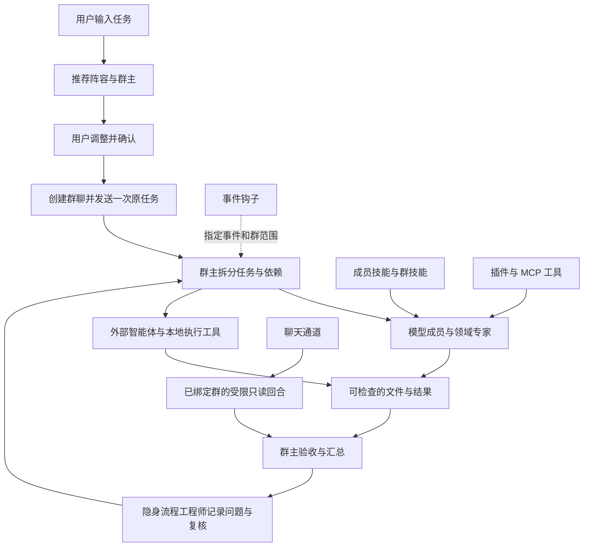

# 能力中心与群协作链

2026-09-26。范围: Team Agent 当前本机配置与本次界面、群接入、钩子测试链修改。运行时检测与端到端制作是不同的验证层级。

## 统一协作关系

聊天通道当前不会走新建群的阵容确认流程。来自外部平台的输入进入已绑定群,使用受限只读工具;不能通过该入口执行视频渲染或写文件。单向机器人通道只负责推送。页面现在把这一限制放在配置前,避免误以为接入平台就获得全部群能力。

专家保留在“成员”之内,提供独立的专家选项与搜索。专家可以承担主持、执行和审查,第三种顶层身份会与成员重叠。群内顶层继续区分成员和工具。

## 六类能力的边界

| 类别 | 内容与职责 | 生效路径 | 需要分清的状态 |
| --- | --- | --- | --- |
| 技能 | 做法、规范、操作说明及附带参考文件 | 分配给单个成员,或在能力中心接入群 | 已安装、被哪些成员使用、已接入哪个群 |
| 插件 | Team Agent 自身加载的 Python 工具 | 安装/重新加载 → 接入群 → 成员调用 | 加载正常/失败、提供的工具、群接入 |
| MCP | 本地进程或远程服务提供的标准工具 | 配置 → 全局启用 → 接入群 → 手动连接或首次调用时连接 | 全局启用、连接状态、群接入分别显示 |
| 外部智能体 | WorkBuddy、Cherry Studio、MetaChat | 添加或复用档案 → 配置 → 加入群 → 接收分工 | 已添加档案、运行环境/网关检测、群接入 |
| 本地执行工具 | HyperFrames、VoiceStudio、Qwen3-TTS、OpenChatCut、Remotion、video-shotcraft | 配置运行环境 → 加入群 → 准备群工作目录内的工程/素材 → 执行任务 | 检测到运行环境不等于完成项目配置或产出验收 |
| 钩子 | 指定事件上的观察、提示词注入或检查动作 | 安装 → 明确作用群 → 启用 → 事件触发 | 是否启用、保存的群范围、最近执行结果 |
| 聊天通道 | 平台收发适配 | 配置接入信息 → 绑定群 → 启用 → 检查连接 | 配置齐全不代表已验证连通,测试发送是独立动作 |

ComfyUI 是图像/视频生成服务。它在“模型服务”中配置,从群内“添加群工具”加入;不能混在 Python 插件或聊天网关中。Codex/其他应用的插件也不等于 Team Agent 的 Python 插件。可迁入的技能和 MCP 分别走各自导入入口。

## 本次修正

- 六页集中在“能力中心”,使用同一内容宽度、群作用范围、搜索与接入表达;管理页让出原成员栏占用的空间,返回群聊恢复原有显示偏好。
- 技能/插件/MCP 的旧提示指向已删除的右侧面板。现可在各自页面直接选择目标群、接入或移出,并筛选“只看本群已接入”。
- 单项接入接口在服务器读取当前列表后修改一项,保留其他技能、插件、MCP、资料库、记忆与分工设置;群忙碌时拒绝修改。重复接入不会重复添加或改变既有顺序。
- 接入 MCP 不会隐式开启、连接服务或运行命令;技能接入也不运行附带脚本。
- 插件页原“从其他应用导入”实际导入 MCP。现改成清晰的技能/MCP 导航,避免成功提示与当前列表不对应。
- 外部能力页改用引擎实际类型分区,展示全部引擎及其档案。视频、语音工具不再要求填写聊天模型和网关地址。支持复用已有档案接入群。
- 本地工具配置不再显示实际上不会进行对话的“云模型连接测试”按钮,保留运行环境检查。
- 钩子范围采用显式“全部群聊/指定群聊”与保存动作;取消最后一个指定群不会扩大为全部群。单次测试只能选择登记的事件与作用范围内的群,后端也校验。
- 通道页先展示缺项和状态,再按接入信息、绑定群、启用、验证排列;平台长说明折叠。切换平台时重建字段,避免上一平台的输入残留。

## 本机盘点

读取真实应用 API 得到以下快照;没有把隔离测试数据写入真实群聊。

- 6 个现有群、63 个技能。
- 0 个 Team Agent Python 插件。这不代表其他应用没有插件。
- 12 个 MCP 配置: deepwiki、cua_repl、node_repl、computer-use、浏览器(Playwright)、Context7、GitHub、Supabase、Sentry、Vercel、Figma、HeyGen。快照时全局开关开启,均未连接,并未逐项验证其服务可用性。
- 9 类外部引擎、10 份成员/工具档案,包括已有的两份 VoiceStudio 档案;没有自动删除或合并用户配置。
- HyperFrames、VoiceStudio、Qwen3-TTS 检测到本地运行环境。WorkBuddy 找到命令行入口;这不等于已验证云端对话。
- OpenChatCut 检测缺 Node 24/occ;Remotion 与 video-shotcraft 的默认运行检查未通过,仍需相应工程和依赖。项目内安装与全局检测可能不同,实际任务需在目标群工作目录验证。
- 1 个示例钩子,未启用。
- WhatsApp、Telegram、企业微信、飞书、钉钉、Slack 六种通道均未启用。前两者为双向通道,后四者为输出通道。

## 验证与边界

- 284 项相关后端测试通过,涵盖群接入、技能别名、插件可见性、忙碌保护、钩子范围、通道、组队、媒体协作和流程反馈。
- 前端生产构建、TypeScript 检查、中文文案检查通过。
- 隔离界面实际验证技能/插件/MCP 接入及移出、切换目标群、成员状态、六类页面、钩子空选拒绝、通道配置顺序;MCP 测试服务保持关闭,没有向真实平台发送消息。
- 视频工具没有在本轮逐个执行真实生成。缺少工程、素材、模型或运行依赖的工具明确保留“待配置”状态,不能视为全部制作任务已验收。
